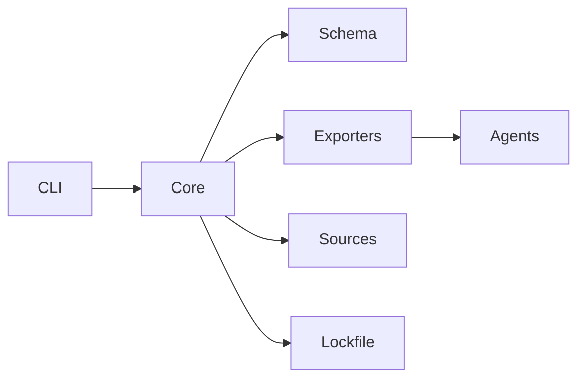

<!--
  ⚠️  AUTO-GENERATED FILE - DO NOT EDIT DIRECTLY

  This file is generated from documentation source.
  To make changes, edit the source file and run: pnpm generate:repo-files

  Source: apps/docs/content/06-development/*.md
-->

# Development Guide

> This guide is auto-generated from the AlignTrue documentation site.

## Table of Contents

- [Architecture in 10 minutes](#architecture-in-10-minutes)
- [Architecture](#architecture)
- [Archiving components checklist](#archiving-components-checklist)
- [CI guide](#ci-guide)
- [Code standards](#code-standards)
- [Development commands](#development-commands)
- [Dependabot auto-merge strategy](#dependabot-auto-merge-strategy)
- [Add a new exporter](#add-a-new-exporter)
- [Package exports](#package-exports)
- [Release process](#release-process)
- [Development setup](#development-setup)
- [Stability and compatibility](#stability-and-compatibility)
- [Test maintenance: Core format and path changes](#test-maintenance-core-format-and-path-changes)
- [Workspace structure](#workspace-structure)

---

# Architecture in 10 minutes

Use this when you need to add a command, change schema/IR, or wire a new exporter.

## System flow (high level)



- **CLI (`packages/cli`)**: argument parsing, UX, config editing, orchestration.
- **Core (`packages/core`)**: IR loading, validation, scopes, overlays/plugs, sync engine.
- **Schema (`packages/schema`)**: IR/schema typing, canonicalization, hashing.
- **Exporters (`packages/exporters`)**: IR → agent-specific files (Cursor, AGENTS.md, VS Code/Claude Code, etc.).
- **Sources (`packages/sources`)**: pulling rules from local/git/catalog inputs.

## Where to change what

- **Add a CLI command**: `packages/cli/src/commands/*` + `manifest.ts` registration. Tests in `packages/cli/tests/commands/`.
- **Add/adjust schema fields**: `packages/schema/src/*` with canonicalization + validation. Update docs/CHANGELOG and consider migration.
- **Core sync behavior**: `packages/core/src/sync/*` and `packages/core/src/paths.ts` for layout. Tests mirror folder names.
- **Exporter logic**: `packages/exporters/src/<agent>/index.ts` and manifest. Register in `packages/exporters/src/registry.ts`.
- **Team mode/lockfile**: `packages/core/src/lockfile/*` and `packages/core/src/team/*`.

## Tests to run by change type

- CLI command: `pnpm --filter @aligntrue/cli vitest run tests/commands/<file>.test.ts`
- Schema/IR: `pnpm --filter @aligntrue/schema test`
- Core sync/pathing: `pnpm --filter @aligntrue/core vitest run tests/sync/*.test.ts`
- Exporter change: `pnpm --filter @aligntrue/exporters test`
- Docs accuracy: `pnpm validate:docs`

Keep changes small and update golden tests when exporter or schema outputs move.

---

# Architecture

Key architectural concepts and design principles for AlignTrue.

## Core principles

1. **Maintainability** – Prefer explicit modules and shallow trees so AI can reason about the code
2. **Determinism** – YAML → Type-safe model → JCS canonical JSON → SHA-256 hashes (lockfile v2 uses a single bundle hash)
3. **Simplicity** – Small, predictable modules; no registries, no plugin magic
4. **Local-first** – All useful flows run offline; cloud augments later
5. **Agent parity** – Exporters preserve semantics and emit fidelity notes when they cannot
6. **Advisory-first** – Validators explain before they block

## Data flow

AlignTrue follows an IR-first (Intermediate Representation) architecture:

```
Source (YAML/Markdown)
  ↓
IR (Intermediate Representation)
  ↓
Canonical JSON (JCS) + SHA-256 Hash
  ↓
Agent Exports (.mdc, AGENTS.md, MCP configs, etc.)
```

### IR-first design

- `.aligntrue/rules` (IR) is the canonical source, not bundles
- Natural markdown sections compile to IR
- All operations work on IR directly
- Canonicalization only at lock/publish boundaries

### Unidirectional sync

- `.aligntrue/rules/*.md` is the single source of truth
- Sync flows from rules → IR → agent files
- All agent files are read-only exports
- No bidirectional sync or conflict resolution needed

## Determinism

### When we canonicalize

We canonicalize any time we compute a content hash so identical inputs yield the
same checksum:

- Rule and section hashing via `computeContentHash` during rule load, sync, and
  exporter content hashing
- Lockfile generation computes a single bundle hash (team rules + team config) for drift detection
- MCP config generation hashes the server map
- Catalog publishing (removed from roadmap) would reuse the same hashing path

We do **not** re-canonicalize whole bundles on every operation—only the inputs
being hashed—to keep normal workflows fast.

### Implementation

- `packages/schema/src/canonicalize.ts` provides JCS canonicalization and hashing
  helpers used across the stack
- `packages/core/src/lockfile/` and `packages/core/src/plugs/hashing.ts` build on
  those helpers for team-mode locks and plug hashes
- Exporters compute `contentHash` with the same canonicalization and return it in
  `ExportResult` (not written into markdown exports)

## Package architecture

### Stable modules (deterministic logic)

Keep these modules consolidated and deterministic:

- `packages/schema/src/canonicalize.ts` – YAML → canonical JSON (JCS)
- `packages/core/src/plugs/hashing.ts` – SHA-256 integrity hashing built on `computeHash` from schema
- `packages/schema/src/validator.ts` – IR validation with Ajv strict mode
- `packages/core/src/config/` – Config parsing and validation
- `packages/core/src/sync/` – Sync engine (rules → IR → agents)
- `packages/core/src/lockfile/` – Lockfile v2 generation with a single bundle hash (team rules + team config)
- `packages/core/src/scope.ts` – Hierarchical scope resolution

### Adaptation layers (agent-specific)

These adapt core logic to specific surfaces:

- `packages/cli/src/commands/*` – CLI command implementations
- `packages/exporters/src/*/exporter.ts` – Agent-specific exports

## Vendor bags

Vendor bags enable lossless round-trips for agent-specific metadata:

- `vendor.<agent>` namespace for agent-specific extensions
- Volatile paths excluded from hashing via `vendor._meta.volatile` (timestamps,
  session IDs, etc.)
- Preserved during sync operations
- Allows agents to store additional metadata without breaking AlignTrue semantics

Example:

```yaml
vendor:
  cursor:
    session_id: "abc123" # Volatile, excluded from hash
    preferences:
      theme: "dark" # Stable, included in hash
  _meta:
    volatile:
      - cursor.session_id
```

## Source precedence and merge

When multiple sources provide rules, first source wins (highest priority):

1. **Local rules** (`.aligntrue/rules/`) - ALWAYS FIRST, ALWAYS WINS
2. First external source listed in config
3. Second external source listed in config
4. ... (in order)

This ensures local customizations always override external sources on conflict.

### External sources

Configured via `sources` array with new `include` syntax:

```yaml
sources:
  - type: git
    include:
      - https://github.com/org/repo # All .md in root
      - https://github.com/org/repo@v2.0.0 # Specific version
      - https://github.com/org/repo/aligns # All .md in directory
      - https://github.com/org/repo/security.md # Single file
```

## Hierarchical scopes

Path-based rules with merge order for monorepos:

1. Root scope (applies everywhere)
2. Directory scopes (applies to subtree)
3. File-level overrides (most specific)

Rules merge with precedence from most specific to least specific.

## Team mode features

### Lockfiles

- Enable with `mode: team` in config
- Generated with `aligntrue sync`
- Lockfile v2 stores only `version` and `bundle_hash` (team rules + team config)
- Detect drift in CI with `aligntrue drift --gates` or `aligntrue check --ci`

### Drift detection

- Compare current state against lockfile
- Report changes to rules, versions, or hashes
- Fail CI if drift detected (configurable severity)

## Exporters

AlignTrue includes 50 exporters supporting 28+ agents; `scripts/validate-docs-accuracy.mjs` cross-checks manifests in `packages/exporters/src`.

### Categories

1. **MCP config exporters** - JSON configs for Model Context Protocol agents
2. **Agent-specific formats** - Native formats (.mdc, .yml, .json, etc.)
3. **Universal formats** - AGENTS.md for broad compatibility
4. **Dual-output** - Both universal + specific (e.g., Aider)

### Fidelity notes

Each exporter documents what information may be lost when converting from IR:

- Computed by exporter
- Returned in `ExportResult.fidelityNotes`
- Displayed in CLI output during sync
- Help users understand limitations
- Guide decisions about which exporters to use

### Content hash

- Computed deterministically from canonicalized IR sections
- Returned in `ExportResult.contentHash`
- Useful for drift detection and integrity verification
- Not written to markdown exports (files kept clean); MCP JSON includes
  `content_hash`

## AI-maintainable code principles

### 1. Explicit over dynamic

```ts
// Good: Explicit dispatch
switch (target) {
  case "cursor":
    return exportCursor(bundle);
  case "codex":
    return exportCodex(bundle);
}

// Bad: Dynamic lookup
const exporters = { cursor: exportCursor, codex: exportCodex };
return exporters[target](bundle);
```

### 2. Flat over nested

Max depth three. Modules at `packages/*/src/` with minimal nesting.

### 3. Consolidated complexity

Keep deterministic logic together up to ~800 LOC. Split only when boundaries are obvious.

### 4. Clear data flow

Good: CLI command → schema service → exporter  
Bad: CLI → orchestrator → factory → plugin host → exporter

### 5. Deterministic schema validation

Single JSON Schema (2020-12) exported from `packages/schema`. Use Ajv strict mode everywhere.

### 6. Finish refactors

If you start moving logic, finish in the same PR or leave a `_legacy.ts` file with owner + removal date.

## Testing philosophy

- Unit tests for all core logic
- Integration tests for CLI commands
- Golden tests for determinism
- Contract tests for exporters
- No real time, network, or randomness in tests
- Match CI environment exactly (TZ=UTC)

## Workspace organization

This architecture translates to a clean pnpm monorepo:

```
aligntrue/
├── packages/
│   ├── schema/           # IR validation, canonicalization, hashing
│   ├── plugin-contracts/ # Plugin interfaces
│   ├── file-utils/       # Shared utilities
│   ├── core/             # Config, sync engine, bundle/lockfile
│   ├── sources/          # Multi-source pulling (local, git)
│   ├── exporters/        # Agent-specific exports (50 exporters)
│   ├── cli/              # aligntrue/aln CLI
│   ├── testkit/          # Conformance vectors and golden tests
│   └── ui/               # Design system components
├── apps/
│   └── docs/             # Nextra documentation site
├── examples/             # Example configurations
└── scripts/              # Build and setup scripts
```

**Design principles applied to structure:**

- Max depth 3: packages at `packages/*/src/` with minimal nesting
- Stable deterministic logic consolidated in `schema/` and `core/`
- Agent exporters thin and isolated in `exporters/`
- CLI is the top-level surface in Phase 1

## Security considerations

- No outbound network calls in core path
- Telemetry opt-in via env var (off by default)
- Never log secrets or PII
- Never commit real tokens
- Atomic file writes prevent corruption
- Sandbox execution for command runners

## Published packages

All packages are published under the `@aligntrue` scope:

- `@aligntrue/schema` - IR validation and types
- `@aligntrue/plugin-contracts` - Plugin interfaces
- `@aligntrue/file-utils` - Shared utilities
- `@aligntrue/core` - Config and sync engine
- `@aligntrue/sources` - Multi-source pulling
- `@aligntrue/exporters` - Agent exporters
- `@aligntrue/cli` - Command-line tool
- `@aligntrue/testkit` - Test utilities

**Shim package:**

- `aligntrue` - Depends on `@aligntrue/cli` for easy installation

**Install:**

```bash
npm i -g @aligntrue/cli@next   # Alpha
npm i -g aligntrue             # Stable
```

## Developer workflow

### Schema or sections format changes

Update schema + CLI + exporters in the same PR:

1. Extend shared package types (e.g., `packages/schema/src/types.ts`)
2. Update CLI command handlers
3. Update exporters
4. Add contract tests in `schema/tests/`
5. Add integration tests in `cli/tests/`
6. Update docs and CHANGELOG

### Adding new exporters

Create a new exporter in `packages/exporters`:

1. Add exporter implementation with manifest
2. Add contract tests
3. Update `packages/exporters/src/index.ts` to export it
4. Update CLI to include new exporter
5. Add docs explaining the exporter
6. Update CHANGELOG

### Avoiding cloud features

Cloud features stay in the cloud repo, never imported here. Keep this repo focused on:

- Local-first workflows
- Deterministic bundling
- CI validation
- Open-source tooling

## CI gates and quality checks

- **Bundle size:** CLI tarball must stay under 600 KB
- **Align vendoring:** Align files must not be vendored in CLI
- **Schema changes:** IR format changes require version bump + changelog
- **Determinism:** Tests run with `TZ=UTC` to match CI environment
- **Type checking:** Full typecheck across all packages on pre-push
- **Tests:** All tests must pass on all packages
- **Build:** Full production build must succeed

**Testing environment:**

Run tests locally with CI environment variables:

```bash
TZ=UTC pnpm test
```

This ensures determinism matches CI exactly.

## Next steps

- Review [workspace structure](https://aligntrue.ai/docs/06-development/workspace)
- Explore [development commands](https://aligntrue.ai/docs/06-development/commands)
- Learn [code standards](https://aligntrue.ai/docs/06-development/code-standards)

---

# Archiving components checklist

This checklist prevents issues like the transpile validation CI failure that occurred when `apps/web` was archived but scripts still referenced it.

## When to use

Follow this checklist when moving any component (app, package, or major module) to the `archive/` directory.

## Pre-archive checklist

### 1. Search for references

Search the entire codebase for references to the component being archived:

```bash
# Replace "path/to/component" with the actual path
grep -r "path/to/component" scripts/
grep -r "path/to/component" .github/workflows/
grep -r "path/to/component" package.json
grep -r "path/to/component" pnpm-workspace.yaml
```

**Example (archiving apps/web):**

```bash
grep -r "apps/web" scripts/
grep -r "apps/web" .github/workflows/
grep -r "apps/web" package.json
```

### 2. Update or remove scripts

For each script that references the archived component:

- **Delete if component-specific** - Script only exists for the archived component
- **Add existsSync() guards** - Script handles multiple components, some archived
- **Update paths** - Component relocated but still active

**Example (validation script with guard):**

```javascript
const configPath = join(rootDir, "apps/web/next.config.ts");
const config = existsSync(configPath) ? loadConfig(configPath) : null;

if (config !== null) {
  // Validate active component
} else {
  console.log("📦 apps/web (skipped - archived)");
}
```

### 3. Test affected scripts

Run all scripts that might be affected:

```bash
# Run validation scripts
node scripts/validate-*.mjs

# Build packages
pnpm build:packages

# Run tests
pnpm test
```

### 4. Update CI workflow

Check `.github/workflows/` for steps that reference the archived component:

- Remove build steps for archived apps
- Remove deployment steps for archived apps
- Remove test steps specific to archived component
- Update validation steps to skip archived components

### 5. Update package configuration

Check and update:

- `package.json` - Remove scripts referencing archived component
- `pnpm-workspace.yaml` - Remove archived workspace paths
- `tsconfig.json` - Remove path mappings to archived component
- `vercel.json` - Remove rewrites/redirects to archived apps

### 6. Document in CHANGELOG

Add entry explaining:

- What was archived and why
- When it was archived
- Migration path (if applicable)
- Restoration triggers (if applicable)

**Example:**

```markdown
### Archived

- **apps/web (Catalog website)** - Archived to simplify pre-launch. Static catalog page in docs site replaces it. Restoration triggers: 50+ active users OR 20+ curated aligns.
```

### 7. Update future features documentation

Document the archived feature with:

- What was built and why it was archived
- Current approach or workaround
- Clear restoration triggers (objective, measurable)
- Estimated restoration effort
- Implementation notes for future restoration

## Post-archive verification

### 1. Local validation

```bash
# Ensure all validation scripts pass
node scripts/validate-ui-tsconfig.mjs
node scripts/validate-transpile-packages.mjs

# Build all active packages
pnpm build:packages

# Run test suite
pnpm test

# Check for untracked files created by scripts
git status
```

### 2. CI validation

Push to a feature branch and verify:

- All CI jobs pass
- No references to archived component in logs
- Build completes successfully
- Tests pass on all platforms

### 3. Documentation review

Verify documentation is updated:

- CHANGELOG.md has archive entry
- Future features doc has restoration guide
- Development docs reference current structure
- README (if applicable) updated

## Common pitfalls

### Hardcoded paths

**Problem:** Scripts assume directory structure without checking existence

**Solution:** Always use `existsSync()` before accessing paths

```javascript
// BAD
const config = readFileSync(configPath);

// GOOD
if (existsSync(configPath)) {
  const config = readFileSync(configPath);
}
```

### Validation scripts

**Problem:** Validators check archived components and fail

**Solution:** Skip archived components gracefully with clear messaging

```javascript
if (!existsSync(componentPath)) {
  console.log(`📦 ${componentName} (skipped - archived)`);
  continue;
}
```

### Build scripts

**Problem:** Build scripts create archived directories

**Solution:** Delete component-specific build scripts, update paths in shared scripts

### CI workflows

**Problem:** CI runs steps for archived components

**Solution:** Remove archived component steps from workflow files

## Example: Archiving apps/web

This real example shows the process:

1. **Search:** Found references in `scripts/catalog/build-catalog.ts`, `scripts/validate-transpile-packages.mjs`, `scripts/validate-ui-tsconfig.mjs`

2. **Update:**
   - Deleted `scripts/catalog/build-catalog.ts` (component-specific)
   - Updated `validate-transpile-packages.mjs` with existsSync() guard
   - Verified `validate-ui-tsconfig.mjs` already had guards

3. **Test:** Ran all validation scripts and build - passed ✅

4. **CI:** Verified no CI steps reference apps/web - clean ✅

5. **Document:**
   - Added CHANGELOG entry
   - Updated future features doc with restoration triggers
   - Created this checklist

6. **Verify:** Pushed to CI, all checks passed ✅

## Related documentation

- [CI guide](https://aligntrue.ai/docs/06-development/ci)
- [Development setup](https://aligntrue.ai/docs/06-development/setup)
- [CHANGELOG](/CHANGELOG.md)

---

# CI guide

This guide explains AlignTrue's multi-layered validation approach to catch errors early and provides quick fixes for common CI failures.

## Overview

AlignTrue uses a multi-layered validation approach:

1. **Pre-refactor validation** - Run before large changes to ensure clean baseline
2. **Pre-commit hook** - Incremental checks on every commit (fast, focused)
3. **CI validation** - Full workspace validation on push (comprehensive)

## Pre-commit hook (automatic)

Runs automatically on every `git commit`. Optimized for speed with incremental checks.

**Flow:**

1. Warn if 50+ files are staged (commit may be slow; consider splitting).
2. Block temp artifacts: fails if any staged path starts with `temp-`.
3. Auto-regenerate protected docs (`README.md`, `CONTRIBUTING.md`, `DEVELOPMENT.md`) when their sources change and stage the outputs.
4. Validate workspace protocol on staged `package.json` files (`pnpm validate:workspace`).
5. Format and lint staged files via `lint-staged` (Prettier + ESLint, zero warnings).
6. If staged files include TypeScript, build affected packages (`pnpm build:packages`) to catch resolution/type errors.
7. Validate Next.js `transpilePackages` configuration.
8. Validate documentation accuracy when docs or related code change (docs content, `package.json`, CLI command registry, exporters, performance thresholds).

**Total time:** ~45-90s for typical commits (faster with small staged sets)

### Protected repository files

The following files are auto-generated from documentation source and cannot be directly edited:

- `README.md` (generated from `apps/docs/content/index.mdx`)
- `CONTRIBUTING.md` (generated from `apps/docs/content/07-contributing/creating-aligns.md`)
- `DEVELOPMENT.md` (generated from `apps/docs/content/06-development/*`)

**Why:** AlignTrue practices what it preaches - documentation is the IR (Intermediate Representation), and generated files are the exports. This enforces the docs-first architecture.

**Correct workflow:**

1. Edit the canonical source in `apps/docs/content/`
2. Run `pnpm generate:repo-files` to regenerate root files (the pre-commit hook will also do this automatically when docs sources change)
3. Commit both the doc changes AND the regenerated files

**If you accidentally try to directly edit a protected file:**

```
❌ Protected files were directly edited

📝 These files are generated from docs content:
   README.md
   CONTRIBUTING.md
   DEVELOPMENT.md

🔄 Correct workflow:
   1. Edit source files in apps/docs/content/
   2. Run: pnpm generate:repo-files
   3. Commit both docs changes AND generated files
```

**To fix:** Follow the workflow above and retry your commit.

### Bypassing the hook

Only use `--no-verify` when absolutely necessary (e.g., emergency hotfix, known CI issue):

```bash
git commit --no-verify -m "fix: Emergency hotfix"
```

## CI validation (automatic)

Runs on every push to `main` or `develop`. Comprehensive validation of entire workspace.

**What CI checks:**

1. Workspace protocol validation (`pnpm validate:workspace`)
2. Workspace link verification (`pnpm verify:workspace-links`)
3. Build all packages (`pnpm build:packages`)
4. Full validation suite (`pnpm validate:all`)
5. Docs build (`pnpm --filter @aligntrue/docs build`)
6. Full typecheck (`pnpm typecheck`)
7. Tests with coverage (`pnpm test -- --coverage`)
8. Conformance testkit (`pnpm verify`)
9. Golden repository validation (`examples/golden-repo/test-golden-repo.sh`)

**Time:** 3-5 minutes per platform

### Platform coverage

CI runs on multiple platforms to catch platform-specific issues:

- **Ubuntu (Linux)** - Node 20 and Node 22
- **macOS** - Node 22
- **Windows** - Node 22 (limited coverage, see below)

### Windows test limitations

**Current status:** 13 integration test suites skip on Windows due to persistent EBUSY file locking issues.

**Affected tests:**

- `init-command.test.ts`
- `sync-command.test.ts`
- `check-command.test.ts`
- `overlays.test.ts`
- `scopes-monorepo.test.ts`
- `plugs-resolution.test.ts`
- `customization-combined.test.ts`
- `align-sources.test.ts`
- `override-add-command.test.ts`
- `override-remove-command.test.ts`
- `override-status-command.test.ts`
- Plus 1 unit test in `core/tests/overlays/patch-writer.test.ts`

**Root cause:** Windows file system locks files more aggressively than Unix-like systems, causing EBUSY errors when tests try to clean up temporary directories. The cleanup helper in `packages/cli/tests/helpers/fs-cleanup.ts` includes retry logic (6 retries on Windows vs 1 on Unix), but CI environment still experiences intermittent failures.

**Impact:**

- Core CLI commands (init, sync, check) are not integration tested on Windows in CI
- Unit tests and smoke tests still run on Windows
- Path normalization and cross-platform compatibility are validated via unit tests
- Windows support is "best effort" - basic functionality works but edge cases may slip through

**Workaround for local Windows testing:**

- Run tests locally with longer timeouts
- Use WSL2 for full test suite coverage
- Report Windows-specific issues as bugs with reproduction steps

**Future work:**

- Investigate more robust cleanup strategies (rimraf, graceful-fs)
- Add Windows-specific smoke tests that DO run in CI
- Consider marking Windows as "community supported" if issues persist

## Troubleshooting quick fixes

### Workspace protocol validation failed

**Symptom**

```
Workspace protocol validation failed: @aligntrue/core version is "^0.2.0".
```

**Fix**

1. Run `pnpm validate:workspace` locally.
2. Update the dependency to `workspace:*` in the referenced `package.json`.
3. Re-run `pnpm install && pnpm build:packages`.

### Workspace link verification failed

**Symptom**

```
Workspace link verification failed: @aligntrue/cli → /node_modules/.pnpm/...
```

**Fix**

1. Ensure you ran `pnpm install` after switching branches.
2. If links still resolve to `.pnpm`, run `pnpm clean && pnpm install`.
3. Re-run `pnpm verify:workspace-links`.

### Version mismatch during prepublish

**Symptom**

```
Versions must match across all workspace packages.
```

**Fix**

1. Run `pnpm prepublish:check` locally; it prints every mismatched package.
2. Bump all packages to the same version (for example, 0.2.0) before releasing.

### Type mismatch after renaming formats

**Symptom**

```
TS2322: Type '"agents-md"' is not assignable to type '"agents"'.
```

**Fix**

1. Ensure packages were rebuilt: `pnpm build:packages`.
2. Run `pnpm validate:workspace` and `pnpm verify:workspace-links`.
3. If CI still fails, run `pnpm clean && pnpm install` to refresh workspace links.

## Common type error patterns

### 1. Import path errors

**Problem:** Wrong import path or missing type export

```typescript
// ❌ Wrong
import { DriftDetectionResult } from "@aligntrue/core/team/drift.js";

// ✅ Correct
import { DriftResult } from "@aligntrue/core/team/drift.js";
```

**Fix:** Check the actual exports in the source file

### 2. Duplicate imports

**Problem:** Same type imported from multiple locations

```typescript
// ❌ Wrong
import { AlignRule } from "@aligntrue/core";
import { AlignRule } from "@aligntrue/schema";

// ✅ Correct
import { AlignRule } from "@aligntrue/schema";
```

**Fix:** Import types from their canonical source (usually `@aligntrue/schema`)

### 3. Type narrowing issues

**Problem:** TypeScript can't infer type after conditional

```typescript
// ❌ Wrong
if (!acc[item.category]) acc[item.category] = [];
acc[item.category].push(item); // Error: possibly undefined

// ✅ Correct
if (!acc[item.category]) acc[item.category] = [];
acc[item.category]!.push(item); // Non-null assertion
```

**Fix:** Use non-null assertion (`!`) or type guards

### 4. exactOptionalPropertyTypes issues

**Problem:** Optional property can't be explicitly set to `undefined`

```typescript
// ❌ Wrong
type Result = {
  summary?: string;
};

// ✅ Correct
type Result = {
  summary?: string | undefined;
};
```

**Fix:** Explicitly allow `undefined` in optional properties

## Import path reference

Common type locations:

- **Schema types:** `@aligntrue/schema`
  - `AlignRule`, `Align`, `validateAlignSchema`, `validateRuleId`
- **Core types:** `@aligntrue/core`
  - `AlignTrueConfig`, `SyncEngine`, `BackupManager`
- **Team types:** `@aligntrue/core/team/drift.js`
  - `DriftResult`, `DriftFinding`, `DriftCategory`
- **Exporter types:** `@aligntrue/exporters`
  - `ExporterRegistry`, `ExportResult`
- **Source types:** `@aligntrue/sources`
  - `GitSourceConfig`, `CatalogSourceConfig`

## Common issues and fixes

### Next.js dev server fails with "Cannot find module" errors

**Symptom:** Dev server crashes with errors like:

```
Error: Cannot find module './vendor-chunks/nextra@4.6.0...'
Cannot find module '@aligntrue/ui'
```

**Cause:** Next.js doesn't transpile workspace packages by default. The `@aligntrue/ui` package exports TypeScript source directly (no build step), so Next.js needs to be configured to transpile it.

**Fix:**

See [Setup - Next.js dev server fails](https://aligntrue.ai/docs/06-development/setup#nextjs-dev-server-fails-with-cannot-find-module-errors) for detailed troubleshooting steps.

### Pre-commit hook is slow

**Cause:** Checking too many packages or full workspace

**Fix:** The optimized hook only checks changed packages. If still slow:

1. Check if you have uncommitted changes in many packages
2. Commit packages separately if working on multiple

### Type errors only appear in CI

**Cause:** Local build is stale or using cached types

**Fix:**

```bash
# Clean and rebuild
pnpm clean
pnpm build

# Then run typecheck
pnpm typecheck
```

### Pre-commit hook fails but types seem fine

**Cause:** Hook uses stricter checks than your IDE

**Fix:**

1. Run `pnpm typecheck` locally to see all errors
2. Check that your IDE is using workspace TypeScript version
3. Ensure `tsconfig.json` has `strict: true`

## Best practices

1. **Commit frequently** - Smaller commits = faster pre-commit checks
2. **Fix type errors immediately** - Don't let them accumulate
3. **Use the right import paths** - Check source files for canonical exports
4. **Test locally before pushing** - Run `pnpm typecheck && pnpm test`

## Next steps

- Review [setup guide](https://aligntrue.ai/docs/06-development/setup)
- Learn [test maintenance](https://aligntrue.ai/docs/06-development/test-maintenance) for handling test failures

---

# Code standards

AlignTrue maintains consistent patterns across packages to improve maintainability and reduce duplication.

## Shared utilities from @aligntrue/schema

The schema package exports high-quality utilities that should be used throughout the codebase to maintain consistency.

### Hashing and cryptography

**Use `computeHash()` instead of raw `createHash()`:**

```typescript
// ❌ Don't: raw crypto operations scattered across code
import { createHash } from "crypto";
const hash = createHash("sha256").update(content).digest("hex");

// ✅ Do: use centralized utility
import { computeHash } from "@aligntrue/schema";
const hash = computeHash(content);
```

**Benefits:**

- Single source of truth for cryptographic operations
- Easier to update algorithm if needed
- Consistent across all packages
- Already handles encoding/formatting

**Available functions:**

- `computeHash(data: string): string` - SHA-256 hash
- `computeContentHash(obj: unknown, excludeVolatile = true): string` - Canonicalize (drops `vendor.*.volatile` by default) + SHA-256
- `hashObject(obj: unknown): string` - Convenience wrapper
- `computeAlignHash(input: string | unknown): string` - Resets `integrity.value` to `<pending>`, filters volatile vendor fields, then hashes

**Locations where hashing is used:**

- File checksum computation (`file-utils`)
- Git repository hashing (`sources`)
- Content change detection (`core/tracking`)
- Section hashing in sync operations

### JSON utilities

**Use `cloneDeep()` instead of `JSON.parse(JSON.stringify())`:**

```typescript
// ❌ Don't: structural cloning anti-pattern
const clone = JSON.parse(JSON.stringify(obj));

// ✅ Do: use native structuredClone with fallback
import { cloneDeep } from "@aligntrue/schema";
const clone = cloneDeep(obj);
```

**Benefits:**

- Uses native `structuredClone()` for better performance
- Handles more types (Date, Map, Set, etc.)
- Explicit intent in code
- Fallback for older environments (though not needed for Node 20+)

**Available functions:**

- `cloneDeep<T>(obj: T): T` - Deep clone using structuredClone
- `parseJsonSafe(str: string): Result<unknown, Error>` - Parse with error handling
- `stringifyCanonical(obj: unknown, excludeVolatile = true): string` - Canonical JSON (drops `vendor.*.volatile` by default)
- `computeContentHash(obj: unknown, excludeVolatile = true): string` - Deterministic hash (canonical JSON + SHA-256)
- `compareCanonical(a: unknown, b: unknown): boolean` - Compare by canonical form
- `type Result<T, E>` - Result type for operations that may fail

**Locations where JSON utilities are recommended:**

- Object cloning in overlay operations
- Align hashing before resolution
- Type-safe parsing of untrusted JSON

### Canonicalization

**Use `canonicalizeJson()` and `computeAlignHash()` for deterministic operations (defaults exclude `vendor.*.volatile`):**

```typescript
// ✅ Do: use schema utilities for determinism
import { canonicalizeJson, computeAlignHash } from "@aligntrue/schema";

const canonical = canonicalizeJson(obj); // volatile fields dropped by default
const hash = computeAlignHash(yamlString); // sets integrity.value to <pending> before hashing
```

## Error handling

### CLI errors

Use the structured error hierarchy (re-exported by `@aligntrue/cli/utils/error-types`, defined in `@aligntrue/core`) so exit codes, hints, and next steps stay consistent:

```typescript
import {
  AlignTrueError,
  ConfigError,
  ValidationError,
  SyncError,
  ErrorFactory,
} from "@aligntrue/cli/utils/error-types";

// Create descriptive errors with actionable guidance
throw new ConfigError(
  "Invalid config field: profile.id missing",
  "Set profile.id in .aligntrue/config.yaml",
).withNextSteps(["Run: aligntrue init", "Edit: aligntrue config edit"]);

// Prefer ErrorFactory helpers for common cases
throw ErrorFactory.configNotFound(configPath);

// Use AlignTrueError (base) only when none of the typed errors fit
throw new AlignTrueError(
  "Unexpected state while resolving plugs",
  "UNEXPECTED_STATE",
  1,
);
```

### Core package errors

Keep error messages clear and actionable. Use the typed errors above for user-facing failures; reserve bare `Error` for internal invariants only:

```typescript
// ✅ Good (user-facing)
throw ErrorFactory.fileWriteFailed(path, cause);

// ✅ Good (internal invariant)
if (!graph.has(node)) {
  throw new Error(`Invariant: node ${node} should exist before traversal`);
}

// ❌ Avoid
throw new Error("Config load failed");
```

## Testing patterns

### Test organization

Mirror source layout in tests:

```
packages/core/
  src/
    sync/
      engine.ts
    config/
      index.ts
  tests/
    sync/
      engine.test.ts
    config/
      index.test.ts
```

### Fixtures and factories

Create reusable test fixtures near complex logic:

```typescript
// packages/core/tests/helpers/test-fixtures.ts
export function createMockConfig(
  overrides?: Partial<AlignTrueConfig>,
): AlignTrueConfig {
  return {
    version: "1.0.0",
    mode: "solo",
    ...overrides,
  };
}
```

## Performance considerations

### File operations

Use the centralized `AtomicFileWriter` from `@aligntrue/file-utils`:

```typescript
import { AtomicFileWriter } from "@aligntrue/file-utils";

const writer = new AtomicFileWriter();
// Optional: prompt-aware checksum handler to protect manual edits
// writer.setChecksumHandler(async (...) => "overwrite" | "keep" | "abort");

await writer.write(filePath, content, { interactive, force });
// Handles atomicity, checksum tracking, overwrite protection, rollback
```

### Large datasets

The schema package provides performance guardrails:

```typescript
import { checkFileSize } from "@aligntrue/core/performance";

checkFileSize(filePath, 100, "team", force);
// Solo: warns; Team/enterprise: throws; Force: bypasses
```

## Package dependencies

### Core package constraints

- **Core (`@aligntrue/core`)**: No UI dependencies
  - Remove unused `@clack/prompts` (only CLI needs this)
  - Focus on config, sync, and validation logic

- **CLI (`@aligntrue/cli`)**: Can depend on UI and prompts
  - Use `@clack/prompts` for interactive prompts
  - Depends on core for business logic

- **Schema (`@aligntrue/schema`)**: No external business logic
  - Validation, hashing, canonicalization only
  - Depended on by all other packages

### Import order

Within files, use this order:

```typescript
// 1. Standard library
import { promises as fs } from "fs";
import { join } from "path";

// 2. Third-party packages
import { parse } from "yaml";

// 3. Local workspace packages
import { computeHash } from "@aligntrue/schema";
import { loadConfig } from "./config/index.js";

// 4. Relative imports
import { helper } from "../utils/helper.js";
```

## Documentation

### When to add documentation

- **Add**: Feature behavior, configuration options, CLI commands, public APIs
- **Skip**: Internal refactors, implementation details that don't affect users
- **Update**: When user-facing behavior changes

### Keep documentation current

Use the `validation/docs` check to ensure:

- Node.js version requirements match `package.json`
- CLI command counts match implementation
- Exporter counts match directory listing

```bash
pnpm validate:docs
```

## Related documentation

- [CI guide](https://aligntrue.ai/docs/06-development/ci) for validation and debugging workflow
- [Architecture](https://aligntrue.ai/docs/06-development/architecture) for design principles
- [Test maintenance](https://aligntrue.ai/docs/06-development/test-maintenance) for test strategy

---

# Development commands

Common commands and workflows for AlignTrue development.

## Canonical workflow (use these first)

- `pnpm dev` – Runs package builds in watch mode and the docs app together.
- `pnpm check` – Lint, format check, typecheck, fast tests, and docs/workspace validations.
- `pnpm ci` – Full CI-parity suite (pre-ci prep, full validation, lint, format check, typecheck, full tests). This is what CI runs; it is slower.

In most cases: keep `pnpm dev` running while coding, run `pnpm check` before pushing, and let CI handle `pnpm ci`.

## Core commands

### Run docs locally

```bash
pnpm dev
```

Starts the docs site at `http://localhost:3000` from `apps/docs`.

### Build

```bash
pnpm build          # Turbo build across workspace
pnpm build:packages # Build only workspace packages
pnpm --filter @aligntrue/core build # Build one package
```

### Tests and type checks

```bash
pnpm test        # All tests
pnpm test:fast   # Fast reporter for quick feedback
pnpm typecheck   # TypeScript across all packages
```

### Linting and formatting

```bash
pnpm lint          # ESLint (zero warnings)
pnpm lint:fix      # Fix then re-run lint
pnpm format        # Prettier write
pnpm format:check  # Prettier check only
```

### Validation helpers

```bash
pnpm validate:all            # Full validation suite
pnpm validate:docs           # Docs accuracy checks
pnpm validate:workspace      # Ensure workspace:* protocol
pnpm verify:workspace-links  # Verify node_modules links resolve locally
pnpm check                   # Aggregated CI-like check runner
pnpm ci:errors               # Summarize recent CI failures
```

### Docs + repo files

```bash
pnpm start:docs          # Start docs with preflight
pnpm generate:repo-files # Regenerate README/CONTRIBUTING/etc. from docs
```

### Cleaning

```bash
pnpm clean        # Remove node_modules and dist outputs
pnpm clean-temp   # Delete temp-* debug files
pnpm cleanup:temps # Remove cached test temp artifacts (supports --delete/--verbose)
```

### Bootstrapping

```bash
pnpm bootstrap  # Install deps then build once
```

## Working on packages

### Package build workflow

When editing workspace packages that other packages depend on (core, schema, exporters), you have two options:

**Option 1: Watch mode (recommended for active development)**

Run packages in watch mode for automatic rebuilds on save:

```bash
pnpm dev:packages
```

This runs all packages in parallel watch mode. Keep this running in a separate terminal while developing.

**Option 2: Manual builds**

Build packages explicitly when needed:

```bash
# Build all packages
pnpm build:packages

# Build specific package
pnpm --filter @aligntrue/core build
```

### Why builds matter

Packages import from `dist/` directories of their dependencies (e.g., CLI imports from `packages/core/dist/`). If you edit source in `packages/core/src/` but don't rebuild, other packages will see stale types and code.

**The pre-commit hook automatically rebuilds packages when source files change**, so you won't commit stale builds. But during development, use watch mode for instant feedback.

### Working with type changes

When you change exported types in core packages (schema, core, exporters, plugin-contracts):

1. Build the package: `pnpm --filter @aligntrue/schema build`
2. Turbo automatically rebuilds dependent packages

Or just run `pnpm build:packages` to rebuild everything. Turbo's dependency graph ensures packages build in the correct order.

### Workspace protocol and release checks

- All `@aligntrue/*` dependencies must use `workspace:*` so local builds always take priority. Run `pnpm validate:workspace` if you edit `package.json`.
- After `pnpm install`, run `pnpm verify:workspace-links` when diagnosing type mismatches. It ensures node_modules links resolve to local workspace packages.
- Before publishing, run `pnpm prepublish:check`. It verifies versions match across packages, the git tree is clean, and build/typecheck/test succeed.
- CI runs the same checks in `.github/workflows/ci.yml`, so keeping them green locally prevents “works on my machine” releases.

## Running tests locally

### All tests

Run the full test suite across all packages:

```bash
pnpm test
```

### Specific package

Test a single package:

```bash
pnpm --filter @aligntrue/cli test
pnpm --filter @aligntrue/schema test
pnpm --filter @aligntrue/core test
```

### Specific test file

Run a specific test file:

```bash
pnpm --filter @aligntrue/cli vitest run tests/commands/sync.test.ts
```

### Watch mode

Run tests in watch mode for rapid feedback during development:

```bash
# Watch all tests in a package
pnpm --filter @aligntrue/cli vitest

# Watch specific test file
pnpm --filter @aligntrue/cli vitest tests/commands/sync.test.ts

# Watch with UI
pnpm --filter @aligntrue/cli vitest --ui
```

### With coverage

Generate coverage reports:

```bash
pnpm --filter @aligntrue/cli vitest --coverage
```

### Deterministic test environment

Match CI environment exactly (useful for debugging CI failures):

```bash
TZ=UTC pnpm test
```

### Fast feedback mode

Use the fast reporter for quicker output:

```bash
pnpm test:fast
```

## Code quality

### TypeScript

- All packages use strict TypeScript
- Extends `tsconfig.base.json` from repo root
- No `any` types allowed
- Use `unknown` and narrow types

### Formatting

EditorConfig is configured at the root. Use:

- 2 spaces for indentation
- LF line endings
- UTF-8 encoding

### Testing

- Unit tests go in `packages/*/tests/`
- Keep tests fast (<1s per test)
- Make tests deterministic (no real time, network, or randomness)

## Common tasks

### Add a new package

1. Create directory under `packages/`
2. Add `package.json` with workspace dependencies
3. Create `tsconfig.json` extending base
4. Add to workspace commands in root `package.json`

### Update dependencies

```bash
pnpm update --latest --recursive
```

### Check for security issues

```bash
pnpm audit
```

## Releasing (manual flow)

Releases use `scripts/manual-release.mjs`—no Changesets.

```bash
pnpm release [--dry-run] [--type=patch|minor|major|current]
```

What it does:

- prompts (or uses `--type`) for bump level across publishable packages
- bumps versions in each package.json
- runs `pnpm build:packages`
- publishes each package with `pnpm publish` (rewrites workspace:\*)
- runs `node scripts/validate-published-deps.mjs` to catch workspace leaks
- commits + tags (`chore: Release <version> (<type>)`) and pushes

Tips:

- Use `--dry-run` to preview without changing files or publishing.
- Start from a clean main branch with CI green and npm auth configured.
- After release, update `CHANGELOG.md` and verify `npx aligntrue --version`.

## CI/CD

CI runs on every PR and reuses the same scripts as local helpers:

- lockfile sync and docs accuracy validation
- `pnpm build`, `pnpm typecheck`, `pnpm test` (unit + integration + golden repo)
- bundle-size and workspace protocol checks

If `pnpm pre-ci` succeeds from a clean tree, CI should match.

## Troubleshooting

### Pre-commit hook fails with formatting errors

The hook auto-regenerates repo files when docs change, validates workspace protocol, runs `pnpm lint-staged`, and builds affected packages when TypeScript files are staged. Fix the first reported failure (format, lint, or build) and rerun.

### Pre-push hook is too slow

Pre-push runs `pnpm pre-ci` (frozen install, build, typecheck, tests, bundle-size validation). Use watch mode and `pnpm test:fast` for tight loops, then rely on pre-push before CI.

### Commit message rejected

Ensure your commit message follows Conventional Commits format:

```bash
<type>: <description>
```

Example: `feat: add new command` or `fix: resolve memory leak`

## Next steps

- Review [workspace structure](https://aligntrue.ai/docs/06-development/workspace)
- Understand [architecture concepts](https://aligntrue.ai/docs/06-development/architecture)
- Learn [CI validation](https://aligntrue.ai/docs/06-development/ci) to prevent failures

---

# Dependabot auto-merge strategy

This document explains AlignTrue's hybrid approach to automatically merging Dependabot PRs.

## Overview

**Goal:** Save maintainer time on routine dependency updates while preserving manual review for higher-risk changes.

**Strategy (matches the workflow logic):**

- Auto-merge when the PR is from Dependabot **and**:
  - Labeled `devDependencies`, **or**
  - Detected as a security patch, **or**
  - Title includes `patch`/`from` **and** the PR is **not** labeled `requires-review`
- Manual review for PRs labeled `requires-review` or anything without a safe signal

## Configuration

### 1. `.github/dependabot.yml`

Dependabot is configured to:

- Create separate PRs per directory (workspace isolation)
- Label PRs by scope (devDependencies, schema, cli, web, docs, etc.)
- Group updates by risk (dev vs production)
- Ignore unsafe updates (e.g., Next.js major versions)

**Key scopes:**

- **Root `/`**: dev-dependencies only → auto-merge safe (labeled `devDependencies`)
- **Packages** (`/packages/schema`, `/packages/cli`, `/packages/mcp`): patch/minor only → auto-merge safe (no `requires-review` label applied)
- **Web app** (`/apps/web`): dev deps auto-merge; production deps labeled `requires-review` → manual
- **Docs app** (`/apps/docs`): dev deps auto-merge; production deps labeled `requires-review` → manual

### 2. `.github/workflows/dependabot-auto-merge.yml`

GitHub Actions workflow that:

1. Detects all Dependabot PRs
2. Checks if PR is labeled as "safe" (`devDependencies`, security, or title includes `patch`/`from` without `requires-review`)
3. Auto-approves safe PRs with rationale
4. Waits for CI to pass (max 10 minutes)
5. Enables GitHub's auto-merge (squash strategy)
6. Leaves unsafe PRs pending for manual review

**Trigger:** Runs on all pull requests to `main`

**Conditions:**

- Only acts on PRs from `dependabot[bot]`
- Requires passing CI checks before merge
- Uses squash merge to keep commit history clean

## What gets auto-merged

✅ **Automatically merged once CI passes (safe signals):**

- Any PR with `devDependencies` label (all scopes)
- PRs Dependabot marks as security patches (label or body text)
- PR titles containing `patch`/`from` **without** `requires-review` label (covers patch/minor in scoped packages; majors would only pass if no `requires-review` label is applied)

Note: The workflow does not explicitly parse minor updates; Dependabot titles include `from`, so the title check covers patch/minor (and majors if a `requires-review` label is missing).

❌ **Requires manual review (no safe signal):**

- PRs labeled `requires-review` (runtime deps for web/docs, or other scopes you opt in)
- Any PR missing a safe signal (e.g., custom scopes without `devDependencies` label)
- Security patches still auto-approve/merge unless you remove that behavior

## What to watch for

1. **CI failures:** If a Dependabot PR fails CI, auto-merge is blocked. Review the error and decide:
   - Is it a real incompatibility? → Manual fix or manual rejection
   - Is it a flaky test? → Re-run CI or merge manually

2. **Security patches:** Auto-merged at all severity levels. The approval comment will clearly identify them:
   - Look for `🔒 Auto-approved: Security patch` in the PR comment
   - Verify CI tests pass (they're gated behind full CI run)
   - Merged via squash merge for clean history
3. **Label coverage:** Manual review depends on `requires-review` labels. If you add new production scopes, ensure Dependabot applies `requires-review` or restricts update types; otherwise majors could be treated as safe due to the title check.
4. **Monorepo balance:** Web and docs apps have both auto-merge and manual-review rules to balance safety with developer experience.

## Performance impact

- **Devs:** Zero overhead. PRs auto-merge while you work on other things.
- **CI:** One full test run per Dependabot PR. Runs on Linux + Windows per `.github/workflows/ci.yml`.
- **Review time:** ~0 seconds for safe updates, on-demand for risky ones.

## Disabling auto-merge

To temporarily disable auto-merge or change the strategy:

1. **Disable entirely:** Comment out the `dependabot-auto-merge.yml` workflow
2. **Change scopes:** Edit `.github/dependabot.yml` labels and allow/ignore rules
3. **Change merge method:** Update `dependabot-auto-merge.yml` to use `merge` or `rebase` instead of `squash`

## Testing the setup

### Automatic testing

After pushing these files, the workflow starts on next pull request:

1. Wait for a new Dependabot PR to arrive (weekly on Mondays)
2. Check the PR for:
   - Expected labels (e.g., `devDependencies`, `cli`, `requires-review`, `security`)
   - Auto-approval comment from the workflow with reasoning
   - Auto-merge badge once CI passes
3. Monitor GitHub Actions to see the workflow logs

### Testing security patch behavior

To verify security patch auto-merge works:

1. **Check a recent security alert:** Visit https://github.com/AlignTrue/aligntrue/security/dependabot
2. **Wait for next Dependabot run** (Mondays, or trigger manually with `gh workflow run`)
3. **Look for security-specific comment:** If Dependabot creates a PR with "security" label or "Dependabot security update" in body, the workflow will:
   - Show `🔒 Auto-approved: Security patch` comment
   - Run full CI (Linux + Windows)
   - Auto-merge once CI passes
4. **Validate in GitHub Actions:** Check `.github/workflows/dependabot-auto-merge.yml` logs to see security detection logic

### Testing manual-review coverage

To confirm majors and other risky updates stay manual:

1. Create or wait for a PR in a scope that should require review (e.g., `apps/web` runtime deps).
2. Verify the PR has `requires-review` label.
3. Confirm the workflow does **not** auto-approve and leaves the PR pending review.

## Related documentation

- [GitHub Dependabot docs](https://docs.github.com/en/code-security/dependabot)
- [GitHub auto-merge API](https://docs.github.com/en/rest/pulls/merges?apiVersion=2022-11-28#enable-auto-merge-for-a-pull-request)
- [CI guide](https://aligntrue.ai/docs/06-development/ci)

---

# Add a new exporter

Follow this recipe to add an agent exporter without guesswork.

## Steps

1. **Create the module**
   - Copy the smallest existing exporter as a starting point (e.g., `packages/exporters/src/cline`).
   - Add `manifest.json` and `index.ts` under `packages/exporters/src/<agent>/`.
   - Register it in `packages/exporters/src/registry.ts`.
2. **Wire outputs**
   - Decide output paths and filenames; keep them deterministic.
   - Include fidelity notes if the format is lossy compared to IR.
3. **Add tests**
   - Golden determinism: IR fixture → expected files in `packages/exporters/tests/__fixtures__/<agent>/`.
   - Contract coverage: validate manifest and hash stability if applicable.
   - Run: `pnpm --filter @aligntrue/exporters test`.
4. **Docs**
   - Add the agent to `apps/docs/content/04-reference/agent-support.md` with any fidelity notes.
   - Update `CHANGELOG.md` under “Added”.
5. **init detection (optional)**
   - If the exporter should auto-detect on `aligntrue init`, hook it into the detection logic in `packages/cli/src/commands/init.ts`.

## Checks before opening a PR

- Golden fixtures pass for the new exporter.
- Manifest fields and outputs are documented.
- `pnpm check` and `pnpm --filter @aligntrue/exporters test` are green.
- Docs updated for user-facing behavior.

---

# Package exports

This document lists all public exports from AlignTrue packages. All exports must be documented here before being added to `package.json`.

## Purpose

- Ensures all exports are intentional and documented
- Prevents accidental exposure of internal APIs
- Provides clear guidance for package consumers
- Enables CI validation of exports

## @aligntrue/exporters

| Export Path              | Purpose                                   | Example                                                                                     |
| ------------------------ | ----------------------------------------- | ------------------------------------------------------------------------------------------- |
| `.`                      | Main entry point with exporter registry   | `import { ExporterRegistry } from '@aligntrue/exporters'`                                   |
| `./cursor`               | Cursor exporter plugin                    | `import { CursorExporter } from '@aligntrue/exporters/cursor'`                              |
| `./agents`               | AGENTS.md exporter plugin                 | `import { AgentsMdExporter } from '@aligntrue/exporters/agents'`                            |
| `./vscode-mcp`           | VS Code MCP exporter plugin               | `import { VsCodeMcpExporter } from '@aligntrue/exporters/vscode-mcp'`                       |
| `./utils/section-parser` | Section parsing utilities for agent files | `import { parseAgentsMd, parseCursorMdc } from '@aligntrue/exporters/utils/section-parser'` |

## @aligntrue/core

| Export Path                  | Purpose                                          | Example                                                                                      |
| ---------------------------- | ------------------------------------------------ | -------------------------------------------------------------------------------------------- |
| `.`                          | Main entry point with core functionality         | `import { loadConfig, SyncEngine } from '@aligntrue/core'`                                   |
| `./team/drift.js`            | Drift detection for team mode                    | `import { detectDriftForConfig } from '@aligntrue/core/team/drift.js'`                       |
| `./lockfile`                 | Lockfile generation and validation               | `import { generateLockfile, validateLockfile } from '@aligntrue/core/lockfile'`              |
| `./parsing/natural-markdown` | Natural markdown parsing                         | `import { parseNaturalMarkdown } from '@aligntrue/core/parsing/natural-markdown'`            |
| `./sync/tracking`            | Last sync timestamp and agent file hash tracking | `import { getLastSyncTimestamp, storeAgentExportHash } from '@aligntrue/core/sync/tracking'` |

## @aligntrue/schema

| Export Path | Purpose                     | Example                                                        |
| ----------- | --------------------------- | -------------------------------------------------------------- |
| `.`         | Schema types and validation | `import type { Align, AlignSection } from '@aligntrue/schema'` |

## @aligntrue/plugin-contracts

| Export Path | Purpose                    | Example                                                             |
| ----------- | -------------------------- | ------------------------------------------------------------------- |
| `.`         | Plugin interface contracts | `import type { ExporterPlugin } from '@aligntrue/plugin-contracts'` |

## @aligntrue/file-utils

| Export Path | Purpose                  | Example                                                    |
| ----------- | ------------------------ | ---------------------------------------------------------- |
| `.`         | File operation utilities | `import { AtomicFileWriter } from '@aligntrue/file-utils'` |

## @aligntrue/sources

| Export Path | Purpose                        | Example                                                  |
| ----------- | ------------------------------ | -------------------------------------------------------- |
| `.`         | Source resolution and fetching | `import { GitSourceProvider } from '@aligntrue/sources'` |

## @aligntrue/cli

| Export Path | Purpose                                  | Example                            |
| ----------- | ---------------------------------------- | ---------------------------------- |
| `.`         | CLI entry point (not typically imported) | N/A - used via `aligntrue` command |

## @aligntrue/testkit

| Export Path | Purpose                        | Example                                                |
| ----------- | ------------------------------ | ------------------------------------------------------ |
| `.`         | Testing utilities and fixtures | `import { createTestAlign } from '@aligntrue/testkit'` |

## @aligntrue/ui

| Export Path | Purpose                     | Example                                         |
| ----------- | --------------------------- | ----------------------------------------------- |
| `.`         | UI components for docs site | `import { AlignTrueLogo } from '@aligntrue/ui'` |

## Adding new exports

When adding a new export:

1. **Document it here first** - Add entry to the appropriate package table
2. **Add to package.json** - Update the `exports` field in the package's `package.json`
3. **Build and test** - Verify the export works: `pnpm build && pnpm test`
4. **Update CHANGELOG** - Add entry describing the new export

### Export format

```json
{
  "exports": {
    "./your-export": {
      "types": "./dist/your-export.d.ts",
      "default": "./dist/your-export.js"
    }
  }
}
```

### Validation

CI will validate that:

- All exports in `package.json` are documented here
- All documented exports exist in `package.json`
- All export files exist in the `dist/` directory after build

## Internal vs public exports

**Public exports** (documented here):

- Stable APIs for external consumption
- Semantic versioning applies
- Breaking changes require major version bump

**Internal imports** (not exported):

- Use direct file imports within the monorepo
- Example: `import { foo } from '../internal/foo.js'`
- Not subject to semver guarantees
- Can change between minor versions

## Notes

- All export paths use `.js` extensions (not `.ts`) to reference compiled output
- Type definitions (`.d.ts`) are automatically generated during build
- Exports must use ES modules format (`type: "module"` in package.json)

---

# Release process

AlignTrue uses a manual release process with automated validation, workspace protocol safety checks, and post-publish verification.

## TL;DR

1. Preflight: clean git, npm auth, Node >=20 / pnpm >=9
2. Interactive (recommended): `pnpm release` or `pnpm release --type=patch|minor|major|current`
3. Scripted publish only: `pnpm release:helper patch|minor|major` (no git commit/tag; no dry-run)
4. Dry run: `pnpm release --dry-run`
5. After helper: run the printed git steps, then verify on npm

---

## Release workflow

### Prerequisites

Before releasing, confirm:

```bash
# Clean git status
git status

# Verify you're logged into npm
npm login

# Verify you're logged into git (SSH keys or git login)
git config --global user.email
git config --global user.name

# Optional quick checks (recommended before publish)
pnpm validate:workspace       # ensure no workspace:* leaks
pnpm test:fast                # or your preferred minimal test set
```

### 1. Interactive release (recommended)

```bash
pnpm release                  # interactive prompts
pnpm release --type=patch     # non-interactive, choose bump upfront
pnpm release --dry-run        # simulate, no changes
```

This prompts you for:

- **Bump type:** `patch` (fixes), `minor` (features), `major` (breaking), or `current` (no bump)
- **Confirmation:** Review version changes before proceeding
- **Dry run option:** Use `--dry-run` to simulate everything

What it does (real run):

- Bumps versions in publishable packages
- Builds all packages
- Publishes to npm via `pnpm publish` (rewrites `workspace:*`)
- Runs post-publish validation (`scripts/validate-published-deps.mjs`)
- Commits and tags git, then pushes (commit message: `chore: Release <version> (<bump>)`)

### 2. Scripted release (CI/automation)

```bash
# For patch release (0.1.0 -> 0.1.1)
pnpm release:helper patch

# For minor release (0.1.0 -> 0.2.0)
pnpm release:helper minor

# For major release (0.1.0 -> 1.0.0)
pnpm release:helper major
```

Notes:

- This path **publishes for real** (no dry-run flag available).
- It does **not** commit or tag. Follow the printed steps afterward.

### 3. What the script does

`pnpm release` (interactive) automatically:

1. Bumps versions in all `package.json` files
2. Builds all packages
3. Publishes to npm using `pnpm publish` (automatically rewrites `workspace:*` to concrete versions)
4. Post-validates: verifies npm registry has correct versions
5. Commits, tags, and pushes git

`pnpm release:helper` (scripted publish only):

1. Bumps versions in all `package.json` files
2. Builds all packages
3. Publishes to npm using `pnpm publish` (automatically rewrites `workspace:*`)
4. Post-validates via `scripts/validate-published-deps.mjs`
5. Prints manual git steps (no commit/tag is performed)

### 4. After publish

If you used `pnpm release:helper`, complete git steps manually:

```bash
pnpm install
git add -A
git commit -m "chore: Release vX.Y.Z"
git tag vX.Y.Z
git push origin main --tags
```

---

## Workspace protocol safety

We use `workspace:*` protocol in `package.json` for internal dependencies during development. This ensures local development always uses the live code.

**Critical:** We never publish packages with `workspace:*` dependencies. Users cannot install them.

### Prevention strategy

Two-layer defense:

1. **pnpm Publish:** We use `pnpm publish` (not `npm publish`). pnpm automatically rewrites `workspace:*` to concrete versions during publish.
2. **Post-publish Validation:** `scripts/validate-published-deps.mjs` queries npm registry immediately after publishing. If it detects `workspace:*` leaks, it alerts you.

Optional preflight check (fast):

```bash
pnpm validate:workspace    # or: node scripts/validate-workspace-protocol.mjs
```

### Manual verification

To manually check a published package:

```bash
npm view aligntrue@latest dependencies
```

You should see concrete versions (e.g., `^0.2.2`), NOT `workspace:*`.

---

## Testing package installation locally

**Important:** `pnpm pack` creates tarballs with `workspace:*` dependencies intact.

### For local testing

**Method 1: Use absolute path to CLI binary (RECOMMENDED)**

```bash
cd /path/to/workspace
pnpm build  # Build all packages first

# Use absolute path
/path/to/workspace/packages/cli/dist/index.js --version
```

This is the most reliable method.

**Method 2: Use distribution simulation script**

```bash
cd packages/cli
bash tests/scripts/test-distribution.sh
```

This script simulates the real npm distribution by rewriting `workspace:*` to concrete versions.

### Why pnpm link --global doesn't work

`pnpm link --global` creates a symlink, but Node.js ESM loader cannot resolve `workspace:*` protocol through symlinks. Result: `ERR_PACKAGE_PATH_NOT_EXPORTED` errors.

---

## Dry run testing

Test the entire release process without publishing:

```bash
pnpm release --dry-run
```

Dry run shows what would happen but makes no changes and performs no git operations.

---

## Troubleshooting

### "Publish failed" or workspace leak detected

If post-publish validation fails:

1. Check if packages were actually published to npm
2. If yes, you may need to unpublish: `npm unpublish aligntrue@X.Y.Z`
3. Fix the workspace protocol issue
4. Try again

### Version mismatch

All packages must have the same version:

```bash
# Check versions
grep '"version"' packages/*/package.json

# If mismatched, fix manually or try releasing again
```

### Git push fails

If git operations fail after publishing:

1. Verify you have push access to the repository
2. Check your git SSH keys are configured
3. Manually complete git operations:
   ```bash
   pnpm install
   git add -A
   git commit -m "chore: Release vX.Y.Z"
   git tag vX.Y.Z
   git push origin main --tags
   ```

---

## Related

- [RELEASING.md](/RELEASING.md) - Detailed release strategy and workspace protocol documentation
- [Semantic Versioning](https://semver.org/)
- [Keep a Changelog](https://keepachangelog.com/)

---

# Development setup

## Prerequisites

- **Node.js** 20 or later (`.node-version` pins 20.18.1 for Volta/asdf/nvm)
- **pnpm** 10 (repo sets `packageManager: pnpm@10.0.0`; `engines.pnpm` is >=9)

**Install pnpm:**

<Tabs items={["npm", "yarn", "Homebrew (macOS)", "Direct"]}>

<Tabs.Tab>`bash npm install -g pnpm@10 `</Tabs.Tab>

<Tabs.Tab>`bash yarn global add pnpm@10 `</Tabs.Tab>

<Tabs.Tab>`bash brew install pnpm pnpm env use --global 10 `</Tabs.Tab>

<Tabs.Tab>
Visit [pnpm.io](https://pnpm.io/installation) for platform-specific
installers.
</Tabs.Tab>

</Tabs>

## Quick start

Bootstrap the entire project with one command:

```bash
pnpm bootstrap
```

This installs dependencies and builds all packages. You're ready to develop!

**Note:** First-time setup takes ~2-3 minutes depending on your machine.

## Install CLI from GitHub

Need to test the latest CLI changes straight from `main`? Because `@aligntrue/cli` imports other workspace packages, build the entire repo before running the binary:

```bash
git clone https://github.com/AlignTrue/aligntrue.git
cd aligntrue
pnpm install          # install all workspace dependencies
pnpm build            # compile every package (core/schema/exporters/cli)
cd packages/cli
pnpm link --global    # exposes the aligntrue/aln commands locally
aligntrue --version
```

Re-run `pnpm build` after dependency changes, or `pnpm --filter @aligntrue/cli build` after CLI-only edits to refresh `dist/`.

## Getting started

### 1. Install dependencies

```bash
pnpm install
```

This will install dependencies for all workspace packages and set up Git hooks automatically.

### 2. Verify installation

After installation completes, verify everything works:

```bash
pnpm typecheck   # Type-check all packages
pnpm test:fast   # Run tests with fast reporter
```

If all checks pass, you're ready to develop!

## Git hooks

Hooks are installed automatically when you run `pnpm install`.

### Pre-commit hook

Runs automatically before each commit and enforces zero warnings:

1. Warns on large staged sets (>50 files)
2. Blocks temp artifacts (`temp-*`)
3. Regenerates repo root docs if `apps/docs/content/**` changed
4. Validates `workspace:*` protocol in staged `package.json` files
5. Formats + lints staged files via lint-staged (Prettier + ESLint)
6. Builds all packages if any staged file is TypeScript (catches missing exports or module resolution issues)
7. Validates Next.js `transpilePackages` config
8. Validates docs accuracy when docs, CLI command list, exporter list, or perf thresholds change

Typical time:

- No TypeScript changes: ~5-15s
- With TypeScript changes (build step): ~15-60s depending on scope

### Commit message hook

Validates commit messages follow Conventional Commits format:

```bash
# Good commit messages
feat: Add drift detection command
fix: Resolve lockfile sync issue
docs: Update setup guide

# Bad commit messages (will be rejected)
updated stuff
WIP
fixes bug
```

Format: `type: Subject in sentence case`

Valid types: `feat`, `fix`, `docs`, `style`, `refactor`, `perf`, `test`, `chore`, `ci`, `build`

### Pre-push hook

Runs `pnpm pre-ci` before pushing:

- Install dependencies with `--frozen-lockfile`
- Full build for all packages
- Full typecheck
- Full test suite (all packages, `TURBO_CONCURRENCY=1`)
- Validate bundle sizes

Expect several minutes on a fresh or large change; matches CI scope.

### Bypassing hooks (emergency only)

If hooks are genuinely broken (not just failing validation):

```bash
git commit --no-verify   # Skip pre-commit
git push --no-verify     # Skip pre-push
```

**Only use when hooks are broken, not to skip validation.**

### Hooks not running

If Git hooks aren't running after `pnpm install`:

```bash
pnpm prepare
```

This manually runs the Husky setup.

## Troubleshooting

### "Command not found: pnpm"

**Cause:** pnpm is not installed globally.

**Fix:** See Prerequisites section above for installation instructions.

Verify installation:

```bash
pnpm --version
```

### "Module not found" errors

Reinstall dependencies:

```bash
pnpm clean
pnpm install
```

### Type errors after changes

Run type-check to see all errors:

```bash
pnpm typecheck
```

### Next.js dev server fails with "Cannot find module" errors

**Symptom:** Dev server crashes with errors like:

```
Error: Cannot find module './vendor-chunks/nextra@4.6.0...'
Cannot find module '@aligntrue/ui'
```

**Cause:** Next.js doesn't transpile workspace packages by default. The `@aligntrue/ui` package exports TypeScript source directly (no build step), so Next.js needs to be configured to transpile it.

**Fix:**

1. Check your Next.js config has `transpilePackages`:

```typescript
// apps/docs/next.config.mjs
export default withNextra({
  transpilePackages: ["@aligntrue/ui"],
  // ... rest of config
});
```

2. Clean stale build caches:

```bash
rm -rf apps/docs/.next
```

3. Restart dev servers:

```bash
pnpm dev:docs
```

**Prevention:**

- CI validates `transpilePackages` config: `pnpm validate:transpile-packages`
- Pre-commit hook validates `transpilePackages`
- If you add a workspace package that exports TypeScript source, add it to `transpilePackages` in each Next.js app config

**Workflow after editing docs:**

```bash
# 1. Edit source files in apps/docs/content/
pnpm dev:docs  # View changes at localhost:3001

# 2. When done, generate root files
pnpm generate:repo-files

# 3. Commit
git add -A
git commit -m "docs: Update documentation"
```

**Important:** Never manually edit `README.md`, `DEVELOPMENT.md`, or `CONTRIBUTING.md` - they're auto-generated from docs sources.

### Missing DOM types in UI packages

**Symptom:** TypeScript errors like `Cannot find name 'window'`, `Cannot find name 'document'`

**Cause:** UI packages with React need DOM library types in `tsconfig.json`.

**Fix:**

Add to `tsconfig.json` compilerOptions:

```json
{
  "compilerOptions": {
    "lib": ["ES2022", "DOM", "DOM.Iterable"]
  }
}
```

**Prevention:** CI validates UI packages with `pnpm validate:ui-tsconfig`.

### Missing type exports

**Symptom:** `Property 'X' does not exist on type 'Y'` in apps consuming schema types.

**Cause:** Type defined in schema package but not exported in `packages/schema/src/index.ts`.

**Fix:**

1. Check the type exists in source file (e.g., `packages/schema/src/catalog-entry.ts`)
2. Add export to `packages/schema/src/index.ts`:

```typescript
export {
  // ... existing exports
  type YourMissingType,
} from "./catalog-entry.js";
```

3. Rebuild schema package:

```bash
pnpm --filter @aligntrue/schema build
```

**Prevention:** CI runs full typecheck across all packages to catch missing exports.

## Next steps

- Learn about the [workspace structure](https://aligntrue.ai/docs/06-development/workspace)
- Explore [development commands](https://aligntrue.ai/docs/06-development/commands)
- Understand [CI validation and troubleshooting](https://aligntrue.ai/docs/06-development/ci)

---

# Stability and compatibility

AlignTrue optimizes for deterministic, reviewable changes. This page documents what is stable, what can change, and how experimental features are treated.

## Versioned contracts

- **Spec version**: The IR/schema version that AlignTrue reads and writes. Minor bumps may add optional fields. Breaking changes require an explicit migration path or a new major spec.
- **Lock schema version**: The on-disk lockfile schema for team mode. Minor bumps are backward compatible or auto-migratable. Breaking changes ship with a migration command and release notes.

## Change categories

- **Backward compatible**: Additive fields, new optional sections, stricter validation that matches documented behavior. No migration needed.
- **Auto-migratable**: Structural shifts that the CLI migrates for you (e.g., field moves). Comes with a migration command and release note.
- **Breaking**: Requires manual action. Documented in changelog and release notes with explicit steps.

## Exporter stability

- Core exporters (Cursor, `AGENTS.md`, VS Code/Claude Code) target byte-stable output for identical inputs. Changes must either be backward compatible or come with a migration + golden test update.
- New exporters start as experimental until they have golden coverage and documented contracts.

## Experimental surfaces

The following are **experimental** and may change faster than the stable surface:

- **Plugs** (slots/fills)
- **Overlays** (override/selector flows)
- **Multi-source** (git/remote source merging)

These are labeled as experimental in CLI help and may introduce breaking changes between minor versions. Use them with caution in CI-critical pipelines.

## Expectations for contributors

- Add or update golden tests when changing exporters or schema-to-IR shaping.
- Document compatibility impact in `CHANGELOG.md` for any non-trivial change.
- Gate experimental behavior behind flags or clearly labeled help text; do not silently change stable contracts.

---

# Test maintenance: Core format and path changes

**When to apply**: After commits that change core file formats, paths, or schemas (e.g., YAML vs markdown, `.rules.yaml` vs `rules.md`).

## Problem

Core format changes break many tests at once. The pre-push hook catches this before push, but requires systematic updates.

## Real example

**Commit:** `3315bd09cd2335acdb4ee1dca3cdbf8557570a5e` (2025-11-06)  
**Change:** Switched from markdown-first to agent-format-first architecture

**Result:** 4 test failures

- `packages/cli/tests/commands/import.test.ts`
- `packages/cli/tests/integration/init-command.test.ts` (2 tests)
- `packages/cli/tests/integration/performance.test.ts`

**Root cause:** Tests expected outdated file paths or formats that have been replaced in the current implementation.

**Time to fix:** ~10 minutes with systematic search and replace.

## Solution: Search → update → verify

### Step 1: Identify affected tests

```bash
# Find references to old formats/paths across tests
rg "old-file-name|old-extension" packages/*/tests

# Example: locate deprecated rule file naming
rg "\.rules\.yaml" packages/*/tests

# Narrow to a package or file when the blast radius is known
rg "legacy-marker" packages/cli/tests/integration
```

### Step 2: Update each test file

For each file found, make these changes:

1. **Update file paths**: Use current expected paths
2. **Update expectations**: Match current format/schema
3. **Update config sources**: If config points to old path, update it
4. **Update content checks**: Match current output format

### Pattern example: File format migration

```typescript
// Before
const rulesPath = join(testDir, ".aligntrue", "old-format.md");
const content = readFileSync(rulesPath, "utf-8");
expect(content).toContain("legacy-marker");

// After: current `.aligntrue/rules/*.md`
const rulesPath = join(testDir, ".aligntrue", "rules", "demo-rule.md");
const content = readFileSync(rulesPath, "utf-8");
expect(content).toContain("---"); // frontmatter delimiter
expect(content).toContain("spec_version: 1");
expect(content).toContain("id: demo-rule");
```

### Step 3: Run tests to verify

```bash
# Target one file to iterate quickly
pnpm --filter @aligntrue/cli vitest run packages/cli/tests/commands/import.test.ts

# Target a single test when fixing assertions
pnpm --filter @aligntrue/cli vitest run packages/cli/tests/integration -- -t "init writes rule frontmatter"

# Update snapshots/fixtures if formats changed
pnpm --filter @aligntrue/core vitest -u

# Full sweep before push
pnpm test
```

## Prevention: Atomic commits

**When making core format changes**, include test updates in the same commit:

```bash
# Good commit message
feat: Switch from YAML-first to agent-format-first
  - Update init command to create .cursor/*.mdc first
  - Update core IR loader to accept only .yaml/.yml
  - Update 3 test files to expect new format

# Bad: leaving test updates for later
feat: Switch to agent-format-first
  (Note: tests failing, will fix separately)
```

Also include any regenerated snapshots or updated fixtures in the same commit to keep history consistent and avoid flaky reviews.

## Why this matters

The pre-push hook catches these failures before they hit `main`, but:

- Catching them early saves CI runs
- Fixing them immediately prevents context-switching
- Atomic commits make git history cleaner
- Reviewers see the full picture in one commit

## Related documentation

- [Development setup](https://aligntrue.ai/docs/06-development/setup)

---

# Workspace structure

AlignTrue is a pnpm monorepo with apps and packages organized for clarity and maintainability.

**See [Architecture](https://aligntrue.ai/docs/06-development/architecture#workspace-organization) for the full workspace tree and design principles.**

## Apps

### apps/docs

Nextra-based documentation site (this site).

**Development:**

```bash
cd apps/docs
pnpm dev           # Start dev server at http://localhost:3001
pnpm build         # Production build
```

## Core packages

### packages/schema

Core validation and canonicalization logic.

**Responsibilities:**

- JSON Schema validation
- YAML → canonical JSON (JCS)
- SHA-256 integrity hashing
- IR (Intermediate Representation) types

**Development:**

```bash
cd packages/schema
pnpm test:watch    # Run tests in watch mode
pnpm build         # Build to dist/
```

### packages/core

Config management and sync engine.

**Responsibilities:**

- Parse and validate `.aligntrue/config.yaml` configuration
- Sync engine (rules → IR → agents)
- Bundle resolution (team mode)
- Lockfile management (team mode)
- Hierarchical scope resolution

**Development:**

```bash
cd packages/core
pnpm test:watch    # Run tests in watch mode
pnpm build         # Build to dist/
```

### packages/cli

The `aligntrue`/`aln` CLI tool.

**Responsibilities:**

- Command-line interface (init, sync, check, lock, etc.)
- Agent auto-detection
- Interactive prompts
- Git integration

**Development:**

```bash
cd packages/cli
pnpm test          # CLI unit/integration tests
pnpm build         # Build to dist/
node dist/index.js --help
```

### packages/exporters

Agent-specific exporters for Cursor, `AGENTS.md`, MCP targets, and other agent formats.

**Responsibilities:**

- Export IR to agent-specific formats
- Cursor `.mdc` files
- `AGENTS.md` universal format
- MCP configurations
- Fidelity notes and metadata

**Development:**

```bash
cd packages/exporters
pnpm test          # Run exporter tests
pnpm test:watch    # Watch mode
pnpm build         # Build to dist/
```

## Supporting packages

### Natural markdown parsing (core parsing layer)

Natural markdown sections → IR conversion (implemented in the core parsing layer).

**Responsibilities:**

- Parse natural markdown with optional YAML frontmatter
- Convert heading sections to IR rules
- Validate extracted content before handing off to core

### packages/sources

Multi-source pulling (local, catalog, git, url).

**Responsibilities:**

- Load rules from multiple sources
- Cache management
- Git repository cloning
- HTTP fetching with ETag support
- Deterministic content hashing for remote sources

### packages/file-utils

Shared infrastructure utilities.

**Responsibilities:**

- Atomic file writes
- Checksums and integrity verification
- No workspace dependencies (pure utilities, safe for cross-package reuse)

### packages/plugin-contracts

Plugin interface definitions.

**Responsibilities:**

- ExporterPlugin interface
- ExporterManifest types
- No implementations (just contracts)

### packages/testkit

Conformance vectors and golden tests.

**Responsibilities:**

- Test fixtures
- Golden test data
- Validation test cases

### packages/ui

Shared design system for web properties.

**Responsibilities:**

- AlignTrueLogo component
- Primer-based color tokens
- Nextra theme integration

**Development:**

```bash
cd packages/ui
pnpm test          # Run tests
pnpm test:watch    # Watch mode
pnpm typecheck     # Type checking
```

### Using the design system

AlignTrue uses a centralized design system (`@aligntrue/ui`) for consistent branding across all web properties.

**Key components:**

- **AlignTrueLogo** - SVG logo with theme-aware colors and orange colon (#F5A623)
- **Primer-based colors** - Semantic tokens that adapt to light/dark modes

**Import components and styles in your Next.js app:**

```tsx
import { AlignTrueLogo } from "@aligntrue/ui";
import "@aligntrue/ui/styles/tokens.css";
```

**Color tokens:**

Use semantic color tokens instead of hardcoded colors:

```tsx
// Good - adapts to theme
<div style={{ color: "var(--fgColor-default)" }}>Text</div>

// Bad - hardcoded, breaks in dark mode
<div style={{ color: "#171717" }}>Text</div>
```

Available token categories:

- `--fgColor-*` - Foreground/text colors
- `--bgColor-*` - Background colors
- `--borderColor-*` - Border colors
- `--color-neutral-*` - Neutral scale (50-950)

**Testing themes:**

Test both light and dark modes during development:

1. Use the theme toggle in the UI
2. Check browser DevTools → Application → Local Storage for `aligntrue-theme`
3. Toggle system preference in OS settings to test "system" mode
4. Verify no FOUC (flash of unstyled content) on page load

**Nextra documentation sites:**

For Nextra-based docs, import Nextra's base styles and configure your `apps/docs/theme.config.tsx` directly:

```tsx
import "nextra-theme-docs/style.css";
import type { DocsThemeConfig } from "nextra-theme-docs";
import { AlignTrueLogo } from "@aligntrue/ui";

const themeConfig: DocsThemeConfig = {
  logo: <AlignTrueLogo size="md" />,
  docsRepositoryBase: "https://github.com/org/repo/tree/main/apps/docs",
  navigation: true,
};

export default themeConfig;
```

This provides:

- Branded logo via the shared `AlignTrueLogo` component
- Consistent sidebar and TOC configuration
- Nextra's built-in theme system for colors

## Package dependencies

Packages are organized in layers:

```
schema (base layer)
  ↓
core, file-utils
  ↓
sources, exporters
  ↓
cli (top layer)
```

Apps depend on multiple packages as needed.

## Working across packages

See [development commands](https://aligntrue.ai/docs/06-development/commands) for package build workflows and watch mode.

From the repo root you can target a package without changing directories:

```bash
pnpm --filter @aligntrue/core test -- --watch
pnpm --filter @aligntrue/cli build
```

## Next steps

- Learn [development commands](https://aligntrue.ai/docs/06-development/commands)
- Understand [architecture concepts](https://aligntrue.ai/docs/06-development/architecture)
- Review [CI guide](https://aligntrue.ai/docs/06-development/ci) for validation workflows

---

---

_This file is auto-generated from the AlignTrue documentation site. To make changes, edit the source files in `apps/docs/content/` and run `pnpm generate:repo-files`._
