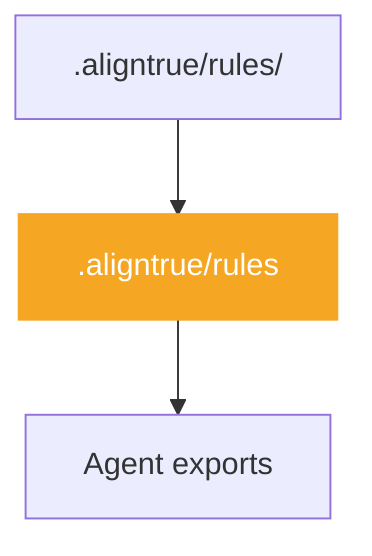
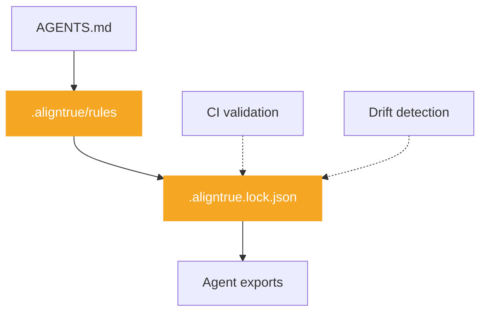

# Choosing a mode

AlignTrue has two modes optimized for different workflows. This guide helps you choose the right one.

## Quick decision

**Working alone?** → Use **solo mode** (default)

**Collaborating with a team?** → Use **team mode**

**Not sure?** Start with solo mode. You can always upgrade to team mode later when you need it.

## Feature comparison

| Feature                  | Solo mode             | Team mode                               |
| ------------------------ | --------------------- | --------------------------------------- |
| **Organization**         | Simple or organized   | Organized or complex                    |
| **Lockfile**             | ❌ Disabled           | ✅ Enabled (soft validation by default) |
| **Allow lists**          | ❌ Not required       | ✅ Required (approved sources)          |
| **Drift detection**      | ❌ Not available      | ✅ Available (aligntrue drift)          |
| **Bundle generation**    | ❌ Disabled           | ✅ Enabled (dependency merging)         |
| **Backup/restore**       | ✅ Available          | ✅ Available                            |
| **Git integration**      | ✅ Optional           | ✅ Recommended                          |
| **CI/CD validation**     | ✅ Basic checks       | ✅ Full validation + drift gates        |
| **Setup complexity**     | Low (60 seconds)      | Medium (5 minutes)                      |
| **Maintenance overhead** | Minimal               | Low to medium                           |
| **Best for**             | Individual developers | Teams and organizations                 |

**Note:** For guidance on choosing between simple, organized, or complex rule organization, see [Choosing your organization structure](/docs/01-guides/06-rule-structure).

### Architecture comparison

**Solo Mode** (default - fast iteration, local-first):



**Team Mode** (reproducible, collaborative):



## Scenario-based recommendations

### Solo developer, personal projects

**Recommended:** Solo mode

**Why:**

- Fast iteration
- No lockfile overhead
- Simple setup and maintenance
- Full customization with plugs and overlays

**Example use case:** You're building a side project and want consistent AI agent behavior across your development workflow.

```bash
aligntrue init  # Creates solo mode config by default
aligntrue sync  # Fast, no validation overhead
```

### Flexible rules for distributed users

**Recommended:** Solo mode

**Why:**

- Solo mode: Fast iteration, each user can customize rules locally
- Team mode: Reproducible builds, consistent rules for all team members

**Example use case:** You maintain a project (internal or open source) and want users to adapt rules for their environment without enforcing uniformity.

**Solo mode approach:**

```bash
# Commit rules, users can customize locally
git add .aligntrue/
git commit -m "Add AlignTrue rules"
```

**Team mode approach:**

```bash
# Enable team mode for reproducibility
aligntrue team enable
aligntrue sync
git add .aligntrue/ .aligntrue.lock.json
git commit -m "Enable AlignTrue team mode"
```

### 2-5 person team

**Recommended:** Team mode (soft lockfile)

**Why:**

- Reproducible builds across team members
- Drift detection for upstream changes
- Soft lockfile warns on drift (doesn't block)
- Allow lists for approved sources

**Example use case:** Small startup team wants consistent AI agent behavior without strict enforcement.

```bash
# Repository owner
aligntrue team enable
aligntrue sync
aligntrue team approve --current
git add .aligntrue/ .aligntrue.lock.json .aligntrue.allow
git commit -m "Enable team mode (soft)"

# Team members
git pull
aligntrue sync  # Validated against allow list
```

### 10+ person team

**Recommended:** Team mode (strict lockfile)

**Why:**

- Strict enforcement prevents drift
- All changes reviewed before merging
- Audit trail for compliance
- Consistent builds across large team

**Example use case:** Engineering team at a growing company needs consistent AI agent behavior with strict enforcement.

```bash
# Repository owner
aligntrue team enable
# Edit config: lockfile.mode: strict
aligntrue team approve git:https://github.com/AlignTrue/aligntrue/examples/aligns/global.yaml
aligntrue sync
git add .aligntrue/ .aligntrue.lock.json
git commit -m "Enable team mode (strict)"

# Team members
git pull
aligntrue sync  # Fails if lockfile doesn't match
```

### Enterprise with compliance requirements

**Recommended:** Team mode (strict) + allow lists

**Why:**

- Approved sources only (security)
- Strict lockfile enforcement (compliance)
- Audit trail (governance)
- Drift detection (monitoring)

**Example use case:** Enterprise team needs to ensure all AI agent rules come from approved sources and are consistently applied.

```bash
# Security team approves sources
aligntrue team approve sha256:abc123...  # Vendored align
aligntrue team approve internal-standards@org/rules@v2.0.0

# Development teams
aligntrue sync  # Only approved sources allowed
aligntrue drift --gates  # Fail CI if drift detected
```

## When to switch modes

### Solo → Team: When you start collaborating

Switch to team mode when:

- You add team members to your project
- You need reproducible builds
- You want drift detection
- You need approval workflows

**How to switch:**

```bash
# Enable team mode
aligntrue team enable

# Generate lockfile
aligntrue sync

# Approve current bundle
aligntrue team approve --current

# Commit team files
git add .aligntrue/config.yaml .aligntrue.allow .aligntrue.lock.json
git commit -m "Switch to team mode"
```

### Allow list quick start

```bash
# After enabling team mode and first sync
aligntrue team approve --current

# This approves your current bundle hash
# Team members can now sync with confidence
```

**Why use allow lists:**

- Security: Only approved rule sources can be used
- Compliance: Audit trail of approved changes
- Collaboration: Team lead approves, members sync

### Team → Solo: When forking for personal use

Switch to solo mode when:

- Forking a team project for personal use
- Prototyping without team overhead
- Working on a personal branch

**How to switch:**

```bash
# Edit .aligntrue/config.yaml
# Change: mode: team → mode: solo

# Remove team files (optional)
rm .aligntrue.lock.json .aligntrue.allow

# Sync
aligntrue sync
```

## What changes when you switch

### Solo → Team changes

| What changes     | Before (solo) | After (team)                               |
| ---------------- | ------------- | ------------------------------------------ |
| **Config**       | `mode: solo`  | `mode: team`                               |
| **New files**    | None          | `.aligntrue.lock.json`, `.aligntrue.allow` |
| **Validation**   | Basic schema  | Schema + allow list + lockfile             |
| **Sync speed**   | Fast          | Slightly slower (validation)               |
| **Git workflow** | Optional      | Recommended (commit lockfile)              |

### Team → Solo changes

| What changes      | Before (team)            | After (solo)          |
| ----------------- | ------------------------ | --------------------- |
| **Config**        | `mode: team`             | `mode: solo`          |
| **Files removed** | Keep lockfile/allow list | Can delete (optional) |
| **Validation**    | Full validation          | Basic schema only     |
| **Sync speed**    | Validation overhead      | Fast                  |
| **Git workflow**  | Lockfile required        | Optional              |

## Public vs private rules in solo mode

Solo mode can store rule sections in two places:

- **Public rules (repo-backed)** live in `.aligntrue/rules` and are committed alongside the rest of your project. Everyone who clones the repo gets the same rules. When you enable team mode, these sections become the shared team rules that require approval to change.
- **Private/personal rules (remote)** live in a separate private git repo and sync only with machines where you configure that remote. They remain personal even when collaborators clone the main repo.

### How to mark public rules as private

1. Configure a personal remote inside `.aligntrue/config.yaml`:

```yaml
mode: solo
storage:
  personal:
    type: remote
    url: git@github.com:you/private-rules.git
    branch: main
```

2. Run `aligntrue migrate personal` (or `aligntrue migrate personal --dry-run` to preview). The CLI launches the remote setup wizard and moves your personal sections into the private repo.
3. Run `aligntrue sync` to write the updated IR and push changes to the remote. From now on, the sections that lived in your private repo are only synced with your personal storage.

### How to bring private rules back into the repo

1. Modify `storage.personal` in `.aligntrue/config.yaml`:
   - Set `type: local` to keep sections machine-local (`.aligntrue/.local/personal/rules.md`)
   - Remove the entire `storage.personal` block to move sections back into the main repo (`.aligntrue/rules`)

2. Copy any sections you still need from:
   - `.aligntrue/.remotes/personal/rules.md` (if remote storage)
   - `.aligntrue/.local/personal/rules.md` (if local storage)
   - Or your private repo directly

   Back into `.aligntrue/rules`.

3. Run `aligntrue sync` and commit `.aligntrue/rules` to publish the now-public sections with the rest of your repo.

You can repeat these steps anytime: flip storage between repo/local/remote or rerun `aligntrue migrate personal` when you want to reclassify sections without touching the rest of your config.

## Frequently asked questions

### Can I try solo mode first and upgrade later?

Yes! This is the recommended approach. Start with solo mode to learn AlignTrue, then upgrade to team mode when you need reproducibility or collaboration features.

### What happens to my rules when I switch modes?

Your rules stay the same. Only the validation and workflow change. Your `.aligntrue/rules` file is unchanged.

### Do I need team mode for projects with multiple users?

Not necessarily. Solo mode works fine when you want users to customize locally. Use team mode if you want:

- Reproducible builds for all team members
- Strict enforcement of approved sources
- Drift detection in CI

### Can team members use different modes?

No. All team members must use the same mode (team mode) for consistent behavior. The mode is set in `.aligntrue/config.yaml` which should be committed to git.

### What's the performance difference?

Solo mode is slightly faster because it skips lockfile and allow list validation. The difference is typically <1 second per sync.

### Can I use team mode without git?

Technically yes, but not recommended. Team mode is designed for git-based collaboration. Without git, you lose the benefits of lockfile versioning and drift detection.

### What if I'm unsure?

Start with solo mode. It's simpler and you can always upgrade later. The switch takes less than 5 minutes.

## Related documentation

- [Quickstart Guide](/docs/00-getting-started/00-quickstart) - Get started with AlignTrue
- [Choosing your organization structure](/docs/01-guides/06-rule-structure) - Select the right rule organization for your project
- [Solo Developer Guide](/docs/01-guides/02-solo-developer-guide) - Complete solo mode workflows
- [Team Guide](/docs/01-guides/04-team-guide) - Complete team mode workflows
- [Team Mode Concepts](/docs/03-concepts/team-mode) - Technical details of team mode
- [FAQ](/docs/00-getting-started/03-faq) - Common questions

## Summary

**Choose solo mode if:**

- You work alone
- You want fast iteration
- You don't need reproducibility
- You're just getting started

**Choose team mode if:**

- You collaborate with others
- You need reproducible builds
- You want drift detection
- You need approval workflows

**Still unsure?** Start with solo mode. You can always upgrade to team mode later when you need it.
