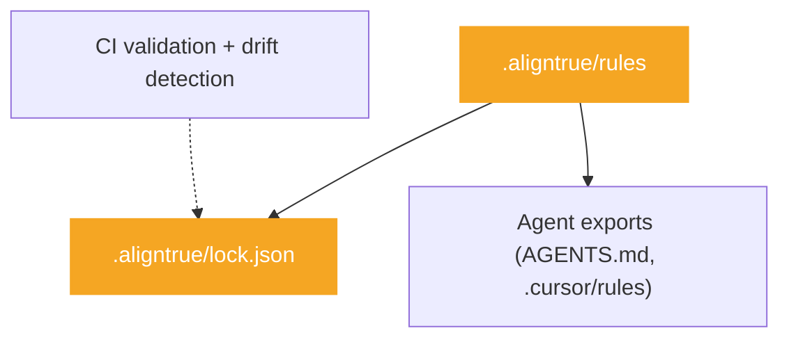

# Choosing a mode

AlignTrue has two modes optimized for different workflows. This guide helps you choose the right one.

## Quick decision

**Working alone?** → Use **solo mode** (default)

**Collaborating with a team?** → Use **team mode**

**Not sure?** Start with solo mode. You can always upgrade to team mode later when you need it.

## Feature comparison

| Feature                  | Solo mode             | Team mode                                      |
| ------------------------ | --------------------- | ---------------------------------------------- |
| **Organization**         | Simple or organized   | Organized or complex                           |
| **Lockfile**             | ❌ Disabled           | ✅ Enabled (bundle hash)                       |
| **Drift detection**      | ❌ Not available      | ✅ Available (lockfile bundle hash comparison) |
| **Backup/restore**       | ✅ Available          | ✅ Available                                   |
| **Git integration**      | ✅ Optional           | ✅ Recommended                                 |
| **CI/CD validation**     | ✅ Basic checks       | ✅ Full validation + drift gates               |
| **Setup complexity**     | Low (60 seconds)      | Medium (5 minutes)                             |
| **Maintenance overhead** | Minimal               | Low to medium                                  |
| **Best for**             | Individual developers | Teams and organizations                        |

**Note:** For guidance on organizing rules, see the rule organization sections in the [Solo developer guide](/docs/01-guides/01-solo-developer-guide#organizing-your-rules) or [Team guide](/docs/01-guides/02-team-guide#organizing-rules-for-teams).

### Architecture comparison

**Solo Mode** (default - fast iteration, local-first):


**Team Mode** (reproducible, collaborative):



## Scenario-based recommendations

### Solo developer, personal projects

**Recommended:** Solo mode

**Why:**

- Fast iteration
- No lockfile overhead
- Simple setup and maintenance
- Full customization with plugs and overlays

**Example use case:** You're building a side project and want consistent AI agent behavior across your development workflow.

```bash
aligntrue init  # Creates solo mode config by default
aligntrue sync  # Fast, no validation overhead
```

### Flexible rules for distributed users

**Recommended:** Solo mode

**Why:**

- Solo mode: Fast iteration, each user can customize rules locally
- Team mode: Reproducible builds, consistent rules for all team members

**Example use case:** You maintain a project (internal or open source) and want users to adapt rules for their environment without enforcing uniformity.

**Solo mode approach:**

```bash
# Commit rules, users can customize locally
git add .aligntrue/
git commit -m "Add AlignTrue rules"
```

**Team mode approach:**

```bash
# Enable team mode for reproducibility
aligntrue team enable
aligntrue sync
git add .aligntrue/ .aligntrue/lock.json
git commit -m "Enable AlignTrue team mode"
```

### 2-5 person team

**Recommended:** Team mode (lockfile + drift gates)

**Why:**

- Reproducible builds across team members
- Drift detection for upstream changes (`aligntrue drift --gates` in CI)
- Git-based approval via PRs

**Example use case:** Small startup team wants consistent AI agent behavior without strict enforcement.

```bash
# Repository owner
aligntrue team enable
aligntrue sync
git add .aligntrue/ .aligntrue/lock.json
git commit -m "Enable team mode (soft)"

# Team members
git pull
aligntrue sync
```

### 10+ person team

**Recommended:** Team mode (lockfile + CI drift enforcement)

**Why:**

- Drift gates in CI prevent unapproved changes
- All changes reviewed before merging
- Audit trail for compliance
- Consistent builds across large team

**Example use case:** Engineering team at a growing company needs consistent AI agent behavior with strict enforcement.

```bash
# Repository owner
aligntrue team enable
aligntrue sync
git add .aligntrue/ .aligntrue/lock.json
git commit -m "Enable team mode (lockfile)"

# Team members
git pull
aligntrue sync
# Enforce drift in CI:
#   aligntrue drift --gates
```

### Enterprise with compliance requirements

**Recommended:** Team mode (strict) with lockfiles

**Why:**

- Strict lockfile enforcement (compliance)
- Audit trail (governance)
- Drift detection (monitoring)

**Example use case:** Enterprise team needs to ensure all AI agent rules come from approved sources and are consistently applied.

```bash
# Development teams
aligntrue sync
aligntrue drift --gates  # Fail CI if drift detected
```

## When to switch modes

### Solo → Team: When you start collaborating

Switch to team mode when:

- You add team members to your project
- You need reproducible builds
- You want drift detection
- You need approval workflows

**How to switch:**

```bash
# Enable team mode (creates two-file config system)
aligntrue team enable

# Generate lockfile
aligntrue sync

# Commit team files
git add .aligntrue/config.team.yaml .aligntrue/lock.json
git commit -m "Switch to team mode"

# Personal config (.aligntrue/config.yaml) is automatically gitignored
```

**Configuration after switching:**

- `.aligntrue/config.team.yaml` (committed) - Team settings, lockfile enable, exporters
- `.aligntrue/config.yaml` (gitignored) - Your personal settings and overrides
- `.aligntrue/lock.json` (committed) - Lockfile v2 with bundle hash of team rules + team config

**Why use team mode:**

- Determinism: Lockfiles pin exact versions
- Compliance: Audit trail of approved changes
- Collaboration: Team lead approves, members sync
- Personal flexibility: Keep personal settings in gitignored config

### Team → Solo: When forking for personal use

Switch to solo mode when:

- Forking a team project for personal use
- Prototyping without team overhead
- Working on a personal branch

**How to switch:**

```bash
# Disable team mode (non-destructive, adds marker comment)
aligntrue team disable

# Your personal config is preserved
# Sync with solo mode behavior
aligntrue sync
```

**Note:** Team mode can be re-enabled later by running `aligntrue team enable` again. Your personal configuration settings are preserved.

## What changes when you switch

### Solo → Team changes

| What changes     | Before (solo)         | After (team)                                       |
| ---------------- | --------------------- | -------------------------------------------------- |
| **Config files** | 1 file (config.yaml)  | 2 files (config.team.yaml + config.yaml)           |
| **New files**    | None                  | `.aligntrue/lock.json`                             |
| **Git status**   | config.yaml committed | config.team.yaml committed, config.yaml gitignored |
| **Validation**   | Basic schema          | Schema + lockfile                                  |
| **Sync speed**   | Fast                  | Slightly slower (validation)                       |

### Team → Solo changes

| What changes          | Before (team)                            | After (solo)                                |
| --------------------- | ---------------------------------------- | ------------------------------------------- |
| **Config files**      | 2 files (config.team.yaml + config.yaml) | 1 effective file (config.yaml)              |
| **Team config**       | Loaded and enforced                      | Ignored (marker comment added)              |
| **Personal settings** | Merged with team settings                | Used directly                               |
| **Lockfile**          | Enforced validation                      | No validation (can keep file for reference) |
| **Git workflow**      | Lockfile required                        | Optional                                    |

## Rule visibility

In solo mode, you can configure where rules are stored and whether they're committed to git.

For detailed information on git visibility, approval scopes, and storage options, see [Rule sharing & privacy](/docs/01-guides/06-rule-sharing-privacy).

## Frequently asked questions

### Can I try solo mode first and upgrade later?

Yes! This is the recommended approach. Start with solo mode to learn AlignTrue, then upgrade to team mode when you need reproducibility or collaboration features.

### What happens to my rules when I switch modes?

Your rules stay the same. Only the validation and workflow change. Your `.aligntrue/rules` file is unchanged.

### Do I need team mode for projects with multiple users?

Not necessarily. Solo mode works fine when you want users to customize locally. Use team mode if you want:

- Reproducible builds for all team members
- Strict enforcement of approved sources
- Drift detection in CI

### Can team members use different modes?

No. Team mode is enforced by the committed `.aligntrue/config.team.yaml`. Personal settings in `.aligntrue/config.yaml` are gitignored and apply only to the individual machine.

### What's the performance difference?

Solo mode is slightly faster because it skips lockfile validation. The difference is typically <1 second per sync.

### Can I use team mode without git?

Technically yes, but not recommended. Team mode is designed for git-based collaboration. Without git, you lose the benefits of lockfile versioning and drift detection.

### What if I'm unsure?

Start with solo mode. It's simpler and you can always upgrade later. The switch takes less than 5 minutes.

## Related documentation

- [Quickstart Guide](/docs/00-getting-started/00-quickstart) - Get started with AlignTrue
- [Solo developer guide](/docs/01-guides/01-solo-developer-guide) - Rule organization for solo developers
- [Team guide](/docs/01-guides/02-team-guide) - Rule organization for teams
- [Solo Developer Guide](/docs/01-guides/01-solo-developer-guide) - Complete solo mode workflows
- [Team Guide](/docs/01-guides/02-team-guide) - Complete team mode workflows
- [Team Mode Concepts](/docs/03-concepts/team-mode) - Technical details of team mode
- [FAQ](/docs/00-getting-started/03-faq) - Common questions

## Summary

**Choose solo mode if:**

- You work alone
- You want fast iteration
- You don't need reproducibility
- You're just getting started

**Choose team mode if:**

- You collaborate with others
- You need reproducible builds
- You want drift detection
- You need approval workflows

**Still unsure?** Start with solo mode. You can always upgrade to team mode later when you need it.
