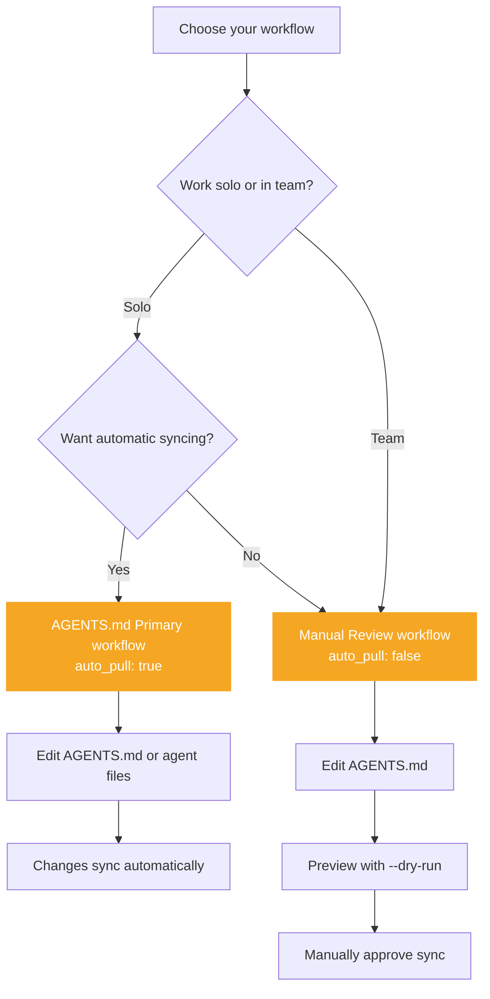

# Choosing your workflow

AlignTrue supports two primary editing workflows. Understanding which one fits your style will help you avoid conflicts and work more efficiently.

> **Quick guide** for choosing your workflow. For comprehensive sync behavior reference, see [Sync Behavior](/docs/03-concepts/sync-behavior).

## Workflow configuration mapping

**Config values → Workflow names:**

| Config Value                   | Workflow Name     | Edit Source              | Auto-pull | Best For                   |
| ------------------------------ | ----------------- | ------------------------ | --------- | -------------------------- |
| `workflow_mode: ir_source`     | Manual Review     | `.aligntrue/.rules.yaml` | ❌ No     | Teams, explicit control    |
| `workflow_mode: native_format` | AGENTS.md Primary | Agent files              | ✅ Yes    | Solo devs, rapid iteration |
| `auto_pull: false`             | Manual Review     | Any                      | ❌ No     | Reviewers, approvals       |
| `auto_pull: true`              | AGENTS.md Primary | Any                      | ✅ Yes    | Quick sync, automatic      |

When you run `aligntrue init`, AlignTrue automatically configures these values based on your choices.

## The two workflows

### AGENTS.md (Primary) workflow

**You edit in your detected agent format (or AGENTS.md) as your source of truth.**

- Rules are written in your agent-native format (`.cursor/*.mdc`, etc.) or universal `AGENTS.md`
- AlignTrue auto-detects your agents during init and configures editing automatically
- Auto-pull is enabled by default (solo mode only) to sync from primary agent back to IR
- IR automatically syncs to all configured agents
- AlignTrue detects and helps resolve conflicts

**Best for:**

- Solo developers who want minimal friction
- Quick experimentation and iteration
- When you prefer editing in agent-native formats
- Workflows where you trust automatic syncing

**Setup:**

```yaml
# .aligntrue/config.yaml
sync:
  primary_agent: "agents-md"
  auto_pull: true
```

### Manual review workflow

**You review changes before syncing to all agents.**

- Edit rules in `AGENTS.md` or a specific agent format
- Auto-pull is disabled to give you control
- Use `aligntrue sync --dry-run` to preview changes
- Manually approve with `aligntrue sync` or restore with backups

**Best for:**

- Teams where rules need review before going live
- Documentation-focused workflows
- When you want full control over sync timing
- Projects where rules are treated as code

**Setup:**

```yaml
# .aligntrue/config.yaml
sync:
  primary_agent: "agents-md"
  auto_pull: false
backup:
  auto_backup: true
```

## Comparison

| Aspect           | AGENTS.md (Primary)        | Manual Review              |
| ---------------- | -------------------------- | -------------------------- |
| Edit location    | `AGENTS.md` or agent files | `AGENTS.md` or agent files |
| Auto-pull        | Enabled                    | Disabled                   |
| Sync direction   | Two-way (automatic)        | Manual (with preview)      |
| Manual control   | Low                        | High                       |
| Conflict prompts | Rare (auto-resolved)       | Explicit (you choose)      |
| Best for         | Solo devs, rapid iteration | Teams, review workflows    |

### Visual workflow comparison



## Choosing your workflow

### Choose manual review if you:

- Work in a team that reviews rule changes
- Want to preview changes before syncing
- Need to control when rules deploy to all agents
- Use PR-based workflows for approvals
- Want full control over sync timing

### Choose AGENTS.md (primary) if you:

- Work solo and want minimal friction
- Prefer automatic syncing and less friction
- Trust auto-pull to handle changes correctly
- Want AlignTrue to "just work" in the background
- Iterate quickly and need changes reflected everywhere

## Configuring your workflow

### Automatic configuration during init

AlignTrue automatically configures your workflow mode during initialization:

**If you import existing rules:**

```bash
aligntrue init
# Detects .cursor/rules/*.mdc
# Offers to import
# Sets workflow_mode: native_format
# Enables auto_pull
```

**If you start fresh:**

```bash
aligntrue init
# No existing rules detected
# Creates AGENTS.md starter template
# Sets primary_agent: agents-md
# Enables auto_pull
```

**Explicit import:**

```bash
aligntrue init --import cursor
# Forces import from Cursor
# Sets workflow_mode: native_format
```

### First-time configuration (legacy)

On your first conflict, AlignTrue will prompt you:

```
💡 This is your first conflict. Let's configure your workflow.

? Which workflow do you prefer?
  > AGENTS.md (Primary) - automatic syncing
    Manual Review - explicit control
    Let me decide each time
```

Your choice is saved and applied automatically on future syncs.

### Manual configuration

Edit `.aligntrue/config.yaml`:

```yaml
sync:
  # Primary agent to pull from during auto-pull
  primary_agent: "agents-md" # Use AGENTS.md as source
  # or "cursor"               # Use Cursor files as source
  auto_pull: true # Enable automatic syncing
  # Set auto_pull: false for Manual Review workflow
```

### Changing workflows

You can change at any time:

```bash
# Switch primary agent
aligntrue config set sync.primary_agent agents-md

# Enable auto-pull (AGENTS.md Primary)
aligntrue config set sync.auto_pull true

# Disable auto-pull (Manual Review)
aligntrue config set sync.auto_pull false
```

## Workflow tips

### Manual review workflow tips

**1. Disable auto-pull explicitly:**

```yaml
sync:
  primary_agent: "agents-md"
  auto_pull: false # Manual control
```

**2. Preview changes before syncing:**

```bash
aligntrue sync --dry-run
```

**3. Commit AGENTS.md to version control:**

```bash
git add AGENTS.md .aligntrue/config.yaml
git commit -m "feat: Add security rules"
```

**4. Keep backups enabled:**

```yaml
backup:
  auto_backup: true
  backup_on: ["sync"]
```

### AGENTS.md (Primary) workflow tips

**1. Enable auto-pull for seamless syncing:**

```yaml
sync:
  primary_agent: "agents-md"
  auto_pull: true # Automatic sync
```

**2. Review changes regularly:**

```bash
aligntrue sync --show-diff
```

**3. Trust the automatic syncing:**

AlignTrue keeps all agent files in sync automatically when you edit AGENTS.md or any agent file.

**4. Restore backups if needed:**

```bash
aligntrue backup list
aligntrue backup restore --to <timestamp>
```

## Mixed workflows (advanced)

You can use both workflows in the same project:

1. **Different directories:** Manual Review for `/team-rules`, AGENTS.md Primary for `/personal-rules`
2. **Different branches:** Manual Review on `main`, AGENTS.md Primary on `feature/*`
3. **Different team members:** Let each dev choose their preferred workflow

**Note:** Mixed workflows require careful coordination to avoid conflicts.

## Conflict handling

### In manual review mode

Conflicts are rare because auto-pull is disabled. If you manually sync:

```bash
aligntrue sync
```

You'll be prompted with options if changes were detected in multiple files:

```
? Multiple agent files have changes. How to proceed?
  > Preview changes (--dry-run)
    Accept and sync all changes
    Abort and review manually
```

### In AGENTS.md (primary) mode

Conflicts happen when you edit different agent files between syncs:

```
⚠ Sync complete with auto-pull
  - Updated from primary agent (agents-md)
  - Synced to all other agents
```

AlignTrue automatically resolves based on your primary_agent setting.

### Manually reviewing conflicts

You can always preview before syncing:

```bash
aligntrue sync --dry-run
```

And restore previous versions if needed:

```bash
aligntrue backup restore --to <timestamp>
```

## Team considerations

### Solo mode

AGENTS.md (Primary) workflow works best. Choose based on your preference.

### Team mode

**Recommended: Manual Review workflow**

Reasons:

- Changes reviewed before syncing to all agents
- Clear control over when rules deploy
- Easier to track changes in version control
- Prevents accidental overwrites

Configuration for teams:

```yaml
mode: team
sync:
  primary_agent: "agents-md"
  auto_pull: false
  backup:
    auto_backup: true
    keep_count: 10
lockfile:
  mode: "strict"
git:
  mode: "commit"
```

## Agent detection

AlignTrue automatically detects new AI agents in your workspace during sync. This helps you stay aligned with all coding agents you use without manual configuration.

### How it works

When you run `aligntrue sync`, AlignTrue scans your workspace for agent-specific files:

- `.cursor/` - Cursor
- `AGENTS.md` - Universal format (GitHub Copilot, Jules, Amp, etc.)
- `.windsurf/` - Windsurf
- `.vscode/mcp.json` - VS Code MCP
- And 40+ other agents

If a new agent is detected (not in config and not ignored), you'll be prompted:

```
⚠ New agent detected: Windsurf
  Found: AGENTS.md

? Would you like to enable Windsurf?
  > Yes, enable and export
    No, skip for now
    Never ask about this agent
```

### Response options

**Yes, enable and export**

- Adds agent to `exporters` in config
- Syncs rules to the new agent immediately
- Agent will be included in future syncs

**No, skip for now**

- Doesn't enable the agent
- Will prompt again next time you run sync
- Useful for agents you're evaluating

**Never ask about this agent**

- Adds agent to `detection.ignored_agents` in config
- Won't prompt about this agent again
- Useful for agents you don't use even though files exist

### Configuring detection

#### Skip detection entirely

```bash
# Skip detection for this sync
aligntrue sync --no-detect

# Or configure in config
sync:
  no_detect: true
```

#### Auto-enable detected agents

```bash
# Auto-enable without prompting (useful for CI)
aligntrue sync --auto-enable

# Or configure in config
detection:
  auto_enable: true
```

#### Manage ignored agents

```bash
# Add agent to ignored list
aligntrue adapters ignore windsurf

# Manually check for new agents
aligntrue adapters detect

# Output shows new agents not in config or ignored list
```

### Configuration

```yaml
# .aligntrue/config.yaml
detection:
  auto_enable: false # Auto-enable detected agents without prompting
  ignored_agents: # Agents to never prompt about
    - windsurf
    - aider-md
```

### Use cases

**Solo developer with multiple agents:**

- Detection helps you discover and enable agents automatically
- Use "Yes" for agents you want to use
- Use "Never" for agents you installed but don't use for this project

**Team environment:**

- Set `detection.auto_enable: true` in team config
- New team members with different agents get auto-enabled
- Ensures everyone exports to all team agents

**CI/CD:**

- Use `--auto-enable` or `detection.auto_enable: true`
- Automatically handles new agents without manual intervention
- Prevents sync from hanging on prompts

### Examples

**Enabling new agent:**

```bash
$ aligntrue sync

⚠ New agent detected: Windsurf
  Found: .windsurf/rules.md

? Would you like to enable Windsurf?
  > Yes, enable and export

✓ Enabled 1 agent(s): windsurf
◇ Syncing to agents...
✓ Wrote 3 files:
  - .windsurf/rules.md
  - .cursor/rules/aligntrue.mdc
  - AGENTS.md
```

**Ignoring agent:**

```bash
$ aligntrue sync

⚠ New agent detected: Aider
  Found: .aider.conf.yml

? Would you like to enable Aider?
  > Never ask about this agent

✓ Ignoring 1 agent(s): aider-md

# Config updated:
# detection:
#   ignored_agents:
#     - aider-md
```

**Manual detection:**

```bash
$ aligntrue adapters detect

Detected 2 new agent(s):

  - Windsurf
    File: .windsurf/rules.md
  - GitHub Copilot
    File: AGENTS.md

To enable:
  aligntrue adapters enable <agent-name>

To ignore:
  aligntrue adapters ignore <agent-name>
```

## Troubleshooting

### "I keep getting conflict prompts"

Disable auto-pull for explicit control:

```bash
aligntrue config set sync.auto_pull false
```

Then use `aligntrue sync --dry-run` to preview before syncing.

### "Auto-pull synced changes I didn't expect"

Switch to Manual Review mode:

```bash
aligntrue config set sync.auto_pull false
aligntrue backup restore --to <timestamp>
```

### "Changes not syncing"

Check your primary agent:

```bash
aligntrue config get sync.primary_agent
```

Verify auto-pull setting:

```bash
aligntrue config get sync.auto_pull
```

## Related pages

- [Natural Markdown Sections](/docs/04-reference/natural-markdown-sections) - Authoring rules with sections and fingerprints
- [Sync behavior](/docs/03-concepts/sync-behavior) - How auto-pull and sync work
- [Sync behavior](/docs/03-concepts/sync-behavior) - Technical sync details
- [Troubleshooting conflicts](/docs/05-troubleshooting/conflicts) - Resolving conflicts
- [Team mode](/docs/03-concepts/team-mode) - Team workflows and lockfiles
