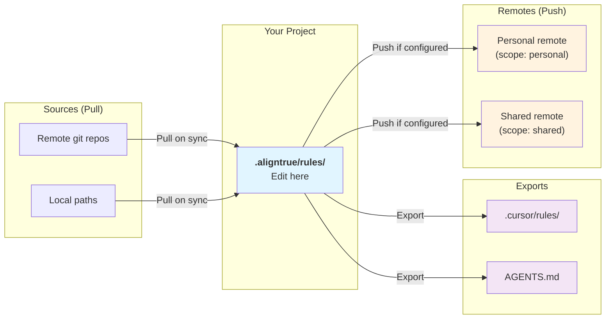

# Rule sharing & privacy

This guide helps you control three independent aspects of your rules: who sees them, whether they need approval, and where they sync.

## Quick decision table

Not sure how to configure your rules? Find your use case below:

| What you want                                      | Go to                                                            |
| -------------------------------------------------- | ---------------------------------------------------------------- |
| Keep a rule private to just this machine (no sync) | [Scenario 1](#scenario-1-keep-a-rule-private-to-my-machine)      |
| Sync personal rules across all my machines         | [Scenario 2](#scenario-2-sync-personal-rules-across-my-machines) |
| Share team standards normally (approval required)  | [Scenario 3](#scenario-3-share-team-rules-normally)              |
| Publish rules for others to use as a pack          | [Scenario 4](#scenario-4-publish-rules-for-others-to-use)        |

## Publishing rules (for maintainers)

### Setting up a shared rules repository

Create a repository to publish your rules:

1. **Create a repository** on GitHub, GitLab, or your preferred git host:
   - For public sharing: Create a public repository
   - For team/private sharing: Create a private repository with appropriate access

2. **Configure remote backup** in `.aligntrue/config.yaml`:

```yaml
remotes:
  shared: git@github.com:username/shared-rules.git
```

3. **Push your rules**:

```bash
aligntrue sync  # Exports to agents and pushes to backup
# Or just push:
aligntrue backup push
```

4. **Share the repository URL** with others. They can consume your rules as a source:

```yaml
# Their config
sources:
  - type: git
    url: https://github.com/username/shared-rules.git
    ref: main
```

### Your rules repository structure

As a rules maintainer:

1. **Edit rules locally** - Make changes in `.aligntrue/rules/`
2. **Test changes** - Run `aligntrue sync` to verify exports
3. **Push to remote** - Your backup auto-pushes on sync

Your rules repository structure:

```
your-rules-repo/
  typescript.md
  testing.md
  guides/
    react.md
    vue.md
```

Consumers receive these files when they sync from your repository.

### Separating public and private rules

You may want to share some rules publicly while keeping others private. Use multiple backup destinations:

```yaml
remotes:
  shared:
    url: git@github.com:username/public-rules.git
  personal:
    url: git@github.com:username/private-rules.git
```

Then use `scope` in rule frontmatter to control routing.

## Privacy controls

The three dimensions of rule privacy:

| Dimension          | Setting                       | What it controls                                | Values                                                                                                |
| ------------------ | ----------------------------- | ----------------------------------------------- | ----------------------------------------------------------------------------------------------------- |
| **Git visibility** | `gitignore: true/false`       | Is the rule committed to your repo?             | `false` (committed) or `true` (gitignored)                                                            |
| **Approval scope** | `scope: team/personal/shared` | Does it require team approval? (team mode only) | `team` (requires approval), `personal` (bypass approval), `shared` (tracked, routed to shared remote) |
| **Remote routing** | `remotes` config              | Where are rules synced?                         | Personal remote, shared remote, or custom remotes                                                     |

These dimensions are **largely independent**. A rule can be:

- Gitignored but tracked in lockfile
- Personal-scope but committed to the repo
- Gitignored and personal-scope (fully private)
- Shared-scope for publishing

### How data flows: Sources vs Remotes

Understanding the difference between sources and remotes is key to setting up your workflow:



### Consumer vs Maintainer roles

| Role           | What you do            | Config    | Example                                           |
| -------------- | ---------------------- | --------- | ------------------------------------------------- |
| **Consumer**   | Pull rules from others | `sources` | Pull TypeScript rules from a shared repo          |
| **Maintainer** | Create and push rules  | `remotes` | Maintain personal rules, push to personal remote  |
| **Both**       | Both pull and push     | Both      | Pull team rules, maintain personal customizations |

You can have multiple roles simultaneously with different rules. For example:

- Pull team standards via `sources`
- Maintain personal preferences locally
- Push personal rules to `remotes.personal`
- Push curated rules to `remotes.shared` for your team

## Common scenarios

### Scenario 1: Keep a rule private to my machine

Use this when the rule is machine-specific or sensitive.

```yaml
---
title: My SSH Configuration
gitignore: true
scope: personal
---
```

**Result:**

- Not committed to git
- Not in lockfile
- Not synced anywhere

### Scenario 2: Sync personal rules across my machines

Use this to access the same personal preferences on all your machines.

```yaml
---
title: My Editor Shortcuts
scope: personal
---
```

Plus configure `.aligntrue/config.yaml`:

```yaml
# Pull personal rules from remote
sources:
  - type: git
    url: git@github.com:yourusername/personal-rules.git
    personal: true

# Push personal rules to the same remote
remotes:
  personal: git@github.com:yourusername/personal-rules.git
```

**Result:**

- Rules committed to your repo
- Not in team lockfile (won't trigger drift)
- Pulled from and pushed to your personal remote
- Accessible on all your machines

### Scenario 3: Share team rules normally

Use this for shared team standards.

```yaml
---
title: Team Security Standards
---
```

No special config needed.

**Result:**

- Committed to git
- Tracked in lockfile (requires team approval to change)
- Stays in main repo only

### Scenario 4: Publish rules for others to use

Use this when you want to share a curated set of rules with your team or the community.

```yaml
---
title: React Best Practices
scope: shared
---
```

Plus configure `.aligntrue/config.yaml`:

```yaml
remotes:
  shared: git@github.com:yourusername/react-rules-pack.git
```

**Result:**

- Committed and tracked in lockfile
- Synced to the shared remote for publishing
- Others can consume via `sources`

## Setting git visibility

Use `gitignore: true` in rule frontmatter to exclude from git:

```yaml
---
title: My Private Notes
gitignore: true
---
# Content here won't be committed
```

AlignTrue will automatically add matching patterns to `.gitignore`.

### Git visibility table

| Setting                      | Behavior                             | Use case                                  |
| ---------------------------- | ------------------------------------ | ----------------------------------------- |
| `gitignore: false` (default) | Rule file committed to git           | Team standards, shared guidelines         |
| `gitignore: true`            | Rule file gitignored (not committed) | Sensitive configs, machine-specific notes |

## Setting approval scope

Use `scope` in rule frontmatter to control lockfile tracking and remote routing:

```yaml
---
title: My Preferences
scope: personal
---
# This rule won't trigger lockfile changes
```

### Scope values and behavior

| Scope            | Lockfile | Remote routing               | Use case                   |
| ---------------- | -------- | ---------------------------- | -------------------------- |
| `team` (default) | Tracked  | Stays in main repo           | Shared team standards      |
| `personal`       | Excluded | Routes to `remotes.personal` | Individual preferences     |
| `shared`         | Tracked  | Routes to `remotes.shared`   | Published rules for others |

**Team-scope rules:**

- Tracked in lockfile (changes require approval)
- Stay in main repo only
- Good for shared standards

**Personal-scope rules:**

- Excluded from lockfile
- Can change freely
- Automatically synced to `remotes.personal` if configured
- Good for individual preferences

**Shared-scope rules:**

- Tracked in lockfile (require team approval)
- Synced to `remotes.shared` for publishing
- Good for rule packs you want to share

## Remote routing with sources and remotes

### Pulling rules from a remote source

Add a git source using the CLI or config:

**CLI:**

```bash
# Add as a connected source (pulls on sync)
aligntrue add source git@github.com:yourusername/personal-rules.git --personal
```

**Config:**

```yaml
# .aligntrue/config.yaml
sources:
  - type: local
    path: .aligntrue/rules
  - type: git
    url: git@github.com:yourusername/personal-rules.git
    personal: true
```

The `personal: true` flag on a source:

- Marks all rules from that source as `scope: personal`
- Auto-applies `gitignore: true`
- SSH URLs (`git@...`) automatically get `gitignore: true`

### Pushing rules to remote repositories

Configure remotes using the CLI or config:

**CLI:**

```bash
# Add personal remote (for scope: personal rules)
aligntrue add remote git@github.com:yourusername/personal-rules.git --personal

# Add shared remote (for scope: shared rules)
aligntrue add remote git@github.com:yourusername/shared-rules.git --shared
```

**Config:**

```yaml
# .aligntrue/config.yaml
remotes:
  # Personal-scope rules go here
  personal: git@github.com:yourusername/personal-rules.git

  # Shared-scope rules go here (for publishing)
  shared: git@github.com:yourusername/shared-rules.git

  # Optional: fine-grained pattern-based routing
  custom:
    - id: typescript
      url: git@github.com:yourusername/typescript-rules.git
      include: ["typescript*.md", "eslint*.md"]
```

### How routing works

1. **Scope-based routing** (primary): Rules are routed based on their `scope` frontmatter
   - `scope: personal` rules → `remotes.personal`
   - `scope: shared` rules → `remotes.shared`
   - `scope: team` rules → stay in main repo only

2. **Custom pattern routing** (additive): Use `custom` for fine-grained control
   - Files matching patterns go to those remotes **in addition** to scope-based routing
   - A rule can go to multiple destinations
   - Useful for creating thematic bundles (e.g., all TypeScript rules)

## Using shared rules (for consumers)

### Option 1: Link as a source (get updates)

Add the repository as a source to get ongoing updates:

```bash
aligntrue add --link https://github.com/username/shared-rules.git
```

Or manually add to config:

```yaml
sources:
  - type: git
    url: https://github.com/username/shared-rules.git
    ref: main # Or a specific tag/commit for stability
```

Run `aligntrue sync` to pull updates.

### Option 2: One-time import (copy)

Copy rules to your local `.aligntrue/rules/`:

```bash
aligntrue add https://github.com/username/shared-rules.git
```

This copies the rules locally. You won't get updates unless you run `add` again.

## Version pinning

For stability, consumers can pin to a specific version:

```yaml
sources:
  - type: git
    url: https://github.com/username/shared-rules.git
    ref: v1.2.0 # Pin to tag
```

Or a specific commit:

```yaml
sources:
  - type: git
    url: https://github.com/username/shared-rules.git
    ref: abc123def # Pin to commit SHA
```

## Personal rules across machines

Use remote backup to sync your personal rules across multiple machines:

### Machine A (primary)

```yaml
remotes:
  personal:
    url: git@github.com:username/my-rules.git
```

### Machine B (secondary)

Option 1: Use as source (pull only):

```yaml
sources:
  - type: git
    url: git@github.com:username/my-rules.git
    personal: true # Skip team approval
```

Option 2: Also backup from Machine B:

```yaml
sources:
  - type: git
    url: git@github.com:username/my-rules.git
    personal: true

remotes:
  personal:
    url: git@github.com:username/my-rules.git
```

With Option 2, edits on either machine will push to the remote. Be careful of conflicts.

## Best practices

### For maintainers

- Use semantic versioning tags for releases
- Document breaking changes in your repository
- Keep rules focused and well-documented
- Consider separating stable rules from experimental ones

### For consumers

- Pin to tags or commits for production use
- Review updates before merging in team mode
- Fork repositories for critical dependencies

### General do's

- Use `gitignore: true` for rules with sensitive content
- Use `scope: personal` for individual preferences in team mode
- Use `scope: shared` for rules you want to publish to others
- Use `sources` with `personal: true` to pull personal rules from remote
- Configure `remotes.personal` to sync personal rules across machines
- Use `remotes.shared` to publish curated rule packs

### General don'ts

- Use `scope: personal` to bypass team review for shared standards
- Assume gitignored rules are backed up (configure `remotes.personal` for that)
- Configure the same URL as both a source and a remote (creates conflicts)

## Complete workflow example

Setting up personal rules that sync across machines:

**Step 1: Create a private repo**

```bash
# On GitHub, create: aligntrue-personal-rules (private)
```

**Step 2: Configure AlignTrue**

Using CLI commands:

```bash
# Import existing rules from your personal repo (one-time copy)
aligntrue add git@github.com:yourusername/aligntrue-personal-rules.git

# OR add as connected source (pulls updates on sync)
aligntrue add source git@github.com:yourusername/aligntrue-personal-rules.git --personal

# Add as push destination
aligntrue add remote git@github.com:yourusername/aligntrue-personal-rules.git --personal
```

Or configure directly in YAML:

```yaml
# .aligntrue/config.yaml
sources:
  - type: local
    path: .aligntrue/rules
  - type: git
    url: git@github.com:yourusername/aligntrue-personal-rules.git
    personal: true

remotes:
  personal: git@github.com:yourusername/aligntrue-personal-rules.git

exporters:
  - cursor
  - agents
```

**Step 3: Create a personal rule**

```yaml
---
title: My Shortcuts
scope: personal
---
## VS Code Shortcuts

- Cmd+Shift+L: Format document
- Cmd+Shift+U: Convert to uppercase
```

**Step 4: Sync**

```bash
aligntrue sync
```

Now your personal rules are:

- Pulled from your personal repo on every sync
- Available locally in `.aligntrue/rules/`
- Exported to your agents
- Pushed back to your personal repo

On another machine, just clone the project and run `aligntrue sync`—your personal rules sync automatically!

## Troubleshooting

### Rule still showing in git status after marking gitignore

Run sync again to update `.gitignore`:

```bash
aligntrue sync
git status
```

If still showing, manually remove from git cache:

```bash
git rm --cached .aligntrue/rules/rulename.md
git status  # Should now be gitignored
```

### Personal-scope rules still in lockfile

Make sure `scope: personal` is in the rule's frontmatter:

```yaml
---
title: My Rule
scope: personal
---
```

Then sync and verify:

```bash
aligntrue sync
cat .aligntrue.lock.json | grep rulename  # Should NOT appear
```

### Rules not syncing to remotes

Check your configuration:

1. Is `remotes` configured?
2. Do your rules have the correct `scope`?
3. Is the remote URL accessible? Try: `git ls-remote <url>`
4. Check for conflicts: same URL as a source? (not allowed)

Run verbose sync to see details:

```bash
aligntrue sync --verbose
```

## Related

- [Team Mode](/docs/03-concepts/team-mode) - How approval scopes work in team workflows
- [Working with external sources](/docs/01-guides/04-external-sources) - Adding and customizing external rules
- [Personal Repository Setup](/docs/04-reference/personal-repo-setup) - SSH and HTTPS configuration
- [Source and remote issues](/docs/05-troubleshooting/source-remote-issues) - Resolving connection issues
