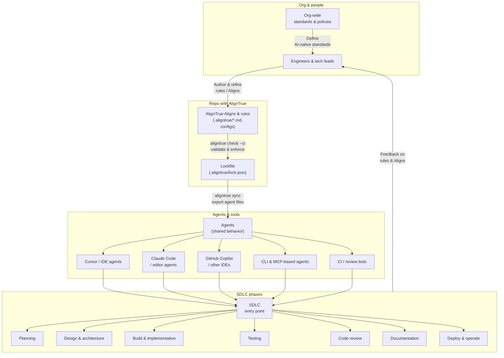

# AI-native engineering

Modern engineering teams are moving from "AI autocomplete" to **AI-native workflows**, where agents participate in planning, design, coding, testing, review, docs, and ops.

This guide (based on OpenAI's guide [here](https://cdn.openai.com/business-guides-and-resources/building-an-ai-native-engineering-team.pdf)) shows how to use AlignTrue as the **rules layer** for that world: encode how agents should behave across your SDLC, keep every agent (Cursor, Copilot, Claude Code, etc.) in sync, and give humans clear ownership while agents do the busy work.

> **New to AlignTrue?** Start with the [Quickstart](/docs/00-getting-started/00-quickstart) and [Introduction](/docs).

## Core principles

These are the high-leverage ideas that matter most for AI-native teams.

### Treat agent behavior as code

Store AI rules, Aligns, and config in git. Review changes through PRs. Validate rules in CI with `aligntrue check --ci`. Use lockfiles in [team mode](/docs/03-concepts/team-mode) for reproducible agent behavior.

**Workflow:**

```bash
# Edit rules
vim AGENTS.md

# Validate before committing
aligntrue check

# CI validates on every PR
aligntrue check --ci
```

See [CI/CD integration](/docs/01-guides/07-ci-cd-integration) for setup details.

### One source of truth, many agents

Agents should not each have their own "secret" rules. With AlignTrue, you write rules once in markdown or IR (Aligns), and AlignTrue exports native formats for 33 agents (Cursor `.mdc`, AGENTS.md, MCP configs, vendor files, etc.). Edit source sync keeps them aligned automatically.

**How it works:**

1. Write rules in `.aligntrue/rules/` directory (the single source of truth)
2. Run `aligntrue sync` to export to all configured agents
3. All agents stay in sync from one source

See [Multi-agent workflows](/docs/01-guides/05-multi-agent-workflows) and [Agent support](/docs/04-reference/agent-support) for details.

### Encode "delegate → review → own" into rules

Most AI-native guidance boils down to:

- **Delegate** repetitive work to agents
- **Review** their output with tools + humans
- **Own** strategy, architecture, and risk

AlignTrue makes this explicit through:

- [Aligns](/docs/02-customization/plugs) that define what agents may do
- [Overlays](/docs/02-customization/overlays) that tighten or relax behavior per area
- [Scopes](/docs/02-customization/scopes) that say where rules apply

See the [Customization overview](/docs/02-customization) for examples.

---

## SDLC phases with agents

Coding agents now participate across the entire software development lifecycle. Here's how agents help in each phase, what engineers do instead, and how AlignTrue ensures consistent behavior.

### Plan

**How agents help:** Coding agents can read feature specifications, cross-reference them against the codebase, flag ambiguities, break work into subcomponents, and trace code paths to show which services are involved—work that previously required hours or days of manual investigation.

**Delegate → Review → Own:**

- **Delegate:** Agents take the first pass at feasibility and architectural analysis. They read specs, map to the codebase, identify dependencies, and surface ambiguities or edge cases.
- **Review:** Engineers review the agent's findings to validate accuracy, assess completeness, and ensure estimates reflect real technical constraints. Story point assignment, effort sizing, and identifying non-obvious risks still require human judgment.
- **Own:** Strategic decisions—prioritization, long-term direction, sequencing, and tradeoffs—remain human-led. Teams may ask agents for options, but final responsibility stays with the organization.

**AlignTrue enables:** Encode planning workflows into rules. Define what agents should analyze (dependencies, edge cases, feasibility), how they should present findings, and what requires human review. Use [Aligns](/docs/02-customization/plugs) to specify planning conventions and [scopes](/docs/02-customization/scopes) to apply different rules per service or team.

### Design

**How agents help:** Agents accelerate prototyping by scaffolding boilerplate code, building project structures, and implementing design tokens or style guides. They can convert designs directly into code, suggest accessibility improvements, and analyze the codebase for user flows or edge cases. This enables iterating on multiple prototypes in hours instead of days.

**Delegate → Review → Own:**

- **Delegate:** Agents handle initial implementation work—scaffolding projects, generating boilerplate, translating mockups into components, and applying design tokens or style guides.
- **Review:** Teams review agent output to ensure components follow design conventions, meet quality and accessibility standards, and integrate correctly with existing systems.
- **Own:** Teams own the overarching design system, UX patterns, architectural decisions, and final direction of the user experience.

**AlignTrue enables:** Define design system rules, component patterns, and accessibility standards in your rules. Use [overlays](/docs/02-customization/overlays) to customize how agents apply design tokens and [scopes](/docs/02-customization/scopes) to enforce different patterns per app or directory.

### Build

**How agents help:** Agents can produce full features end-to-end—data models, APIs, UI components, tests, and documentation—in a single coordinated run. With sustained reasoning across the entire codebase, they handle decisions that once required engineers to manually trace code paths. They generate boilerplate matching conventions: error handling, telemetry, security wrappers, or style patterns.

**Delegate → Review → Own:**

- **Delegate:** Agents draft entire feature implementations based on written specs, search and modify code across dozens of files while maintaining consistency, and generate boilerplate that matches conventions.
- **Review:** Engineers focus on refining core logic, establishing scalable architectural patterns, and ensuring components meet quality and reliability standards.
- **Own:** Engineers own architecture, design decisions, and code quality. They validate agent output, ensure it meets standards, and own what ships to production.

**AlignTrue enables:** Encode your coding standards, testing requirements, and architectural patterns directly into rules. Define what "good code" means for your project, how agents should structure features, and what conventions they should follow. Use Aligns for language-specific or framework-specific patterns.

### Review

**How agents help:** AI code reviewers can actually execute parts of the code, interpret runtime behavior, and trace logic across files and services—unlike traditional static analysis tools that rely only on pattern matching. This allows every PR to receive a consistent baseline of attention, catching issues that contributors can correct before pulling in another engineer.

**Delegate → Review → Own:**

- **Delegate:** Engineers delegate the initial code review to agents, which may happen multiple times before the pull request is marked ready for teammate review.
- **Review:** Engineers still review pull requests, but with more emphasis on architectural alignment—are composable patterns being implemented, are correct conventions being used, does functionality match requirements.
- **Own:** Engineers ultimately own the code that is deployed to production. They must ensure it functions reliably and fulfills intended requirements.

**AlignTrue enables:** Define code review standards and priorities in your rules. Specify what agents should check (security, performance, maintainability), how they should prioritize feedback, and what requires human attention. Use overlays to customize review severity per rule or project area.

### Document

**How agents help:** Agents are highly capable of summarizing functionality based on reading codebases. They can write about how parts of the codebase work, generate system diagrams in syntaxes like mermaid, and review commits to summarize key changes. Since agents can be run programmatically, they can be incorporated into release workflows, making documentation a built-in part of the delivery pipeline.

**Delegate → Review → Own:**

- **Delegate:** Fully hand off low-risk, repetitive work to agents like first-pass summaries of files and modules, basic descriptions of inputs and outputs, dependency lists, and short summaries of pull-request changes.
- **Review:** Engineers review and edit important docs drafted by agents like overviews of core services, public API and SDK docs, runbooks, and architecture pages before anything is published.
- **Own:** Engineers remain responsible for overall documentation strategy and structure, standards and templates agents follow, and all external-facing or safety-critical documentation involving legal, regulatory, or brand risk.

**AlignTrue enables:** Define documentation standards, templates, and conventions in your rules. Specify what agents should document (APIs, architecture, workflows), how they should structure documentation, and what requires human review. Include documentation guidelines in your AGENTS.md or Aligns.

### Deploy & maintain

**How agents help:** By connecting agents to logging tools via MCP servers and providing codebase context, engineers can prompt agents to look at errors for a specific endpoint. Agents can then traverse the codebase and find relevant bugs or performance issues. They can also use command-line tools to examine git history and identify specific changes that might result in issues captured in log traces.

**Delegate → Review → Own:**

- **Delegate:** Many operational tasks can be delegated to agents—parsing logs, surfacing anomalous metrics, identifying suspect code changes, and even proposing hotfixes.
- **Review:** Engineers vet and refine AI-generated diagnostics, confirm accuracy, and approve remediation steps. They ensure fixes meet reliability, security, and compliance standards.
- **Own:** Critical decisions stay with engineers, especially for novel incidents, sensitive production changes, or situations where model confidence is low. Humans remain responsible for judgment and final sign-off.

**AlignTrue enables:** Encode operational workflows and debugging patterns into rules. Define how agents should analyze logs, what metrics to prioritize, and how they should present findings. Use Aligns for operational conventions and incident response procedures.

**Example:** Teams use AlignTrue to ensure all agents follow the same operational standards when analyzing logs or tracing issues. By defining these patterns once in rules, every agent—whether in IDE, CLI, or CI—applies consistent triage and diagnostic workflows.



---

## Quick setup: make a repo AI-native

This is the 80/20 setup that works for most teams.

### Step 1: Choose your mode

**Solo mode (default):**

Best for individual developers or small teams. Fast iteration, no lockfile overhead.

```bash
npm install -g aligntrue
aligntrue init
aligntrue sync
```

See [Solo developer guide](/docs/01-guides/01-solo-developer-guide) for details.

**Team mode:**

Best for teams that need versioned, reviewed rule sets enforced in CI.

```bash
npm install -g aligntrue
aligntrue init
aligntrue team enable
aligntrue sync
```

See [Team mode](/docs/03-concepts/team-mode) and [Team guide](/docs/01-guides/02-team-guide) for details.

### Step 2: Configure exporters

Edit `.aligntrue/config.yaml` to specify which agents you use:

```yaml
exporters:
  - cursor # Cursor IDE
  - agents # GitHub Copilot, Claude Code, Aider
  - copilot # GitHub Copilot specific format
  - claude # Claude Code specific format
```

See [Agent support](/docs/04-reference/agent-support) for the full list.

### Step 3: Write your rules

Edit your rules in `.aligntrue/rules/`:

```markdown
# Project rules

## Code standards

Use TypeScript strict mode. Prefer explicit types over `any`.

## Testing

Write tests before implementing features. Use Vitest for unit tests.
```

### Step 4: Sync to agents

```bash
aligntrue sync
```

This exports your rules to all configured agents. Run `aligntrue sync --dry-run` first to preview changes.

---

## Common workflows

### Daily iteration

```bash
# Edit rules
vim AGENTS.md

# Preview changes
aligntrue sync --dry-run

# Apply changes
aligntrue sync
```

### Adding a new agent

1. Add exporter to `.aligntrue/config.yaml`
2. Run `aligntrue sync`
3. Verify the new agent file was created

### Team collaboration

1. Enable [team mode](/docs/03-concepts/team-mode)
2. Commit rules to git
3. Review rule changes in PRs
4. CI validates with `aligntrue check --ci`

See [Team guide](/docs/01-guides/02-team-guide) for complete workflows.

---

## Next steps

- [Sync behavior](/docs/03-concepts/sync-behavior) - Understand how rules sync to agents
- [Multi-agent workflows](/docs/01-guides/05-multi-agent-workflows) - Use multiple agents simultaneously
- [Customization](/docs/02-customization) - Plugs, overlays, and scopes
- [Solo developer guide](/docs/01-guides/01-solo-developer-guide#organizing-your-rules) - Organize rules for your project size
