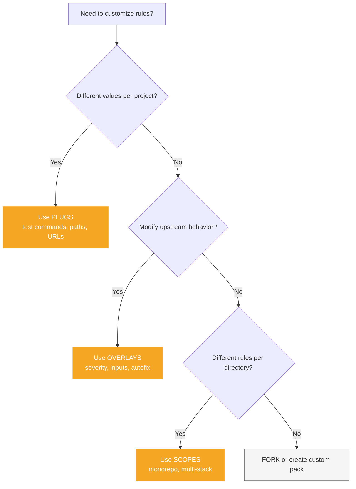

# Customization overview

AlignTrue provides three complementary mechanisms for customizing rules to fit your project, stack, and team needs without forking upstream packs.

## The three pillars

### Plugs - Fill template slots

**What:** Dynamic configuration slots that get filled with stack-specific or project-specific values.

**When to use:**

- Test commands that vary by stack (`pytest` vs `pnpm test`)
- File paths specific to your project structure
- URLs, author names, or other project metadata
- Any value that differs between projects using the same rules

**Example:**

```yaml
# Rule with plug
guidance: |
  Run tests with: [[plug:test.cmd]]

plugs:
  slots:
    test.cmd:
      description: "Command to run tests"
      format: command
      required: true
      example: "pytest -q"
  fills:
    test.cmd: "pnpm test" # Your project's value
```

[Learn more about plugs →](/docs/02-customization/plugs)

### Overlays - Override rule properties

**What:** Declarative overrides that modify upstream rule properties without forking.

**When to use:**

- Adjust severity levels (warning → error, or disable entirely)
- Add check inputs for project-specific thresholds
- Remove autofix while keeping the check
- Temporary adjustments during migration periods

**Example:**

```yaml
overlays:
  overrides:
    - selector: "rule[id=no-console-log]"
      set:
        severity: "error" # Upgrade from warning to error
```

[Learn more about overlays →](/docs/02-customization/overlays)

### Scopes - Apply rules by path

**What:** Path-based rule application for monorepos with different requirements per directory.

**When to use:**

- Monorepos with frontend + backend + services
- Different tech stacks in different directories
- Team boundaries within a monorepo
- Progressive rule adoption (strict in new code, lenient in legacy)

**Example:**

```yaml
scopes:
  - path: "apps/web"
    include: ["**/*.ts", "**/*.tsx"]
    rulesets: ["nextjs-rules", "react-rules"]

  - path: "packages/api"
    include: ["**/*.ts"]
    rulesets: ["node-rules", "api-rules"]
```

[Learn more about scopes →](/docs/02-customization/scopes)

## Decision tree

Use this flowchart to choose the right customization mechanism:



## Feature comparison

| Feature         | Plugs                 | Overlays              | Scopes              |
| --------------- | --------------------- | --------------------- | ------------------- |
| **Purpose**     | Fill template slots   | Override properties   | Apply rules by path |
| **Granularity** | Per-slot              | Per-rule              | Per-directory       |
| **Use case**    | Stack-specific values | Severity adjustments  | Monorepo structure  |
| **Determinism** | Resolved at export    | Applied before export | Applied at load     |
| **Team mode**   | Fills can be shared   | Tracked in lockfile   | Defined in config   |
| **Solo mode**   | Repo-local fills      | Repo-local overrides  | Repo-local scopes   |

## Solo vs team patterns

### Solo developer patterns

**Plugs:**

- Set repo-local fills for your project (`aligntrue plugs set test.cmd "pnpm test"`)
- Override stack pack defaults with your preferences
- Quick iteration without committing to team standards

**Overlays:**

- Temporarily disable strict rules during refactoring
- Adjust severity for personal workflow
- Experiment with rule configurations

**Scopes:**

- Organize personal monorepo with different rules per app
- Progressive adoption (strict in new code, lenient in old)
- Stack-specific rules (Next.js vs Node.js vs Python)

### Team patterns

**Plugs:**

- Stack packs provide default fills
- Teams override with org-specific values
- Shared fills committed to repo for consistency

**Overlays:**

- Team-wide severity preferences
- Adjust third-party packs to team standards
- Document customization decisions in config

**Scopes:**

- Team boundaries in monorepo (team A owns `apps/web`, team B owns `packages/api`)
- Shared base rules + scope-specific overrides
- Gradual rollout (strict in new modules, lenient in legacy)

## Integration and order

When using multiple customization features together, they apply in this order:

1. **Scopes** - Filter rules by path
2. **Plugs** - Resolve template slots
3. **Overlays** - Apply property overrides

**Example workflow:**

```yaml
# 1. Scopes: Apply different rules to web vs api
scopes:
  - path: "apps/web"
    rulesets: ["nextjs-rules"]
  - path: "packages/api"
    rulesets: ["node-rules"]

# 2. Plugs: Fill stack-specific values
plugs:
  fills:
    test.cmd: "pnpm test"
    docs.url: "https://docs.example.com"

# 3. Overlays: Adjust severity for team
overlays:
  overrides:
    - selector: "rule[id=no-console-log]"
      set:
        severity: "error"
```

## Common scenarios

### Scenario 1: Solo dev with Next.js + Node.js monorepo

**Goal:** Different rules for frontend and backend, custom test commands

**Solution:**

- **Scopes** for frontend vs backend
- **Plugs** for test commands
- **Overlays** to adjust severity during migration

```yaml
scopes:
  - path: "apps/web"
    rulesets: ["nextjs-rules"]
  - path: "packages/api"
    rulesets: ["node-rules"]

plugs:
  fills:
    test.cmd: "pnpm test"

overlays:
  overrides:
    - selector: "rule[id=strict-null-checks]"
      set:
        severity: "warn" # Temporarily downgrade during migration
```

### Scenario 2: Team sharing TypeScript standards

**Goal:** Consistent TypeScript rules across team, team-specific severity preferences

**Solution:**

- Pull upstream TypeScript pack
- **Overlays** for team severity preferences
- **Plugs** for org-specific values

```yaml
sources:
  - git: https://github.com/org/typescript-standards
    ref: v1.0.0

plugs:
  fills:
    org.name: "Acme Corp"
    test.cmd: "pnpm test"

overlays:
  overrides:
    - selector: "rule[id=no-any]"
      set:
        severity: "error" # Team treats this as error
```

### Scenario 3: Monorepo with multiple teams

**Goal:** Shared base rules, team-specific overrides, different stacks per team

**Solution:**

- **Scopes** for team boundaries
- Shared base pack + team-specific packs
- **Overlays** for team preferences

```yaml
scopes:
  - path: "apps/web"
    rulesets: ["base-rules", "nextjs-rules"]
  - path: "apps/mobile"
    rulesets: ["base-rules", "react-native-rules"]
  - path: "services/api"
    rulesets: ["base-rules", "node-rules"]

overlays:
  overrides:
    # Team A: Strict on web
    - selector: "rule[id=accessibility]"
      set:
        severity: "error"
```

## Vendor bags (passive)

**Note:** Vendor bags are a passive feature that preserves agent-specific metadata during two-way sync. You don't need to configure or manage them - they work automatically.

**What they do:**

- Preserve Cursor-specific fields when importing from `.mdc` files
- Store agent metadata in `vendor.<agent>.*` namespace
- Exclude volatile fields (like session IDs) from hashing
- Enable lossless round-trips between IR and agent formats

**When they matter:**

- Using two-way sync (editing agent files, pulling back to IR)
- Importing from agent-specific formats
- Preserving agent hints and metadata

You don't need to understand vendor bags to use AlignTrue effectively - they're an implementation detail.

## Next steps

- [Plugs guide](/docs/02-customization/plugs) - Detailed plug usage with examples
- [Overlays guide](/docs/02-customization/overlays) - Fork-safe customization patterns
- [Scopes guide](/docs/02-customization/scopes) - Monorepo rule organization
- [Solo developer guide](/docs/01-guides/04-solo-developer-guide) - Complete solo workflow
- [Team guide](/docs/01-guides/05-team-guide) - Team collaboration patterns

## CLI commands

- `aligntrue plugs list` - List slots and fills
- `aligntrue plugs set <key> <value>` - Set fill value
- `aligntrue override add` - Create overlay
- `aligntrue override status` - View overlays
- `aligntrue scopes` - List configured scopes

See [CLI Reference](/docs/04-reference/cli-reference) for complete command documentation.
