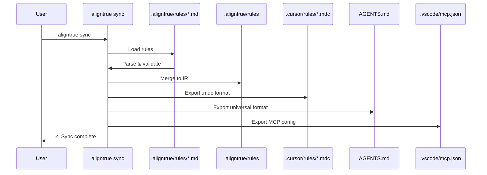

# Sync behavior

Complete technical reference for AlignTrue's sync system. This document is the source of truth for what AlignTrue actually does—no marketing, no aspirations, just the real behavior.

## Rule management

AlignTrue uses **unidirectional sync**: edit files in `.aligntrue/rules/`, run sync, and changes flow to all configured agents.

**When you run `aligntrue sync`:**

1. **Load config** from `.aligntrue/config.yaml`
2. **Check for team mode** - if enabled, validate lockfile
3. **Load rules** from `.aligntrue/rules/*.md` (your source of truth)
4. **Detect edits** by checking modification times (mtime)
5. **Create backup** (if enabled) - backs up both internal state and agent files
6. **Merge to IR** - your rules are loaded into `.aligntrue/rules`
7. **Export to all agents** - IR syncs to Cursor, AGENTS.md, VS Code, etc. (read-only exports)
8. **Done** - no interaction required

**Key facts:**

- ✅ Single source of truth (your `.aligntrue/rules/` directory)
- ✅ One-way sync (rules directory → IR → exports)
- ✅ Agent files are **read-only** with warning comments
- ✅ Works in **both solo and team mode**
- ✅ Clear ownership, no conflicts
- ❌ Editing agent files does not sync back (correct behavior - they are exports)

## How unidirectional sync works

**Your workflow:**

1. You edit files in `.aligntrue/rules/` (e.g., `global.md`, `backend.md`, `testing.md`)
2. Run `aligntrue sync`
3. Changes flow from rules directory → internal IR → all configured agents
4. All other formats (Cursor, AGENTS.md, etc.) are read-only exports

**One-way flow:**

```
.aligntrue/rules/*.md → IR (.aligntrue/rules) → all configured agents (read-only)
```

**Why unidirectional?**

- Single source of truth prevents conflicts
- Clear ownership - you know who edited what
- Predictable behavior - same edits produce same results every time
- Perfect for teams - pairs with team mode for approval workflows
- No bidirectional sync confusion

## Configuration examples

### Solo developer with rules directory

```yaml
# .aligntrue/config.yaml
mode: solo
sources:
  - type: local
    path: .aligntrue/rules
exporters:
  - cursor
  - agents
```

Edit `.aligntrue/rules/global.md`, run `aligntrue sync`, changes export to all agents.

### Team mode with rules directory

```yaml
# .aligntrue/config.yaml
mode: team
sources:
  - type: local
    path: .aligntrue/rules
exporters:
  - cursor
  - agents

lockfile:
  mode: soft # Warn on unapproved changes (default)
```

Edit `.aligntrue/rules/` → changes validated against lockfile.

## Common sync scenarios

### 1. Solo developer editing local rules

```bash
# Edit your rules
nano .aligntrue/rules/global.md
nano .aligntrue/rules/backend.md

# Sync to all agents
aligntrue sync
```

**Result:** Changes synced to all configured agents (Cursor, AGENTS.md, etc.) within seconds.

### 2. Team editing with lockfile approval

```bash
# Edit rules
nano .aligntrue/rules/global.md

# Sync detects changes
aligntrue sync
# ◇ Detected 1 edited file(s)
# ◇ Merging changes from rules
# ✓ Merged changes to IR
# ⚠ Lockfile drift (soft mode - warning)
# ✓ Synced to: .cursor/rules/*.mdc, AGENTS.md
```

**Flow:**

- Changes merge to IR
- Bundle hash computed and checked
- If hash not approved: warning shown, sync continues (soft mode)

## Technical details: rule loading and merging

### How rule loading works

```typescript
// Pseudo-code
function loadRules(cwd, config) {
  const rulesDir = ".aligntrue/rules";
  const rules = [];

  // Load all *.md files
  const files = glob(`${rulesDir}/*.md`);
  for (const file of files) {
    const parsed = parseMarkdown(file);
    rules.push(...parsed.sections);
  }

  return rules;
}
```

**Important:** Every sync reads all rule files from `.aligntrue/rules/` to ensure IR matches your intent.

### How merging works

When you have multiple files in `.aligntrue/rules/` (e.g., `global.md`, `backend.md`, `testing.md`), they are merged into the IR:

1. Parse all `*.md` files in `.aligntrue/rules/`
2. Collect all sections from all files
3. Update IR with the latest content

**Files are loaded in alphabetical order** for determinism.

## Overview

AlignTrue synchronizes rules between three locations:

1. **Rules Directory** - `.aligntrue/rules/*.md` (your editable source, natural markdown with YAML frontmatter)
2. **Intermediate Representation (IR)** - `.aligntrue/rules` (internal, auto-generated, pure YAML format with section fingerprints)
3. **Team Lockfile** - `.aligntrue/lock.json` (team mode only, tracks section fingerprints for approval)

The sync engine maintains consistency with one-way flow from rules directory to all exports.

## Sync directions

### Rules Directory → IR → Agents (default)

**When:** Every `aligntrue sync` command (default direction)

**Flow:**

```
Rules Directory (.aligntrue/rules/*.md) → Parse → Validate → Merge to IR → Export → Agent files
```

### Visual flow



**What happens:**

1. Load configuration from `.aligntrue/config.yaml`
2. Read all `*.md` files from `.aligntrue/rules/`
3. Parse sections from rule files
4. Validate against JSON Schema
5. Merge into IR (`.aligntrue/rules`)
6. Resolve scopes and merge rules
7. Export to each enabled agent (Cursor, AGENTS.md, etc.)
8. Write agent files atomically (temp+rename)
9. Update lockfile (team mode only)

**Example:**

```bash
# Standard sync
aligntrue sync

# Preview changes
aligntrue sync --dry-run

# Non-interactive (CI)
aligntrue sync --force
```

**Output:**

```
◇ Loading configuration...
◇ Parsing rules...
◇ Syncing to 2 agents...
│
◆ Files written:
│  • .cursor/rules/rule1.mdc
│  • .cursor/rules/rule2.mdc
│  • .cursor/rules/rule3.mdc
│  • AGENTS.md (3 rules)
│
◇ Sync complete! No conflicts detected.
```

---

## Precedence rules

### Rules directory is authoritative

**`.aligntrue/rules/*.md` is the primary source of truth.**

Your rules in `.aligntrue/rules/` define what IR contains. Agent files are exports.

If you edit both rules and agent files:

- `aligntrue sync` → Rules overwrite agent files (no prompt)

**Recommended workflow:**

1. Edit `.aligntrue/rules/*.md`
2. Run `aligntrue sync`
3. All agent files updated automatically

### Agent files are read-only

Agent files (Cursor, AGENTS.md, etc.) receive exports from IR and should not be manually edited.

If you edit an agent file:

```bash
aligntrue sync
# ⚠ Checksum mismatch: AGENTS.md
#
# This file was manually edited since last sync.
# Backing up to .aligntrue/.backups/files/AGENTS.2025-01-15T10-30-45.md.bak
# Overwriting with current rules from IR.
```

**Why**: Agent files are under AlignTrue's control. Manual edits are overwritten to maintain consistency.

**Best practice:** Edit `.aligntrue/rules/*.md`, not agent files.

### Manual edit detection

If sync detects manual edits to generated files:

```
⚠ Checksum mismatch: .cursor/rules/rule1.mdc

This file was manually edited since last sync.

[v] View current content
[o] Overwrite (discard manual edits)
[k] Keep manual edits (skip sync)
[a] Abort sync

Choice:
```

**Checksum tracking:**

- AlignTrue computes SHA-256 hash of each generated file
- Stores hash in `.aligntrue/.checksums.json`
- Compares before overwriting

### Automatic overwriting of agent files

Agent files are automatically overwritten during sync if manually edited:

1. **Before overwriting**: Original content is backed up to `.aligntrue/.backups/files/` with a timestamp
2. **During sync**: File is overwritten with clean IR content (no merge, no user edits preserved)
3. **No --force needed**: This happens automatically for agent files

**Example:**

```bash
# Edit .aligntrue/rules/
nano .aligntrue/rules/global.md

# Sync overwrites agent files with new content
aligntrue sync
# Result:
# 1. Backup created: .aligntrue/.backups/files/AGENTS.2025-01-15T14-30-00.md.bak
# 2. Files overwritten with IR content
```

**Why**: Agent files are exports under AlignTrue's control. Manual edits are considered unauthorized and are overwritten to maintain consistency.

**Safety**: All manual edits are backed up before overwriting, so nothing is lost.

## See also

- [Team mode](/docs/03-concepts/team-mode) - Learn about lockfiles and team approval workflows
- [CLI reference](/docs/04-reference/cli-reference) - Detailed sync command documentation
- [Quickstart](/docs/00-getting-started/00-quickstart) - Get started with your first sync
