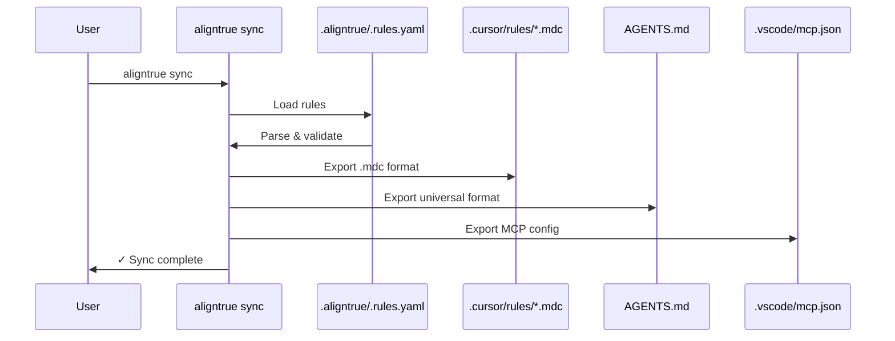

# Sync behavior

Complete technical reference for AlignTrue's sync system. This document is the source of truth for what AlignTrue actually does—no marketing, no aspirations, just the real behavior.

> **For practical setup and workflow examples,** see [Choosing Your Edit Source](/docs/01-guides/00-edit-source).  
> **Experimental features:** See [Experimental Features](/docs/04-reference/experimental) for decentralized rule management.

## Default: Centralized rule management

AlignTrue uses **centralized rule management** by default: you designate ONE edit source, edit that file, and changes flow one-way to all other read-only exports.

**When you run `aligntrue sync`:**

1. **Load config** from `.aligntrue/config.yaml`
2. **Check for team mode** - if enabled, validate lockfile
3. **Detect new agent files with content** - prompts to import untracked files
4. **Load your edit source** - the file pattern you configured to edit
5. **Detect edits to your edit source** by checking modification times (mtime)
6. **Create backup** (if enabled) - backs up both internal state and agent files
7. **Merge edits to IR** - your edit source sections update `.aligntrue/.rules.yaml`
8. **Export IR** to all configured agent files (read-only exports)
9. **Done** - no interaction required

**Key facts:**

- ✅ Single source of truth (your `edit_source`)
- ✅ One-way sync (edit_source → IR → exports)
- ✅ Other formats are **read-only** with warning comments
- ✅ Works in **both solo and team mode**
- ✅ Clear ownership, no conflicts
- ❌ Editing read-only exports does not sync back (correct behavior)

## How centralized rule management works

**Your workflow:**

1. You choose ONE edit source: `"AGENTS.md"` or `".cursor/rules/*.mdc"` etc.
2. Edit that file as your primary source of truth
3. Run `aligntrue sync` - changes flow from your edit source → internal rules → all exports
4. All other formats are read-only (have warning comments)

**One-way flow:**

```
edit_source → IR (.aligntrue/.rules.yaml) → all configured agents (read-only)
```

**Why centralized?**

- Single source of truth prevents conflicts
- Clear ownership - you know who edited what
- Predictable behavior - same edits produce same results every time
- Perfect for teams - pairs with team mode for approval workflows

## Configuration examples

### Single file edit source

```yaml
# .aligntrue/config.yaml
mode: solo
sync:
  edit_source: "AGENTS.md"
```

Edit AGENTS.md, run `aligntrue sync`, changes export to all agents.

### Glob pattern edit source (still single source)

```yaml
# .aligntrue/config.yaml
mode: solo
sync:
  edit_source: ".cursor/rules/*.mdc"
  scope_prefixing: "auto"
```

Edit any `.cursor/rules/*.mdc` file, run `aligntrue sync`, changes export to all agents.

### Team mode with centralized management

```yaml
mode: team
sync:
  edit_source: "AGENTS.md"

lockfile:
  mode: soft # Warn on unapproved changes (default)
```

Edit AGENTS.md → changes validated against lockfile → team approves if needed.

## Common sync scenarios

### 1. Solo developer with AGENTS.md

```bash
# Config: edit_source: "AGENTS.md"
nano AGENTS.md         # Edit your rules
aligntrue sync         # Changes flow: AGENTS.md → IR → all agents
```

**Result:** Changes synced to all configured agents (Cursor, VS Code, etc.) within seconds.

### 2. Developer using Cursor native format

```bash
# Config: edit_source: ".cursor/rules/*.mdc"
nano .cursor/rules/backend.mdc    # Edit Cursor files
aligntrue sync                     # Changes flow: Cursor files → IR → all agents
```

**Result:** Changes synced to IR and exported to all other agents (AGENTS.md, etc.).

### 3. Team mode with soft lockfile

```bash
# Config: mode: team, edit_source: "AGENTS.md", lockfile.mode: soft
nano AGENTS.md         # Edit rules
aligntrue sync         # Changes validated against lockfile
```

**Flow:**

- Changes merge to IR
- Bundle hash computed and checked
- If hash not approved: warning shown, sync continues (soft mode)
- Team lead approves later via `aligntrue team approve --current`

### 4. Team mode with strict lockfile

```bash
# Config: mode: team, lockfile.mode: strict
aligntrue sync
```

**Flow:**

- Changes merge to IR
- Bundle hash computed and checked
- If hash not approved: ❌ Sync blocked, changes not exported
- Team lead must approve before sync can complete

**Flow:**

```
Step 1-2: Detect and merge

Step 3: Compute bundle hash
  sha256:def456...

Step 4: Check allow list
  ❌ Not found (blocking)

Step 5a: Interactive terminal (TTY)
  Prompt: "Approve this bundle and continue?"
  • Yes → Add to allow list, export
  • No → Abort, nothing written

Step 5b: Non-interactive (CI, pipe, redirect)
  Error and exit code 1
  Message: "Bundle hash not in allow list (strict mode)"
  Solution shown: "Run: aligntrue team approve --current"
```

**Result:** Nothing happens until approved (team lead or engineer via `--force`).

## Technical details: edit detection and merging

### How edit detection works

```typescript
// Pseudo-code from packages/core/src/sync/multi-file-parser.ts

function detectEditedFiles(cwd, config) {
  const editedFiles = [];

  // Check each agent file's modification time
  if (existsSync(AGENTS_MD)) {
    const mtime = statSync(AGENTS_MD).mtime;
    // Since lastSyncTime is NOT passed, this is always true
    // So every file is considered "edited" by default
    editedFiles.push({ path: "AGENTS.md", mtime, sections: parsed });
  }

  if (existsSync(CURSOR_MDC)) {
    const mtime = statSync(CURSOR_MDC).mtime;
    editedFiles.push({
      path: ".cursor/rules/aligntrue.mdc",
      mtime,
      sections: parsed,
    });
  }

  return editedFiles;
}
```

**Important:** The mtime check is not comparing against a saved "last sync time". Every agent file is always considered "edited" on every sync. The actual filtering happens at the merge stage (only if sections actually changed).

### How merging works

```typescript
// Pseudo-code from packages/core/src/sync/multi-file-parser.ts

function mergeFromMultipleFiles(editedFiles, currentIR) {
  const sectionsByHeading = new Map();

  // Sort by mtime: oldest first, so newest wins
  const sorted = editedFiles.sort(
    (a, b) => a.mtime - b.mtime, // Ascending
  );

  for (const file of sorted) {
    for (const section of file.sections) {
      const key = section.heading.toLowerCase();

      // Last-write-wins: newer file replaces older
      sectionsByHeading.set(key, {
        heading: section.heading,
        content: section.content,
        sourceFile: file.path,
        mtime: file.mtime,
      });
    }
  }

  return mergedSections;
}
```

**Algorithm:**

1. Sort files by mtime (oldest → newest)
2. Process in order
3. Same heading? Overwrite with newer version
4. Result: newest file's sections always win

**Example:**

```
File A (10:00 AM): ## Security, ## Testing
File B (11:00 AM): ## Security, ## CI/CD

Merge result:
• ## Security ← from File B (newer)
• ## Testing ← from File A (only in A)
• ## CI/CD ← from File B (only in B)
```

## What does NOT happen

### ❌ No conflict detection

There is **no** detection of conflicting edits. If two files have the same section with different content:

```
File A: ## Security
  Content: "Use bcrypt for passwords"

File B: ## Security
  Content: "Use argon2 for passwords"

Result: File B's version wins (if newer by mtime)

No warning. No prompt. Just last-write-wins.
```

### ❌ No automatic background sync

The system does **not** watch files or sync in the background. You must explicitly run `aligntrue sync`.

### ❌ No timestamp tracking for conflict detection

There is no `.aligntrue/.last-sync` file that tracks when the last sync happened. The mtime check is absolute (file modified recently?), not relative to last sync.

### ❌ No prompts for multi-file edits

Even if multiple files changed, there are no prompts. Just automatic merge.

### ❌ No workflow modes

The config has `sync.workflow_mode`, `sync.primary_agent`, and `sync.auto_pull` fields, but they are **not implemented**. Don't use them.

## Practical implications

### For solo developers

**Pro:** Simple, fast, predictable

- Edit in any file
- Run sync
- Everything updates
- Done

**Con:** If you're not careful with edits

- Edit AGENTS.md at 10:00
- Edit .cursor/rules at 10:05 with conflicting content
- Run sync → .cursor/rules wins (it's newer)

**Mitigation:** Pick one file as primary (usually AGENTS.md) and edit there most of the time.

### For teams with soft lockfile mode

**Pro:** Changes go out fast, team lead approves after

- Engineer makes change
- Sync succeeds (warning shown)
- Agent files updated
- Team lead reviews at their pace
- Approve when ready

**Con:** Unapproved changes might reach agents temporarily

- If you want strict control, use strict mode instead

### For teams with strict lockfile mode

**Pro:** Explicit approval required before any change

- Engineer makes change
- Sync blocks or prompts
- Change doesn't go out until approved
- Audit trail in git history

**Con:** Requires team coordination

- Someone needs to approve
- Or use `--force` (not recommended)

### For teams with central rule management

**Pro:** Single source of truth

- Team lead maintains rules in central repo
- Engineers pull rules, can't edit locally
- All changes reviewed before publication

**Con:** Requires different workflow

- Engineers can't make quick local changes
- Must go through team lead review

## Disabling two-way sync

If you want **only** IR → agents export (no agent→IR merge):

```yaml
sync:
  two_way: false
```

Then:

- Agent file edits are ignored
- Only IR is used as source
- Agent files are treated as read-only exports

## Overview

AlignTrue synchronizes rules between three locations:

1. **Intermediate Representation (IR)** - `.aligntrue/.rules.yaml` (internal, auto-generated, pure YAML format with section fingerprints)
2. **User-Editable Files** - `AGENTS.md` (natural markdown with YAML frontmatter), `.cursor/*.mdc`, `.vscode/mcp.json`, etc.
3. **Team Lockfile** - `.aligntrue.lock.json` (team mode only, tracks section fingerprints)

The sync engine maintains consistency while allowing both IR→agent and agent→IR flows. For details on authoring rules in natural markdown format, see [Natural Markdown Sections](/docs/04-reference/natural-markdown-sections).

## Sync directions

### IR → Agent (default)

**When:** Every `aligntrue sync` command (default direction)

**Flow:**

```
IR (.aligntrue/.rules.yaml) → Parse → Validate → Export → Agent files
```

### Visual flow



**What happens:**

1. Load configuration from `.aligntrue/config.yaml`
2. Parse rules from `.aligntrue/.rules.yaml` (internal IR)
3. Validate against JSON Schema
4. Resolve scopes and merge rules
5. Export to each enabled agent (Cursor, AGENTS.md, etc.)
6. Write agent files atomically (temp+rename)
7. Update lockfile (team mode only)

**Example:**

```bash
# Standard sync
aligntrue sync

# Preview changes
aligntrue sync --dry-run

# Non-interactive (CI)
aligntrue sync --force
```

**Output:**

```
◇ Loading configuration...
◇ Parsing rules...
◇ Syncing to 2 agents...
│
◆ Files written:
│  • .cursor/rules/aligntrue.mdc (3 rules)
│  • AGENTS.md (3 rules)
│
◇ Sync complete! No conflicts detected.
```

---

### Agent → IR (edit source sync)

**When:** Automatic with every `aligntrue sync` (when files match `edit_source`)

**Edit Source Configuration:**

Edit files matching your `sync.edit_source` configuration and changes automatically merge back to IR, then sync to all other agents.

```bash
# Edit files in your edit_source
vi AGENTS.md
# or
vi .cursor/rules/backend.mdc

# Sync detects edits and merges automatically
aligntrue sync
# ◇ Detected 1 edited file(s)
# ◇ Merging changes from agent files to IR
# ✓ Merged changes from agent files to IR
# ✓ Synced to: .cursor/rules/*.mdc, AGENTS.md
```

**Configuration:**

```yaml
# .aligntrue/config.yaml
exporters:
  - cursor
  - agents

sync:
  edit_source: "AGENTS.md"  # Single file
  # OR
  edit_source: ".cursor/rules/*.mdc"  # Glob pattern
  # OR
  edit_source: ["AGENTS.md", ".cursor/rules/*.mdc"]  # Multiple
  # OR
  edit_source: "any_agent_file"  # All agents
```

**Deprecated:**

```yaml
# OLD (still works, auto-migrates)
sync:
  two_way: true # → edit_source: "any_agent_file"
```

**Section-Level Merging:**

Two-way sync uses section-based merging:

- **Sections matched by heading** (case-insensitive)
- **Change detection via SHA-256 hash**
- **User sections preserved** alongside team sections
- **Last-write-wins** when same section edited in multiple files

**Flow:**

```
Any agent file → Parse sections → Merge to IR → Export to all agent files
```

### Two-way sync flow


**What happens:**

1. Detect edited agent files by modification time
2. Parse sections from edited files by heading
3. Merge sections into IR (last-write-wins for conflicts)
4. Write updated `.aligntrue/.rules.yaml`
5. Export merged IR to all configured agents

**Team-Managed Sections:**

Team mode can designate sections as managed:

```yaml
# .aligntrue/config.yaml
managed:
  sections:
    - "Security"
    - "Compliance"
  source_url: "https://github.com/company/rules"
```

Managed sections are marked with 🔒 icon and HTML comments warning against direct edits.

**Example:**

```bash
# Standard two-way sync (default)
aligntrue sync

# Watch mode for continuous sync
aligntrue watch
```

See the [Quickstart](/docs/00-getting-started/00-quickstart) to get started.

---

## Precedence rules

### IR wins by default

**.aligntrue/.rules.yaml is the internal authority.**

**Format:** Pure YAML (not markdown). This is an internal file auto-generated by AlignTrue. Users should edit `AGENTS.md` or agent-specific files instead.

If you edit both IR and agent files:

- `aligntrue sync` → IR overwrites agent files (no prompt)
- `aligntrue sync --accept-agent` → Triggers conflict resolution

**Recommended workflow:**

1. Edit `AGENTS.md` or agent files
2. Run `aligntrue sync`
3. All agent files updated automatically

### Explicit pullback required

To pull changes from agent files back to IR:

```bash
# Must explicitly opt in
aligntrue sync --accept-agent cursor
```

Without `--accept-agent`, IR always wins.

### Section-level merging behavior

Two-way sync uses section-based merging instead of field-level conflict detection:

**Match by heading:**

- Sections matched by heading (case-insensitive, whitespace-trimmed)
- Content hash (SHA-256) determines if section changed

**Merge actions:**

- **Keep:** Section unchanged in both IR and agent file
- **Update:** Section changed in IR, updates agent file
- **Add:** New section in IR, adds to agent file
- **User-added:** Section only in agent file, preserved

**Example merge:**

```markdown
# AGENTS.md (edited by user)

## Testing

Run tests before committing.

## My workflow notes

Personal notes here.

# .cursor/rules/aligntrue.mdc (from IR)

## Testing

Run all tests before committing.

## Security

Validate all input.
```

**After sync:**

- "Testing" section updated with IR content
- "My Workflow Notes" preserved as user-added section
- "Security" section added from IR
- Result: All 3 sections in both files

### Conflict resolution

**Last-write-wins strategy:**

When same section edited in multiple agent files:

- Files sorted by modification time (oldest first)
- Newest version wins
- Warning logged for conflicts

**Example:**

```
⚠ Section "Testing" edited in multiple files: AGENTS.md, .cursor/rules/aligntrue.mdc
  Using version from .cursor/rules/aligntrue.mdc (most recent)
```

**Team-managed sections:**

Changes to team-managed sections trigger warnings:

```
⚠ Team-managed section "Security" was modified
  Reverting to team version
  To keep your changes, rename the section or submit a PR
```

### Non-interactive mode

For CI or scripting, use default strategy:

```bash
# Keep IR, discard all agent changes (default)
aligntrue sync --force

# Accept all agent changes (coming in Step 17)
aligntrue sync --accept-agent cursor --force
```

No prompts, uses default resolution strategy.

### Manual edit detection

If sync detects manual edits to generated files:

```
⚠ Checksum mismatch: .cursor/rules/aligntrue.mdc

This file was manually edited since last sync.

[v] View current content
[o] Overwrite (discard manual edits)
[k] Keep manual edits (skip sync)
[a] Abort sync

Choice:
```

**Checksum tracking:**

- AlignTrue computes SHA-256 hash of each generated file
- Stores hash in `.aligntrue/.checksums.json`
- Compares before overwriting

**Best practice:** Edit `AGENTS.md` or agent files, not generated exports.

### Automatic overwriting of read-only files

Read-only files (files NOT matching `edit_source`) are automatically overwritten during sync if they've been manually edited:

1. **Before overwriting**: Original content is backed up to `.aligntrue/overwritten-rules/` with a timestamp
2. **During sync**: File is overwritten with clean IR content (no merge, no user edits preserved)
3. **No --force needed**: This happens automatically for read-only files

**Example:**

```bash
# edit_source is "AGENTS.md"
# User manually edits .cursor/rules/aligntrue.mdc (read-only)

aligntrue sync
# Result:
# 1. Backup created: .aligntrue/overwritten-rules/cursor/rules/aligntrue.2025-01-15T14-30-00.mdc
# 2. File overwritten with IR content
# 3. Manual edit is gone (preserved in backup)
```

**Why**: Read-only files are under AlignTrue's control. Manual edits are considered unauthorized and are overwritten to maintain consistency.

**Safety**: All manual edits are backed up before overwriting, so nothing is lost.

**When --force is needed**: For files that ARE in `edit_source`, use `--force` to overwrite manual edits during conflict resolution.

---

## New file detection

In centralized mode (default), AlignTrue automatically detects agent files with content that aren't tracked in your `edit_source` configuration.

### How it works

When you run `aligntrue sync`:

1. **Scans workspace** for all agent files (`.mdc`, `.md`, etc.)
2. **Parses content** to find files with sections
3. **Compares against edit_source** to identify untracked files
4. **Prompts for action** if untracked files with content are found

### The prompt

```
⚠ Detected files with content outside your edit source

In centralized mode, these files will become export targets.
Any existing content will be extracted for your review.

cursor: 3 file(s), 25 section(s)
  • .cursor/rules/backend.mdc - 10 sections, modified 2 days ago
  • .cursor/rules/frontend.mdc - 8 sections, modified 2 days ago
  • .cursor/rules/testing.mdc - 7 sections, modified 1 week ago

Enable these files as export targets?

What happens:
• Existing content will be backed up to .aligntrue/overwritten-rules/
• Files will be synced with your current rules from: AGENTS.md

You can always change your edit source later.
```

### What happens when you confirm

**Files enabled as export targets:**

- AlignTrue backs up the entire existing file to `.aligntrue/overwritten-rules/{file}-{timestamp}` for recovery
- On the next sync, these files receive your current rules from `edit_source`
- All existing content is preserved in the backup for your reference

**Backup message:**

```
Files enabled as export targets
Backed up existing content:
  • .aligntrue/overwritten-rules/cursor/rules/backend.2025-01-15T10-30-45.mdc
  • .aligntrue/overwritten-rules/cursor/rules/frontend.2025-01-15T10-30-45.mdc

Current edit source: AGENTS.md
These files will be synced on your next sync.

To change your edit source, run: aligntrue config set sync.edit_source
```

### Old rules preservation

When files are detected and enabled, their existing content is backed up to `.aligntrue/overwritten-rules/`:

**Backup structure:**

```
.aligntrue/overwritten-rules/
  ├── cursor/
  │   └── rules/
  │       ├── backend.2025-01-15T10-30-45.mdc
  │       └── frontend.2025-01-15T10-30-45.mdc
  └── AGENTS.2025-01-15T10-30-45.md
```

**File management:**

- Each backup includes a timestamp to distinguish multiple backups
- All backups are preserved indefinitely
- You manually manage cleanup (review and delete as needed)
- Backups preserve the exact original file structure for full recovery

### Best practices

**When you discover untracked agent files:**

1. Run `aligntrue sync`
2. Review the detected files
3. Confirm to enable them as export targets
4. AlignTrue extracts old content to `.aligntrue/extracted-rules.md`
5. Review the extracted content for anything you want to keep
6. Copy/paste important sections into your `edit_source` file (e.g., `AGENTS.md`)
7. On next sync, files are automatically synced with your current rules

**For rules from other sources:**

1. Copy rules into a temporary agent file (e.g., `CLAUDE.md`, `.cursor/rules/temp.mdc`)
2. Run `aligntrue sync`
3. Confirm to enable the file
4. Review extracted content in `.aligntrue/extracted-rules.md`
5. Copy/paste the rules you want into your edit source
6. Delete the temporary file (or leave it - it will continue receiving your synced rules)
7. Edit source files to remove duplicates
8. Run `aligntrue sync` again

**Better to merge first, clean up later** than lose content.

---

## Scope behavior

### Per-scope exports

Some exporters create one file per scope:

**Cursor (`.cursor/rules/*.mdc`):**

```
.aligntrue/.rules.yaml (with scopes):
  - default scope → .cursor/rules/aligntrue.mdc
  - apps/web scope → .cursor/rules/apps-web.mdc
  - packages/core scope → .cursor/rules/packages-core.mdc
```

**Filename conversion:**

- Scope path → filename
- Forward slashes → hyphens
- Example: `apps/web` → `apps-web.mdc`

**Why per-scope files?**

- Cursor can load rules contextually based on current file
- Smaller files, faster parsing
- Clearer organization

---

### Merged exports

Other exporters merge all scopes into one file:

**AGENTS.md:**

```
.aligntrue/.rules.yaml (with scopes):
  - default scope
  - apps/web scope
  - packages/core scope

→ AGENTS.md (single file, all rules merged)
```

**Scope metadata preserved:**

```markdown
## Rule: use-typescript-strict

**Scope:** apps/web

Use TypeScript strict mode in all files.
```

**Why merged?**

- Universal format for multiple agents
- Simpler for agents without scope support
- Single source of truth at root

---

### Scope merge order

When rules overlap across scopes, merge order determines precedence:

```yaml
# .aligntrue/config.yaml
scopes:
  - name: root
    path: .
    merge_order: [root, path, local]
  - name: apps-web
    path: apps/web
    merge_order: [root, path, local]
```

**Merge order levels:**

- `root` - Workspace-level rules (lowest priority)
- `path` - Scope-specific rules (medium priority)
- `local` - File-level overrides (highest priority)

**Example:**

```yaml
# Root scope defines base rule
id: my-project.global.use-typescript
severity: warn

# apps/web scope overrides severity
id: my-project.global.use-typescript
severity: error  # Stricter in frontend
```

Final merged rule in `apps/web` scope:

```yaml
id: my-project.global.use-typescript
severity: error # apps/web override wins
```

---

## Dry run mode

Preview changes without writing files:

```bash
aligntrue sync --dry-run
```

**Output shows:**

1. **Audit trail** - All operations with timestamps
2. **Files that would be written** - Paths and sizes
3. **Warnings** - Potential issues
4. **Conflicts** - What would trigger prompts
5. **Content hashes** - SHA-256 of each file

**Example:**

```
◆ Dry-run mode: No files will be written

Audit trail:
  [2025-10-27T12:00:00Z] Loaded config from .aligntrue/config.yaml
  [2025-10-27T12:00:01Z] Parsed 3 rules from .aligntrue/.rules.yaml
  [2025-10-27T12:00:02Z] Resolved 2 scopes
  [2025-10-27T12:00:03Z] Exported to cursor (1 file)
  [2025-10-27T12:00:04Z] Exported to agents (1 file)

Files to write:
  • .cursor/rules/aligntrue.mdc (2.4 KB, hash: a3b2c1d4...)
  • AGENTS.md (1.8 KB, hash: e5f6a7b8...)

Warnings: None

Conflicts: None
```

**Use cases:**

- Verify changes before committing
- Debug exporter behavior
- Review scope resolution
- CI validation (non-destructive)

---

## Git integration

AlignTrue can automatically manage git operations for generated files.

### Three modes

**1. Ignore Mode (Default)**

```yaml
# .aligntrue/config.yaml
git:
  mode: ignore
```

- Adds generated files to `.gitignore`
- Developers sync locally, don't commit agent files
- Recommended for solo developers

**Behavior:**

```bash
aligntrue sync
# Adds to .gitignore:
#   .cursor/rules/*.mdc
#   AGENTS.md
#   .vscode/mcp.json
```

**2. Commit Mode**

```yaml
# .aligntrue/config.yaml
git:
  mode: commit
```

- Commits generated files automatically after sync
- Team shares agent files via git
- Recommended for teams with consistent agents

**Behavior:**

```bash
aligntrue sync
# After successful sync:
git add .cursor/rules/*.mdc AGENTS.md
git commit -m "chore: sync AlignTrue rules"
```

**3. Branch Mode**

```yaml
# .aligntrue/config.yaml
git:
  mode: branch
```

- Creates feature branch for each sync
- Commit changes to branch
- Developers review before merging

**Behavior:**

```bash
aligntrue sync
# Creates branch: aligntrue/sync-2025-10-27-120000
# Commits changes to branch
# Developer reviews and merges via PR
```

---

### Per-adapter override

Override git mode for specific exporters:

```yaml
# .aligntrue/config.yaml
git:
  mode: ignore # Default for all exporters

exporters:
  - name: cursor
    git_override: commit # Commit Cursor files

  - name: agents
    # Uses default (ignore)
```

**Use case:** Commit `.cursor/*.mdc` for team, ignore `AGENTS.md` for personal use.

---

### Idempotent .gitignore

AlignTrue safely manages `.gitignore`:

- Adds entries only if not present
- Preserves existing entries and comments
- Uses markers for AlignTrue-managed section:

```gitignore
# Your existing entries
node_modules/
dist/

# BEGIN AlignTrue
.cursor/rules/*.mdc
AGENTS.md
# END AlignTrue
```

**Safe operations:**

- Running sync multiple times doesn't duplicate entries
- Manual edits outside markers are preserved
- Removing marker comments stops AlignTrue management

---

## Lockfile behavior (team mode)

When team mode enabled (`mode: team` in config):

### Validation before sync

Lockfile validated before syncing:

```yaml
# .aligntrue/config.yaml
lockfile:
  mode: soft # Warn but continue (default)
  # mode: strict  # Block on mismatch (CI)
  # mode: off     # Disable validation
```

**Three modes:**

**Off (Solo Mode):**

- No lockfile validation
- Always succeeds
- Recommended for solo developers

**Soft (Team Mode Default):**

- Warns on lockfile mismatch
- Continues sync anyway
- Exit code 0 (success)

**Strict (CI):**

- Errors on lockfile mismatch
- Aborts sync
- Exit code 1 (failure)

---

### Regeneration after sync

Lockfile regenerated after successful sync (team mode only):

```bash
aligntrue sync
# 1. Validates lockfile (soft/strict)
# 2. Performs sync
# 3. Regenerates .aligntrue.lock.json
```

**Lockfile contents:**

```json
{
  "version": "1",
  "generated_at": "2025-10-27T12:00:00Z",
  "mode": "soft",
  "rules": [
    {
      "rule_id": "my-project.backend.use-typescript",
      "content_hash": "a3b2c1d4e5f6...",
      "source": "local:.aligntrue/.rules.yaml"
    }
  ],
  "bundle_hash": "e5f6a7b8c9d0..."
}
```

**Per-rule hashes:**

- SHA-256 of canonical IR (JCS)
- Excludes `vendor.*.volatile` fields
- Deterministic across machines

**Bundle hash:**

- SHA-256 of sorted rule hashes
- Quick validation before per-rule check

---

### Drift detection

Lockfile drift occurs when:

- Rules edited but lockfile not updated
- Teammate pushed rules without lockfile
- Git merge conflict resolved manually

**Detection:**

```bash
aligntrue sync
# Compares current rules to lockfile hashes
# Reports mismatches
```

**Resolution:**

**Soft mode (warning):**

```
⚠ Warning: Lockfile is out of sync
  Rule 'my-project.backend.use-typescript' hash mismatch

Continuing sync...
```

**Strict mode (error):**

```
✖ Error: Lockfile validation failed
  Rule 'my-project.backend.use-typescript' hash mismatch

Aborting sync. Use --force to override.
```

**Fix:**

```bash
# Regenerate lockfile
aligntrue sync --force

# Or delete and regenerate
rm .aligntrue.lock.json
aligntrue sync
```

---

## Performance considerations

### File operations

AlignTrue optimizes sync performance:

- **Atomic writes** - Temp file + rename (prevents partial writes)
- **Lazy loading** - Only parses files when needed
- **Caching** - Reuses parsed IR across exporters
- **Parallel exports** - Multiple exporters run concurrently

### Large repositories

For monorepos with many scopes:

```yaml
# .aligntrue/config.yaml
scopes:
  - name: backend
    path: packages/backend
    include: ["**/*.ts"]
    exclude: ["**/*.test.ts", "**/node_modules/**"]
```

**Performance tips:**

- Use `exclude` patterns to skip irrelevant files
- Limit scope depth with specific paths
- Enable only needed exporters

### CI optimization

```bash
# Fast validation (no file writes)
aligntrue check --ci

# Faster than full sync in CI
```

---

## Troubleshooting

### Sync hangs or times out

**Cause:** Large rule files, slow disk, or exporter deadlock.

**Fix:**

```bash
# Check file sizes
ls -lh AGENTS.md .aligntrue/.rules.yaml

# Run with dry-run to test
aligntrue sync --dry-run

# Disable problematic exporter
# Edit .aligntrue/config.yaml and remove exporter
```

---

### Conflicts on every sync

**Cause:** Agent and IR are both being edited.

**Fix:**

**Option 1: Native format workflow (recommended)**

- Edit `AGENTS.md` or any agent file
- Run `aligntrue sync` to propagate changes
- Enable bidirectional sync with `auto_pull: true`

**Option 2: Manual control**

- Edit `AGENTS.md` as primary file
- Run `aligntrue sync` to update other agents
- Disable auto-pull with `auto_pull: false`

**Tip:** Use native format workflow for flexibility - edit any file, changes sync everywhere.

---

### Lockfile always out of sync

**Cause:** Volatile vendor fields changing on each sync.

**Fix:**

```yaml
# Mark changing fields as volatile
vendor:
  _meta:
    volatile: ["my-agent.timestamp", "my-agent.cache"]
  my-agent:
    timestamp: "2025-10-27T12:00:00Z" # Excluded from hash
```

Volatile fields won't cause lockfile drift.

---

## Exit codes and errors

### Successful sync

```bash
$ aligntrue sync
✓ Sync complete

$ echo $?
0
```

### Team mode: strict lockfile, unapproved (non-interactive)

```bash
$ aligntrue sync
✗ Bundle hash not in allow list (strict mode)

$ echo $?
1
```

### Team mode: unapproved, but --force flag

```bash
$ aligntrue sync --force
⚠ Bypassing allow list validation (--force)
✓ Sync complete

$ echo $?
0
```

## The actual defaults

| Setting            | Default         | Actual Behavior                             |
| ------------------ | --------------- | ------------------------------------------- |
| `mode`             | `solo`          | No lockfile, no team features               |
| `sync.two_way`     | `true`          | Detect and merge agent file edits           |
| `lockfile.mode`    | (N/A solo)      | Soft (team mode) - warn on drift            |
| Conflict handling  | Last-write-wins | Most recent file's version used, no prompts |
| Prompts            | None            | All merges automatic                        |
| Timestamp tracking | None            | No `.last-sync` file used                   |
| Workflow modes     | Not implemented | Fields exist but ignored                    |
| Primary agent      | Not implemented | Fields exist but ignored                    |

## Common questions

**Q: Can I have Cursor and AGENTS.md in sync?**  
A: Yes, by default. Edit either one, run `aligntrue sync`, both stay synchronized.

**Q: What if I edit both files before syncing?**  
A: Last-write-wins by mtime. Whichever you edited more recently is used.

**Q: Can I prevent edits to certain files?**  
A: Not at the file level. In team mode, you can use lockfile validation to block unapproved changes.

**Q: What happens if both files have the same section but I edited different sections in each?**  
A: Sections are independent. Both are kept unless there's a heading conflict. If same heading, newer file wins.

**Q: Is there a `.last-sync` file I should commit?**  
A: No. That file is not used in the current implementation.

**Q: What does `sync.primary_agent` do?**  
A: It's a configuration field but not implemented. Don't use it.

**Q: Can I set up automatic syncing?**  
A: No. Use `aligntrue watch` for continuous file watching, or CI/CD for scheduled syncs.

---

## Advanced: Experimental decentralized mode

For experimental multi-source editing with two-way sync between multiple edit sources, see [Experimental Features](/docs/04-reference/experimental). This is an unsupported feature for advanced users only.

## See also

- [Choosing Your Edit Source](/docs/01-guides/00-edit-source) - For practical setup and workflow examples
- [Natural Markdown Sections](/docs/04-reference/natural-markdown-sections) - Authoring rules with sections and fingerprints
- [Command Reference](/docs/04-reference/cli-reference) - Detailed flag documentation
- [Quickstart](/docs/00-getting-started/00-quickstart) - Get started with AlignTrue
- [Git Sources Guide](/docs/04-reference/git-sources) - Pull rules from repositories
- [Troubleshooting](/docs/05-troubleshooting) - Common sync issues
- [Extending AlignTrue](/docs/06-contributing/adding-exporters) - Create custom exporters
- [Experimental Features](/docs/04-reference/experimental) - Advanced experimental features
