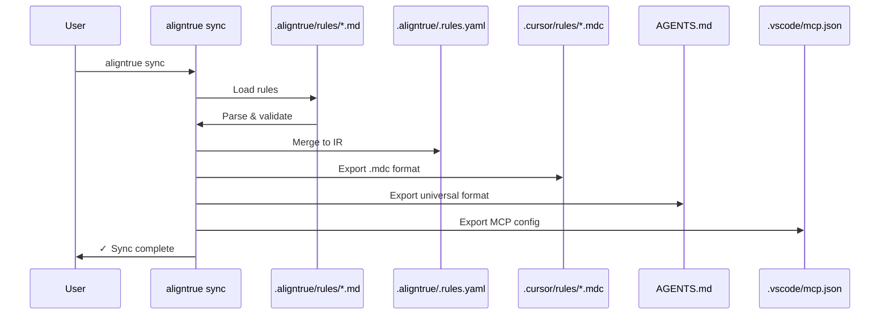

# Sync behavior

Complete technical reference for AlignTrue's sync system. This document is the source of truth for what AlignTrue actually does—no marketing, no aspirations, just the real behavior.

## Rule management

AlignTrue uses **unidirectional sync**: edit files in `.aligntrue/rules/`, run sync, and changes flow to all configured agents.

**When you run `aligntrue sync`:**

1. **Load config** from `.aligntrue/config.yaml`
2. **Check for team mode** - if enabled, validate lockfile
3. **Load rules** from `.aligntrue/rules/*.md` (your source of truth)
4. **Detect edits** by checking modification times (mtime)
5. **Create backup** (if enabled) - backs up both internal state and agent files
6. **Merge to IR** - your rules are loaded into `.aligntrue/.rules.yaml`
7. **Export to all agents** - IR syncs to Cursor, AGENTS.md, VS Code, etc. (read-only exports)
8. **Done** - no interaction required

**Key facts:**

- ✅ Single source of truth (your `.aligntrue/rules/` directory)
- ✅ One-way sync (rules directory → IR → exports)
- ✅ Agent files are **read-only** with warning comments
- ✅ Works in **both solo and team mode**
- ✅ Clear ownership, no conflicts
- ❌ Editing agent files does not sync back (correct behavior - they are exports)

## How unidirectional sync works

**Your workflow:**

1. You edit files in `.aligntrue/rules/` (e.g., `global.md`, `backend.md`, `testing.md`)
2. Run `aligntrue sync`
3. Changes flow from rules directory → internal IR → all configured agents
4. All other formats (Cursor, AGENTS.md, etc.) are read-only exports

**One-way flow:**

```
.aligntrue/rules/*.md → IR (.aligntrue/.rules.yaml) → all configured agents (read-only)
```

**Why unidirectional?**

- Single source of truth prevents conflicts
- Clear ownership - you know who edited what
- Predictable behavior - same edits produce same results every time
- Perfect for teams - pairs with team mode for approval workflows
- No bidirectional sync confusion

## Configuration examples

### Solo developer with rules directory

```yaml
# .aligntrue/config.yaml
mode: solo
sources:
  - type: local
    path: .aligntrue/rules
exporters:
  - cursor
  - agents
```

Edit `.aligntrue/rules/global.md`, run `aligntrue sync`, changes export to all agents.

### Team mode with rules directory

```yaml
# .aligntrue/config.yaml
mode: team
sources:
  - type: local
    path: .aligntrue/rules
exporters:
  - cursor
  - agents

lockfile:
  mode: soft # Warn on unapproved changes (default)
```

Edit `.aligntrue/rules/` → changes validated against lockfile → team approves if needed.

## Common sync scenarios

### 1. Solo developer editing local rules

```bash
# Edit your rules
nano .aligntrue/rules/global.md
nano .aligntrue/rules/backend.md

# Sync to all agents
aligntrue sync
```

**Result:** Changes synced to all configured agents (Cursor, AGENTS.md, etc.) within seconds.

### 2. Team editing with lockfile approval

```bash
# Edit rules
nano .aligntrue/rules/global.md

# Sync detects changes
aligntrue sync
# ◇ Detected 1 edited file(s)
# ◇ Merging changes from rules
# ✓ Merged changes to IR
# ⚠ Bundle hash not in allow list (soft mode - warning)
# ✓ Synced to: .cursor/rules/*.mdc, AGENTS.md
```

**Flow:**

- Changes merge to IR
- Bundle hash computed and checked
- If hash not approved: warning shown, sync continues (soft mode)
- Team lead approves later via `aligntrue team approve --current`

## Technical details: rule loading and merging

### How rule loading works

```typescript
// Pseudo-code
function loadRules(cwd, config) {
  const rulesDir = ".aligntrue/rules";
  const rules = [];

  // Load all *.md files
  const files = glob(`${rulesDir}/*.md`);
  for (const file of files) {
    const parsed = parseMarkdown(file);
    rules.push(...parsed.sections);
  }

  return rules;
}
```

**Important:** Every sync reads all rule files from `.aligntrue/rules/` to ensure IR matches your intent.

### How merging works

When you have multiple files in `.aligntrue/rules/` (e.g., `global.md`, `backend.md`, `testing.md`), they are merged into the IR:

1. Parse all `*.md` files in `.aligntrue/rules/`
2. Collect all sections from all files
3. Update IR with the latest content

**Files are loaded in alphabetical order** for determinism.

## Overview

AlignTrue synchronizes rules between three locations:

1. **Rules Directory** - `.aligntrue/rules/*.md` (your editable source, natural markdown with YAML frontmatter)
2. **Intermediate Representation (IR)** - `.aligntrue/.rules.yaml` (internal, auto-generated, pure YAML format with section fingerprints)
3. **Team Lockfile** - `.aligntrue.lock.json` (team mode only, tracks section fingerprints for approval)

The sync engine maintains consistency with one-way flow from rules directory to all exports.

## Sync directions

### Rules Directory → IR → Agents (default)

**When:** Every `aligntrue sync` command (default direction)

**Flow:**

```
Rules Directory (.aligntrue/rules/*.md) → Parse → Validate → Merge to IR → Export → Agent files
```

### Visual flow



**What happens:**

1. Load configuration from `.aligntrue/config.yaml`
2. Read all `*.md` files from `.aligntrue/rules/`
3. Parse sections from rule files
4. Validate against JSON Schema
5. Merge into IR (`.aligntrue/.rules.yaml`)
6. Resolve scopes and merge rules
7. Export to each enabled agent (Cursor, AGENTS.md, etc.)
8. Write agent files atomically (temp+rename)
9. Update lockfile (team mode only)

**Example:**

```bash
# Standard sync
aligntrue sync

# Preview changes
aligntrue sync --dry-run

# Non-interactive (CI)
aligntrue sync --force
```

**Output:**

```
◇ Loading configuration...
◇ Parsing rules...
◇ Syncing to 2 agents...
│
◆ Files written:
│  • .cursor/rules/rule1.mdc
│  • .cursor/rules/rule2.mdc
│  • .cursor/rules/rule3.mdc
│  • AGENTS.md (3 rules)
│
◇ Sync complete! No conflicts detected.
```

---

## Precedence rules

### Rules directory is authoritative

**`.aligntrue/rules/*.md` is the primary source of truth.**

Your rules in `.aligntrue/rules/` define what IR contains. Agent files are exports.

If you edit both rules and agent files:

- `aligntrue sync` → Rules overwrite agent files (no prompt)

**Recommended workflow:**

1. Edit `.aligntrue/rules/*.md`
2. Run `aligntrue sync`
3. All agent files updated automatically

### Agent files are read-only

Agent files (Cursor, AGENTS.md, etc.) receive exports from IR and should not be manually edited.

If you edit an agent file:

```bash
aligntrue sync
# ⚠ Checksum mismatch: AGENTS.md
#
# This file was manually edited since last sync.
# Backing up to .aligntrue/overwritten-rules/AGENTS.2025-01-15T10-30-45.md
# Overwriting with current rules from IR.
```

**Why**: Agent files are under AlignTrue's control. Manual edits are overwritten to maintain consistency.

**Best practice:** Edit `.aligntrue/rules/*.md`, not agent files.

### Manual edit detection

If sync detects manual edits to generated files:

```
⚠ Checksum mismatch: .cursor/rules/rule1.mdc

This file was manually edited since last sync.

[v] View current content
[o] Overwrite (discard manual edits)
[k] Keep manual edits (skip sync)
[a] Abort sync

Choice:
```

**Checksum tracking:**

- AlignTrue computes SHA-256 hash of each generated file
- Stores hash in `.aligntrue/.checksums.json`
- Compares before overwriting

### Automatic overwriting of agent files

Agent files are automatically overwritten during sync if manually edited:

1. **Before overwriting**: Original content is backed up to `.aligntrue/overwritten-rules/` with a timestamp
2. **During sync**: File is overwritten with clean IR content (no merge, no user edits preserved)
3. **No --force needed**: This happens automatically for agent files

**Example:**

```bash
# Edit .aligntrue/rules/
nano .aligntrue/rules/global.md

# Sync overwrites agent files with new content
aligntrue sync
# Result:
# 1. Backup created: .aligntrue/overwritten-rules/AGENTS.2025-01-15T14-30-00.md
# 2. Files overwritten with IR content
```

**Why**: Agent files are exports under AlignTrue's control. Manual edits are considered unauthorized and are overwritten to maintain consistency.

**Safety**: All manual edits are backed up before overwriting, so nothing is lost.

---

## Scope behavior

### Per-scope exports

Some exporters create one file per scope:

**Cursor (`.cursor/rules/*.mdc`):**

```
.aligntrue/.rules.yaml (with scopes):
  - default scope → .cursor/rules/rule1.mdc, rule2.mdc, etc.
  - apps/web scope → apps/web/.cursor/rules/rule1.mdc, rule2.mdc, etc.
  - packages/core scope → packages/core/.cursor/rules/rule1.mdc, rule2.mdc, etc.
```

**Filename conversion:**

- Scope path → filename
- Forward slashes → hyphens
- Example: `apps/web` → `apps-web.mdc`

**Why per-scope files?**

- Cursor can load rules contextually based on current file
- Smaller files, faster parsing
- Clearer organization

---

### Merged exports

Other exporters merge all scopes into one file:

**AGENTS.md:**

```
.aligntrue/.rules.yaml (with scopes):
  - default scope
  - apps/web scope
  - packages/core scope

→ AGENTS.md (single file, all rules merged)
```

**Scope metadata preserved:**

```markdown
## Rule: use-typescript-strict

**Scope:** apps/web

Use TypeScript strict mode in all files.
```

**Why merged?**

- Universal format for multiple agents
- Simpler for agents without scope support
- Single source of truth at root

---

### Scope merge order

When rules overlap across scopes, merge order determines precedence:

```yaml
# .aligntrue/config.yaml
scopes:
  - name: root
    path: .
    merge_order: [root, path, local]
  - name: apps-web
    path: apps/web
    merge_order: [root, path, local]
```

**Merge order levels:**

- `root` - Workspace-level rules (lowest priority)
- `path` - Scope-specific rules (medium priority)
- `local` - File-level overrides (highest priority)

**Example:**

```yaml
# Root scope defines base rule
id: my-project.global.use-typescript
severity: warn

# apps/web scope overrides severity
id: my-project.global.use-typescript
severity: error  # Stricter in frontend
```

Final merged rule in `apps/web` scope:

```yaml
id: my-project.global.use-typescript
severity: error # apps/web override wins
```

---

## Dry run mode

Preview changes without writing files:

```bash
aligntrue sync --dry-run
```

**Output shows:**

1. **Audit trail** - All operations with timestamps
2. **Files that would be written** - Paths and sizes
3. **Warnings** - Potential issues
4. **Conflicts** - What would trigger prompts
5. **Content hashes** - SHA-256 of each file

**Example:**

```
◆ Dry-run mode: No files will be written

Audit trail:
  [2025-10-27T12:00:00Z] Loaded config from .aligntrue/config.yaml
  [2025-10-27T12:00:01Z] Parsed 3 rules from .aligntrue/rules/
  [2025-10-27T12:00:02Z] Resolved 2 scopes
  [2025-10-27T12:00:03Z] Exported to cursor (1 file)
  [2025-10-27T12:00:04Z] Exported to agents (1 file)

Files to write:
  • .cursor/rules/rule1.mdc (1.2 KB, hash: a3b2c1d4...)
  • .cursor/rules/rule2.mdc (1.2 KB, hash: e5f6a7b8...)
  • AGENTS.md (1.8 KB, hash: c1a2b3d4...)

Warnings: None

Conflicts: None
```

**Use cases:**

- Verify changes before committing
- Debug exporter behavior
- Review scope resolution
- CI validation (non-destructive)

---

## Git integration

AlignTrue can automatically manage git operations for generated files.

### Three modes

**1. Ignore Mode (Default)**

```yaml
# .aligntrue/config.yaml
git:
  mode: ignore
```

- Adds generated files to `.gitignore`
- Developers sync locally, don't commit agent files
- Recommended for solo developers

**Behavior:**

```bash
aligntrue sync
# Adds to .gitignore:
#   .cursor/rules/*.mdc
#   AGENTS.md
#   .vscode/mcp.json
```

**2. Commit Mode**

```yaml
# .aligntrue/config.yaml
git:
  mode: commit
```

- Commits generated files automatically after sync
- Team shares agent files via git
- Recommended for teams with consistent agents

**Behavior:**

```bash
aligntrue sync
# After successful sync:
git add .cursor/rules/*.mdc AGENTS.md
git commit -m "chore: sync AlignTrue rules"
```

**3. Branch Mode**

```yaml
# .aligntrue/config.yaml
git:
  mode: branch
```

- Creates feature branch for each sync
- Commit changes to branch
- Developers review before merging

**Behavior:**

```bash
aligntrue sync
# Creates branch: aligntrue/sync-2025-10-27-120000
# Commits changes to branch
# Developer reviews and merges via PR
```

---

### Per-adapter override

Override git mode for specific exporters:

```yaml
# .aligntrue/config.yaml
git:
  mode: ignore # Default for all exporters

exporters:
  - name: cursor
    git_override: commit # Commit Cursor files

  - name: agents
    # Uses default (ignore)
```

**Use case:** Commit `.cursor/*.mdc` for team, ignore `AGENTS.md` for personal use.

---

### Idempotent .gitignore

AlignTrue safely manages `.gitignore`:

- Adds entries only if not present
- Preserves existing entries and comments
- Uses markers for AlignTrue-managed section:

```gitignore
# Your existing entries
node_modules/
dist/

# BEGIN AlignTrue
.cursor/rules/*.mdc
AGENTS.md
# END AlignTrue
```

**Safe operations:**

- Running sync multiple times doesn't duplicate entries
- Manual edits outside markers are preserved
- Removing marker comments stops AlignTrue management

---

## Lockfile behavior (team mode)

When team mode enabled (`mode: team` in config):

### Validation before sync

Lockfile validated before syncing:

```yaml
# .aligntrue/config.yaml
lockfile:
  mode: soft # Warn but continue (default)
  # mode: strict  # Block on mismatch (CI)
  # mode: off     # Disable validation
```

**Three modes:**

**Off (Solo Mode):**

- No lockfile validation
- Always succeeds
- Recommended for solo developers

**Soft (Team Mode Default):**

- Warns on lockfile mismatch
- Continues sync anyway
- Exit code 0 (success)

**Strict (CI):**

- Errors on lockfile mismatch
- Aborts sync
- Exit code 1 (failure)

---

### Regeneration after sync

Lockfile regenerated after successful sync (team mode only):

```bash
aligntrue sync
# 1. Validates lockfile (soft/strict)
# 2. Performs sync
# 3. Regenerates .aligntrue.lock.json
```

**Lockfile contents:**

```json
{
  "version": "1",
  "generated_at": "2025-10-27T12:00:00Z",
  "mode": "soft",
  "rules": [
    {
      "rule_id": "my-project.backend.use-typescript",
      "content_hash": "a3b2c1d4e5f6...",
      "source": "local:.aligntrue/rules/"
    }
  ],
  "bundle_hash": "e5f6a7b8c9d0..."
}
```

**Per-rule hashes:**

- SHA-256 of canonical IR (JCS)
- Excludes `vendor.*.volatile` fields
- Deterministic across machines

**Bundle hash:**

- SHA-256 of sorted rule hashes
- Quick validation before per-rule check

---

### Drift detection

Lockfile drift occurs when:

- Rules edited but lockfile not updated
- Teammate pushed rules without lockfile
- Git merge conflict resolved manually

**Detection:**

```bash
aligntrue sync
# Compares current rules to lockfile hashes
# Reports mismatches
```

**Resolution:**

**Soft mode (warning):**

```
⚠ Warning: Lockfile is out of sync
  Rule 'my-project.backend.use-typescript' hash mismatch

Continuing sync...
```

**Strict mode (error):**

```
✖ Error: Lockfile validation failed
  Rule 'my-project.backend.use-typescript' hash mismatch

Aborting sync. Use --force to override.
```

**Fix:**

```bash
# Regenerate lockfile
aligntrue sync --force

# Or delete and regenerate
rm .aligntrue.lock.json
aligntrue sync
```

---

## Performance considerations

### File operations

AlignTrue optimizes sync performance:

- **Atomic writes** - Temp file + rename (prevents partial writes)
- **Lazy loading** - Only parses files when needed
- **Caching** - Reuses parsed IR across exporters
- **Parallel exports** - Multiple exporters run concurrently

### Large repositories

For monorepos with many scopes:

```yaml
# .aligntrue/config.yaml
scopes:
  - name: backend
    path: packages/backend
    include: ["**/*.ts"]
    exclude: ["**/*.test.ts", "**/node_modules/**"]
```

**Performance tips:**

- Use `exclude` patterns to skip irrelevant files
- Limit scope depth with specific paths
- Enable only needed exporters

### CI optimization

```bash
# Fast validation (no file writes)
aligntrue check --ci

# Faster than full sync in CI
```

---

## Troubleshooting

### Sync hangs or times out

**Cause:** Large rule files, slow disk, or exporter deadlock.

**Fix:**

```bash
# Check file sizes
ls -lh .aligntrue/rules/*.md .aligntrue/.rules.yaml

# Run with dry-run to test
aligntrue sync --dry-run

# Disable problematic exporter
# Edit .aligntrue/config.yaml and remove exporter
```

---

### Agent files not updating

**Cause:** Agent files are read-only exports. Edit `.aligntrue/rules/` instead.

**Fix:**

```bash
# Edit rule files
nano .aligntrue/rules/global.md

# Sync exports to agents
aligntrue sync
```

---

### Lockfile always out of sync

**Cause:** Volatile vendor fields changing on each sync.

**Fix:**

```yaml
# Mark changing fields as volatile
vendor:
  _meta:
    volatile: ["my-agent.timestamp", "my-agent.cache"]
  my-agent:
    timestamp: "2025-10-27T12:00:00Z" # Excluded from hash
```

Volatile fields won't cause lockfile drift.

---

## Exit codes and errors

### Successful sync

```bash
$ aligntrue sync
✓ Sync complete

$ echo $?
0
```

### Team mode: strict lockfile, unapproved (non-interactive)

```bash
$ aligntrue sync
✗ Bundle hash not in allow list (strict mode)

$ echo $?
1
```

### Team mode: unapproved, but --force flag

```bash
$ aligntrue sync --force
⚠ Bypassing allow list validation (--force)
✓ Sync complete

$ echo $?
0
```

## The actual defaults

| Setting           | Default         | Actual Behavior                      |
| ----------------- | --------------- | ------------------------------------ |
| `mode`            | `solo`          | No lockfile, no team features        |
| `lockfile.mode`   | (N/A solo)      | Soft (team mode) - warn on drift     |
| Conflict handling | Last-write-wins | Most recent file's version used      |
| Prompts           | None            | All merges automatic                 |
| Git mode          | ignore          | Agent files not committed by default |

## Common questions

**Q: Where do I edit my rules?**
A: Edit files in `.aligntrue/rules/` (e.g., `global.md`, `backend.md`, `testing.md`).

**Q: Can I have Cursor and AGENTS.md in sync?**
A: Yes, by default. Edit `.aligntrue/rules/`, run `aligntrue sync`, both stay synchronized.

**Q: What if I edit an agent file directly?**
A: It will be backed up and overwritten on the next sync. Agent files are read-only exports. Edit `.aligntrue/rules/` instead.

**Q: Can I prevent edits to certain files?**
A: Not at the file level. In team mode, you can use lockfile validation to block unapproved changes.

**Q: Is there a `.last-sync` file I should commit?**
A: No. That file is not used in the current implementation.

**Q: Can I set up automatic syncing?**
A: No. Use `aligntrue watch` for continuous file watching, or CI/CD for scheduled syncs.

---

## See also

- [Natural Markdown Sections](/docs/04-reference/natural-markdown-sections) - Authoring rules with sections and fingerprints
- [Command Reference](/docs/04-reference/cli-reference) - Detailed flag documentation
- [Quickstart](/docs/00-getting-started/00-quickstart) - Get started with AlignTrue
- [Git Sources Guide](/docs/04-reference/git-sources) - Pull rules from repositories
- [Troubleshooting](/docs/05-troubleshooting) - Common sync issues
- [Extending AlignTrue](/docs/06-contributing/adding-exporters) - Create custom exporters
