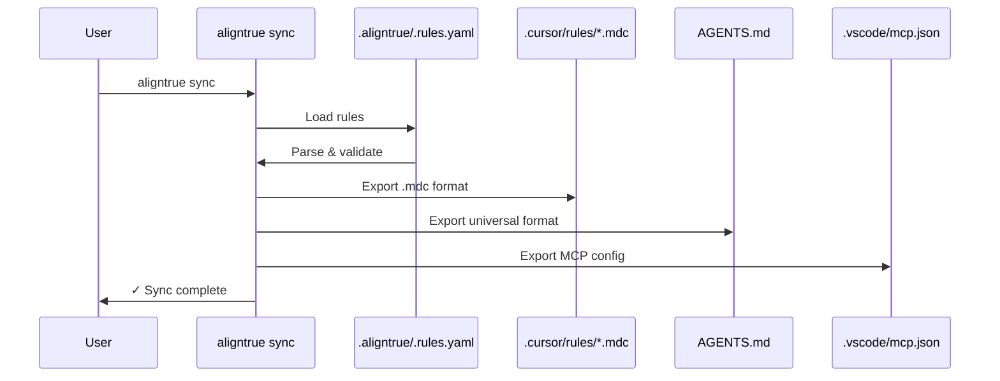

# Sync behavior

Complete reference for AlignTrue's two-way sync system, conflict resolution, and precedence rules.

> **Comprehensive reference** for sync internals. For practical workflow selection, see [Choosing Your Workflow](/docs/01-guides/01-workflows).

## Overview

AlignTrue synchronizes rules between three locations:

1. **Intermediate Representation (IR)** - `.aligntrue/.rules.yaml` (internal, auto-generated, pure YAML format with section fingerprints)
2. **User-Editable Files** - `AGENTS.md` (natural markdown with YAML frontmatter), `.cursor/*.mdc`, `.vscode/mcp.json`, etc.
3. **Team Lockfile** - `.aligntrue.lock.json` (team mode only, tracks section fingerprints)

The sync engine maintains consistency while allowing both IR→agent and agent→IR flows. For details on authoring rules in natural markdown format, see the [Natural Markdown Workflow guide](/docs/01-guides/natural-markdown-workflow).

## Sync directions

### IR → Agent (default)

**When:** Every `aligntrue sync` command (default direction)

**Flow:**

```
IR (.aligntrue/.rules.yaml) → Parse → Validate → Export → Agent files
```

### Visual flow



**What happens:**

1. Load configuration from `.aligntrue/config.yaml`
2. Parse rules from `.aligntrue/.rules.yaml` (internal IR)
3. Validate against JSON Schema
4. Resolve scopes and merge rules
5. Export to each enabled agent (Cursor, AGENTS.md, etc.)
6. Write agent files atomically (temp+rename)
7. Update lockfile (team mode only)

**Example:**

```bash
# Standard sync
aligntrue sync

# Preview changes
aligntrue sync --dry-run

# Non-interactive (CI)
aligntrue sync --force
```

**Output:**

```
◇ Loading configuration...
◇ Parsing rules...
◇ Syncing to 2 agents...
│
◆ Files written:
│  • .cursor/rules/aligntrue.mdc (3 rules)
│  • AGENTS.md (3 rules)
│
◇ Sync complete! No conflicts detected.
```

---

### Agent → IR (edit source sync)

**When:** Automatic with every `aligntrue sync` (when files match `edit_source`)

**Edit Source Configuration:**

Edit files matching your `sync.edit_source` configuration and changes automatically merge back to IR, then sync to all other agents.

```bash
# Edit files in your edit_source
vi AGENTS.md
# or
vi .cursor/rules/backend.mdc

# Sync detects edits and merges automatically
aligntrue sync
# ◇ Detected 1 edited file(s)
# ◇ Merging changes from agent files to IR
# ✓ Merged changes from agent files to IR
# ✓ Synced to: .cursor/rules/*.mdc, AGENTS.md
```

**Configuration:**

```yaml
# .aligntrue/config.yaml
exporters:
  - cursor
  - agents-md

sync:
  edit_source: "AGENTS.md"  # Single file
  # OR
  edit_source: ".cursor/rules/*.mdc"  # Glob pattern
  # OR
  edit_source: ["AGENTS.md", ".cursor/rules/*.mdc"]  # Multiple
  # OR
  edit_source: "any_agent_file"  # All agents
```

**Deprecated:**

```yaml
# OLD (still works, auto-migrates)
sync:
  two_way: true # → edit_source: "any_agent_file"
```

**Section-Level Merging:**

Two-way sync uses section-based merging:

- **Sections matched by heading** (case-insensitive)
- **Change detection via SHA-256 hash**
- **User sections preserved** alongside team sections
- **Last-write-wins** when same section edited in multiple files

**Flow:**

```
Any agent file → Parse sections → Merge to IR → Export to all agent files
```

### Two-way sync flow

```mermaid
graph LR
    A[Edit AGENTS.md or .mdc] --> B[aligntrue sync]
    B --> C[Detect edited files]
    C --> D[Parse sections by heading]
    D --> E[Merge to IR last-write-wins]
    E --> F[Export to all agents]
    F --> G[All files updated]

    style A fill:#f5f5f5,stroke:#666,stroke-width:1px
    style B fill:#F5A623,stroke:#F5A623,color:#fff,stroke-width:2px
    style C fill:#F5A623,stroke:#F5A623,color:#fff,stroke-width:2px
    style D fill:#F5A623,stroke:#F5A623,color:#fff,stroke-width:2px
    style E fill:#F5A623,stroke:#F5A623,color:#fff,stroke-width:2px
```



**What happens:**

1. Detect edited agent files by modification time
2. Parse sections from edited files by heading
3. Merge sections into IR (last-write-wins for conflicts)
4. Write updated `.aligntrue/.rules.yaml`
5. Export merged IR to all configured agents

**Team-Managed Sections:**

Team mode can designate sections as managed:

```yaml
# .aligntrue/config.yaml
managed:
  sections:
    - "Security"
    - "Compliance"
  source_url: "https://github.com/company/rules"
```

Managed sections are marked with 🔒 icon and HTML comments warning against direct edits.

**IR-Only Mode:**

```yaml
# .aligntrue/config.yaml
sync:
  edit_source: ".rules.yaml" # Only IR accepts edits
```

With IR-only mode, agent → IR sync is disabled, and only IR → agent sync occurs.

**Example:**

```bash
# Standard two-way sync (default)
aligntrue sync

# Watch mode for continuous sync
aligntrue watch
```

See the [Quickstart](/docs/00-getting-started/00-quickstart) to get started.

---

## Precedence rules

### IR wins by default

**.aligntrue/.rules.yaml is the internal authority.**

**Format:** Pure YAML (not markdown). This is an internal file auto-generated by AlignTrue. Users should edit `AGENTS.md` or agent-specific files instead.

If you edit both IR and agent files:

- `aligntrue sync` → IR overwrites agent files (no prompt)
- `aligntrue sync --accept-agent` → Triggers conflict resolution

**Recommended workflow:**

1. Edit `AGENTS.md` or agent files
2. Run `aligntrue sync`
3. All agent files updated automatically

### Explicit pullback required

To pull changes from agent files back to IR:

```bash
# Must explicitly opt in
aligntrue sync --accept-agent cursor
```

Without `--accept-agent`, IR always wins.

### Section-level merging behavior

Two-way sync uses section-based merging instead of field-level conflict detection:

**Match by heading:**

- Sections matched by heading (case-insensitive, whitespace-trimmed)
- Content hash (SHA-256) determines if section changed

**Merge actions:**

- **Keep:** Section unchanged in both IR and agent file
- **Update:** Section changed in IR, updates agent file
- **Add:** New section in IR, adds to agent file
- **User-added:** Section only in agent file, preserved

**Example merge:**

```markdown
# AGENTS.md (edited by user)

## Testing

Run tests before committing.

## My Workflow Notes

Personal notes here.

# .cursor/rules/aligntrue.mdc (from IR)

## Testing

Run all tests before committing.

## Security

Validate all input.
```

**After sync:**

- "Testing" section updated with IR content
- "My Workflow Notes" preserved as user-added section
- "Security" section added from IR
- Result: All 3 sections in both files

### Conflict resolution

**Last-write-wins strategy:**

When same section edited in multiple agent files:

- Files sorted by modification time (oldest first)
- Newest version wins
- Warning logged for conflicts

**Example:**

```
⚠ Section "Testing" edited in multiple files: AGENTS.md, .cursor/rules/aligntrue.mdc
  Using version from .cursor/rules/aligntrue.mdc (most recent)
```

**Team-managed sections:**

Changes to team-managed sections trigger warnings:

```
⚠ Team-managed section "Security" was modified
  Reverting to team version
  To keep your changes, rename the section or submit a PR
```

### Non-interactive mode

For CI or scripting, use default strategy:

```bash
# Keep IR, discard all agent changes (default)
aligntrue sync --force

# Accept all agent changes (coming in Step 17)
aligntrue sync --accept-agent cursor --force
```

No prompts, uses default resolution strategy.

### Manual edit detection

If sync detects manual edits to generated files:

```
⚠ Checksum mismatch: .cursor/rules/aligntrue.mdc

This file was manually edited since last sync.

[v] View current content
[o] Overwrite (discard manual edits)
[k] Keep manual edits (skip sync)
[a] Abort sync

Choice:
```

**Checksum tracking:**

- AlignTrue computes SHA-256 hash of each generated file
- Stores hash in `.aligntrue/.checksums.json`
- Compares before overwriting

**Best practice:** Edit `AGENTS.md` or agent files, not generated exports.

---

## Scope behavior

### Per-scope exports

Some exporters create one file per scope:

**Cursor (`.cursor/rules/*.mdc`):**

```
.aligntrue/.rules.yaml (with scopes):
  - default scope → .cursor/rules/aligntrue.mdc
  - apps/web scope → .cursor/rules/apps-web.mdc
  - packages/core scope → .cursor/rules/packages-core.mdc
```

**Filename conversion:**

- Scope path → filename
- Forward slashes → hyphens
- Example: `apps/web` → `apps-web.mdc`

**Why per-scope files?**

- Cursor can load rules contextually based on current file
- Smaller files, faster parsing
- Clearer organization

---

### Merged exports

Other exporters merge all scopes into one file:

**AGENTS.md:**

```
.aligntrue/.rules.yaml (with scopes):
  - default scope
  - apps/web scope
  - packages/core scope

→ AGENTS.md (single file, all rules merged)
```

**Scope metadata preserved:**

```markdown
## Rule: use-typescript-strict

**Scope:** apps/web

Use TypeScript strict mode in all files.
```

**Why merged?**

- Universal format for multiple agents
- Simpler for agents without scope support
- Single source of truth at root

---

### Scope merge order

When rules overlap across scopes, merge order determines precedence:

```yaml
# .aligntrue/config.yaml
scopes:
  - name: root
    path: .
    merge_order: [root, path, local]
  - name: apps-web
    path: apps/web
    merge_order: [root, path, local]
```

**Merge order levels:**

- `root` - Workspace-level rules (lowest priority)
- `path` - Scope-specific rules (medium priority)
- `local` - File-level overrides (highest priority)

**Example:**

```yaml
# Root scope defines base rule
id: my-project.global.use-typescript
severity: warn

# apps/web scope overrides severity
id: my-project.global.use-typescript
severity: error  # Stricter in frontend
```

Final merged rule in `apps/web` scope:

```yaml
id: my-project.global.use-typescript
severity: error # apps/web override wins
```

---

## Dry run mode

Preview changes without writing files:

```bash
aligntrue sync --dry-run
```

**Output shows:**

1. **Audit trail** - All operations with timestamps
2. **Files that would be written** - Paths and sizes
3. **Warnings** - Potential issues
4. **Conflicts** - What would trigger prompts
5. **Content hashes** - SHA-256 of each file

**Example:**

```
◆ Dry-run mode: No files will be written

Audit trail:
  [2025-10-27T12:00:00Z] Loaded config from .aligntrue/config.yaml
  [2025-10-27T12:00:01Z] Parsed 3 rules from .aligntrue/.rules.yaml
  [2025-10-27T12:00:02Z] Resolved 2 scopes
  [2025-10-27T12:00:03Z] Exported to cursor (1 file)
  [2025-10-27T12:00:04Z] Exported to agents-md (1 file)

Files to write:
  • .cursor/rules/aligntrue.mdc (2.4 KB, hash: a3b2c1d4...)
  • AGENTS.md (1.8 KB, hash: e5f6a7b8...)

Warnings: None

Conflicts: None
```

**Use cases:**

- Verify changes before committing
- Debug exporter behavior
- Review scope resolution
- CI validation (non-destructive)

---

## Git integration

AlignTrue can automatically manage git operations for generated files.

### Three modes

**1. Ignore Mode (Default)**

```yaml
# .aligntrue/config.yaml
git:
  mode: ignore
```

- Adds generated files to `.gitignore`
- Developers sync locally, don't commit agent files
- Recommended for solo developers

**Behavior:**

```bash
aligntrue sync
# Adds to .gitignore:
#   .cursor/rules/*.mdc
#   AGENTS.md
#   .vscode/mcp.json
```

**2. Commit Mode**

```yaml
# .aligntrue/config.yaml
git:
  mode: commit
```

- Commits generated files automatically after sync
- Team shares agent files via git
- Recommended for teams with consistent agents

**Behavior:**

```bash
aligntrue sync
# After successful sync:
git add .cursor/rules/*.mdc AGENTS.md
git commit -m "chore: sync AlignTrue rules"
```

**3. Branch Mode**

```yaml
# .aligntrue/config.yaml
git:
  mode: branch
```

- Creates feature branch for each sync
- Commit changes to branch
- Developers review before merging

**Behavior:**

```bash
aligntrue sync
# Creates branch: aligntrue/sync-2025-10-27-120000
# Commits changes to branch
# Developer reviews and merges via PR
```

---

### Per-adapter override

Override git mode for specific exporters:

```yaml
# .aligntrue/config.yaml
git:
  mode: ignore # Default for all exporters

exporters:
  - name: cursor
    git_override: commit # Commit Cursor files

  - name: agents-md
    # Uses default (ignore)
```

**Use case:** Commit `.cursor/*.mdc` for team, ignore `AGENTS.md` for personal use.

---

### Idempotent .gitignore

AlignTrue safely manages `.gitignore`:

- Adds entries only if not present
- Preserves existing entries and comments
- Uses markers for AlignTrue-managed section:

```gitignore
# Your existing entries
node_modules/
dist/

# BEGIN AlignTrue
.cursor/rules/*.mdc
AGENTS.md
# END AlignTrue
```

**Safe operations:**

- Running sync multiple times doesn't duplicate entries
- Manual edits outside markers are preserved
- Removing marker comments stops AlignTrue management

---

## Lockfile behavior (team mode)

When team mode enabled (`mode: team` in config):

### Validation before sync

Lockfile validated before syncing:

```yaml
# .aligntrue/config.yaml
lockfile:
  mode: soft # Warn but continue (default)
  # mode: strict  # Block on mismatch (CI)
  # mode: off     # Disable validation
```

**Three modes:**

**Off (Solo Mode):**

- No lockfile validation
- Always succeeds
- Recommended for solo developers

**Soft (Team Mode Default):**

- Warns on lockfile mismatch
- Continues sync anyway
- Exit code 0 (success)

**Strict (CI):**

- Errors on lockfile mismatch
- Aborts sync
- Exit code 1 (failure)

---

### Regeneration after sync

Lockfile regenerated after successful sync (team mode only):

```bash
aligntrue sync
# 1. Validates lockfile (soft/strict)
# 2. Performs sync
# 3. Regenerates .aligntrue.lock.json
```

**Lockfile contents:**

```json
{
  "version": "1",
  "generated_at": "2025-10-27T12:00:00Z",
  "mode": "soft",
  "rules": [
    {
      "rule_id": "my-project.backend.use-typescript",
      "content_hash": "a3b2c1d4e5f6...",
      "source": "local:.aligntrue/.rules.yaml"
    }
  ],
  "bundle_hash": "e5f6a7b8c9d0..."
}
```

**Per-rule hashes:**

- SHA-256 of canonical IR (JCS)
- Excludes `vendor.*.volatile` fields
- Deterministic across machines

**Bundle hash:**

- SHA-256 of sorted rule hashes
- Quick validation before per-rule check

---

### Drift detection

Lockfile drift occurs when:

- Rules edited but lockfile not updated
- Teammate pushed rules without lockfile
- Git merge conflict resolved manually

**Detection:**

```bash
aligntrue sync
# Compares current rules to lockfile hashes
# Reports mismatches
```

**Resolution:**

**Soft mode (warning):**

```
⚠ Warning: Lockfile is out of sync
  Rule 'my-project.backend.use-typescript' hash mismatch

Continuing sync...
```

**Strict mode (error):**

```
✖ Error: Lockfile validation failed
  Rule 'my-project.backend.use-typescript' hash mismatch

Aborting sync. Use --force to override.
```

**Fix:**

```bash
# Regenerate lockfile
aligntrue sync --force

# Or delete and regenerate
rm .aligntrue.lock.json
aligntrue sync
```

---

## Performance considerations

### File operations

AlignTrue optimizes sync performance:

- **Atomic writes** - Temp file + rename (prevents partial writes)
- **Lazy loading** - Only parses files when needed
- **Caching** - Reuses parsed IR across exporters
- **Parallel exports** - Multiple exporters run concurrently

### Large repositories

For monorepos with many scopes:

```yaml
# .aligntrue/config.yaml
scopes:
  - name: backend
    path: packages/backend
    include: ["**/*.ts"]
    exclude: ["**/*.test.ts", "**/node_modules/**"]
```

**Performance tips:**

- Use `exclude` patterns to skip irrelevant files
- Limit scope depth with specific paths
- Enable only needed exporters

### CI optimization

```bash
# Fast validation (no file writes)
aligntrue check --ci

# Faster than full sync in CI
```

---

## Troubleshooting

### Sync hangs or times out

**Cause:** Large rule files, slow disk, or exporter deadlock.

**Fix:**

```bash
# Check file sizes
ls -lh AGENTS.md .aligntrue/.rules.yaml

# Run with dry-run to test
aligntrue sync --dry-run

# Disable problematic exporter
# Edit .aligntrue/config.yaml and remove exporter
```

---

### Conflicts on every sync

**Cause:** Agent and IR are both being edited.

**Fix:**

**Option 1: Native format workflow (recommended)**

- Edit `AGENTS.md` or any agent file
- Run `aligntrue sync` to propagate changes
- Enable bidirectional sync with `auto_pull: true`

**Option 2: Manual control**

- Edit `AGENTS.md` as primary file
- Run `aligntrue sync` to update other agents
- Disable auto-pull with `auto_pull: false`

**Tip:** Use native format workflow for flexibility - edit any file, changes sync everywhere.

---

### Lockfile always out of sync

**Cause:** Volatile vendor fields changing on each sync.

**Fix:**

```yaml
# Mark changing fields as volatile
vendor:
  _meta:
    volatile: ["my-agent.timestamp", "my-agent.cache"]
  my-agent:
    timestamp: "2025-10-27T12:00:00Z" # Excluded from hash
```

Volatile fields won't cause lockfile drift.

---

## See also

- [Natural Markdown Workflow](/docs/01-guides/natural-markdown-workflow) - Authoring rules with sections and fingerprints
- [Natural Markdown Sections](/docs/04-reference/natural-markdown-sections) - Technical reference for section-based format
- [Command Reference](/docs/04-reference/cli-reference) - Detailed flag documentation
- [Quickstart](/docs/00-getting-started/00-quickstart) - Get started with AlignTrue
- [Git Sources Guide](/docs/04-reference/git-sources) - Pull rules from repositories
- [Troubleshooting](/docs/05-troubleshooting) - Common sync issues
- [Extending AlignTrue](/docs/06-contributing/adding-exporters) - Create custom exporters
- [Quickstart Guide](/docs/00-getting-started/00-quickstart) - Get started in <60 seconds
