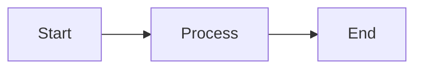
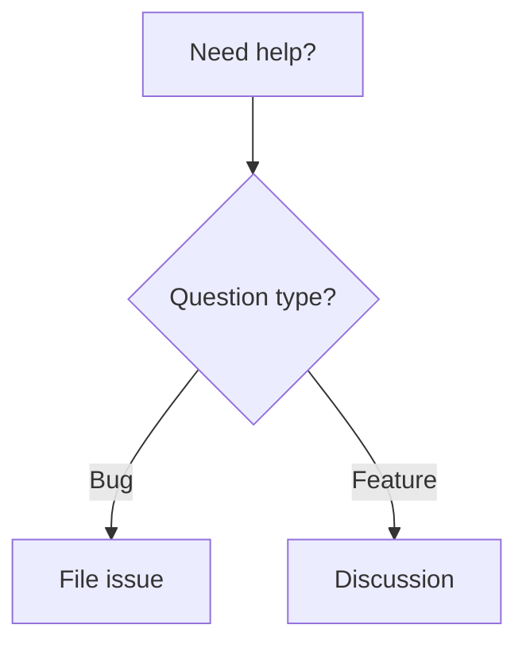
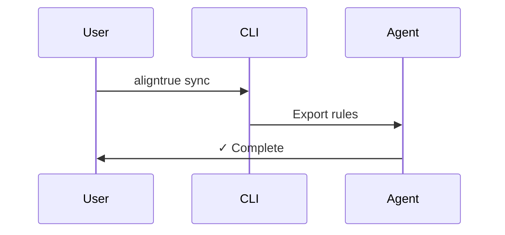
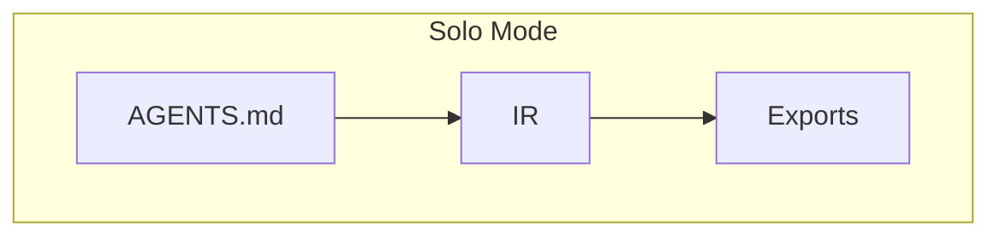
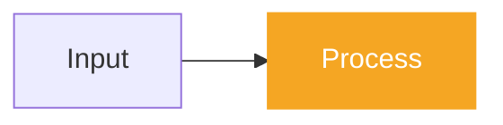

# Editing documentation

AlignTrue uses a docs-first architecture where the documentation site is the canonical source and repo root files are generated from it.

## Architecture overview

```
apps/docs/content/ (canonical source - edit here)
  ↓
scripts/generate-repo-files.ts (transformation)
  ↓
README.md, CONTRIBUTING.md, DEVELOPMENT.md (generated - don't edit)
```

This mirrors AlignTrue's own philosophy: docs are the IR (Intermediate Representation), and repo files are exports.

## File mapping

| Docs Source                                           | Generated File    | Purpose                          |
| ----------------------------------------------------- | ----------------- | -------------------------------- |
| `apps/docs/content/index.mdx`                         | `README.md`       | GitHub landing page              |
| `apps/docs/content/06-contributing/creating-packs.md` | `CONTRIBUTING.md` | Contribution guide               |
| `apps/docs/content/08-development/*.md`               | `DEVELOPMENT.md`  | Development guide (concatenated) |
| `apps/docs/content/07-policies/security.md`           | `SECURITY.md`     | Security policy                  |

## Editing workflow

### 1. Edit docs content

Edit files in `apps/docs/content/`:

```bash
# Edit the docs homepage (becomes README.md)
apps/docs/content/index.mdx

# Edit contribution guide (becomes CONTRIBUTING.md)
apps/docs/content/06-contributing/creating-packs.md

# Edit development pages (become DEVELOPMENT.md)
apps/docs/content/08-development/setup.mdx
apps/docs/content/08-development/workspace.md
apps/docs/content/08-development/commands.md
apps/docs/content/08-development/architecture.md

# Edit security policy (becomes SECURITY.md)
apps/docs/content/07-policies/security.md
```

### 2. Stage your changes

Stage the docs source files:

```bash
git add apps/docs/content/
```

You can also stage any other files that are part of your change.

### 3. Commit

When you commit, the pre-commit hook will automatically:

- Detect that docs source changed
- Run `pnpm generate:repo-files`
- Stage the regenerated protected files
- Allow the commit to proceed

```bash
git commit -m "docs: Update documentation"
```

The generated files are included automatically.</xai:function_call">---

<xai:function_call name="read_file">
<parameter name="target_file">apps/docs/content/06-contributing/editing-docs.md

## Link handling

### Internal links (standard format)

**Always use absolute paths from `/docs/` root for internal documentation links.**

```markdown
<!-- ✅ Correct: Absolute path from /docs/ root -->

[Team Mode](/docs/03-concepts/team-mode)
[Quickstart Guide](/docs/00-getting-started/00-quickstart)
[CLI Reference](/docs/04-reference/cli-reference)

<!-- ❌ Incorrect: Relative paths -->

[Team Mode](./team-mode)
[Team Mode](../concepts/team-mode)
```

**Why absolute paths?**

- Robust during directory refactors
- Work consistently in all contexts (navigation, search, external links)
- Easier for contributors (one pattern to remember)
- Future-proof for multi-site deployments

**Path format:**

`/docs/{section-number}-{section-name}/{page-name}`

Examples:

- `/docs/00-getting-started/00-quickstart`
- `/docs/01-guides/05-team-guide`
- `/docs/02-customization/overlays`
- `/docs/03-concepts/team-mode`
- `/docs/04-reference/cli-reference`

**How to find the correct path:**

1. Check the `_meta.json` file in that section for the section number
2. Use the file name without the `.md` extension
3. Join with `/docs/` prefix

The generation script automatically transforms these to absolute URLs for GitHub:

```markdown
See [team mode](/docs/03-concepts/team-mode) for details.
```

### External links

External links remain unchanged:

```markdown
[GitHub repository](https://github.com/AlignTrue/aligntrue)
```

### Anchor links

Anchor links are preserved:

```markdown
See [installation](#installation) below.
```

## Adding diagrams

AlignTrue documentation uses Mermaid for diagrams. Diagrams render as static content at build time with AlignTrue brand theming.

### Mermaid syntax

Use standard Mermaid code blocks in your markdown:

````markdown

````

### Diagram types

Mermaid supports multiple diagram types:

**Flowcharts:**

````markdown

````

**Sequence diagrams:**

````markdown

````

**Architecture diagrams:**

````markdown

````

### AlignTrue branding

Diagrams automatically use AlignTrue brand colors:

- **Primary nodes:** Orange (#F5A623) with white text
- **Secondary nodes:** Light gray with dark borders
- **Theme-aware:** Adapts to light/dark mode

To highlight key nodes with brand colors:

````markdown

````

### Best practices

1. **Keep diagrams simple** - Focus on key concepts, avoid clutter
2. **Use consistent terminology** - Match docs language (IR, agents, sync)
3. **Add context** - Include brief explanation before/after diagram
4. **Test rendering** - Verify in both light and dark modes
5. **Mobile-friendly** - Ensure diagrams are readable on small screens

### Examples in docs

See these pages for diagram examples:

- [How it works](/docs) - Homepage flow diagram
- [Sync behavior](/docs/03-concepts/sync-behavior) - Sequence diagrams
- [Workflows](/docs/01-guides/01-workflows) - Decision tree
- [Solo vs team](/docs/00-getting-started/02-solo-vs-team-mode) - Architecture comparison
- [Customization](/docs/02-customization) - Decision flowchart

## Testing locally

### Test docs site

```bash
cd apps/docs
pnpm dev
# Open http://localhost:3001
```

### Test generation script

```bash
pnpm generate:repo-files
```

### Test both

```bash
pnpm docs:build
```

This runs generation then builds the docs site.

## What if you manually edit protected files?

If you try to commit changes to `README.md`, `CONTRIBUTING.md`, `DEVELOPMENT.md`, or `SECURITY.md` directly:

1. The pre-commit hook detects the edit
2. It regenerates the file from source
3. It stages the regenerated version
4. Your commit proceeds normally

The hook ensures protected files always match their source. You never need to manually edit them.

## Auto-generation headers

Generated files include a header indicating they are auto-generated:

```markdown
<!--
  ⚠️  AUTO-GENERATED FILE - DO NOT EDIT DIRECTLY

  This file is generated from documentation source.
  To make changes, edit the source file and run: pnpm generate:repo-files

  Source: apps/docs/content/...
-->
```

And a footer:

```markdown
---

_This file is auto-generated from the AlignTrue documentation site. To make changes, edit the source files in `apps/docs/content/` and run `pnpm generate:repo-files`._
```

If you accidentally edit these files, the pre-commit hook will regenerate them from source.

## Benefits of docs-first

1. **Single source of truth** - Docs site is canonical
2. **No drift** - Repo files always match docs
3. **Better structure** - Multi-page docs vs single flat files
4. **Easier maintenance** - Edit in one place, export everywhere
5. **Aligned with philosophy** - IR-first → exports (just like AlignTrue itself)

## Common tasks

### Add a new docs page

1. Create file in `apps/docs/content/`
2. Update `_meta.json` in that directory
3. Add cross-links from related pages
4. Run `pnpm generate:repo-files` if it affects repo files

### Reorganize docs structure

1. Move/rename files in `apps/docs/content/`
2. Update all `_meta.json` files
3. Update cross-references
4. Run `pnpm generate:repo-files`
5. Test navigation on docs site

### Update README content

1. Edit `apps/docs/content/index.mdx`
2. Run `pnpm generate:repo-files`
3. Verify `README.md` looks correct
4. Commit both files

## Questions?

- See [getting started](/docs/06-contributing/getting-started) for development setup
- See [workspace structure](/docs/08-development/workspace) for repo layout
- See [architecture](/docs/08-development/architecture) for design principles
