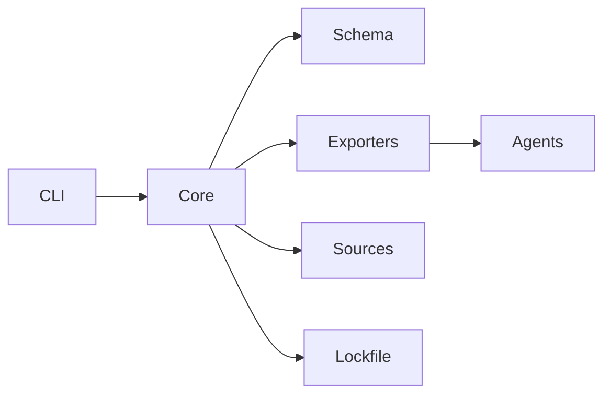

# Architecture in 10 minutes

Use this when you need to add a command, change schema/IR, or wire a new exporter.

## System flow (high level)

- **CLI (`packages/cli`)**: argument parsing, UX, config editing, orchestration.
- **Core (`packages/core`)**: IR loading, validation, scopes, overlays/plugs, sync engine.
- **Schema (`packages/schema`)**: IR/schema typing, canonicalization, hashing.
- **Exporters (`packages/exporters`)**: IR → agent-specific files (Cursor, AGENTS.md, VS Code/Claude Code, etc.).
- **Sources (`packages/sources`)**: pulling rules from local/git/catalog inputs.

## Where to change what

- **Add a CLI command**: `packages/cli/src/commands/*` + `manifest.ts` registration. Tests in `packages/cli/tests/commands/`.
- **Add/adjust schema fields**: `packages/schema/src/*` with canonicalization + validation. Update docs/CHANGELOG and consider migration.
- **Core sync behavior**: `packages/core/src/sync/*` and `packages/core/src/paths.ts` for layout. Tests mirror folder names.
- **Exporter logic**: `packages/exporters/src/<agent>/index.ts` and manifest. Register in `packages/exporters/src/registry.ts`.
- **Team mode/lockfile**: `packages/core/src/lockfile/*` and `packages/core/src/team/*`.

## Tests to run by change type

- CLI command: `pnpm --filter @aligntrue/cli vitest run tests/commands/<file>.test.ts`
- Schema/IR: `pnpm --filter @aligntrue/schema test`
- Core sync/pathing: `pnpm --filter @aligntrue/core vitest run tests/sync/*.test.ts`
- Exporter change: `pnpm --filter @aligntrue/exporters test`
- Docs accuracy: `pnpm validate:docs`

Keep changes small and update golden tests when exporter or schema outputs move.
